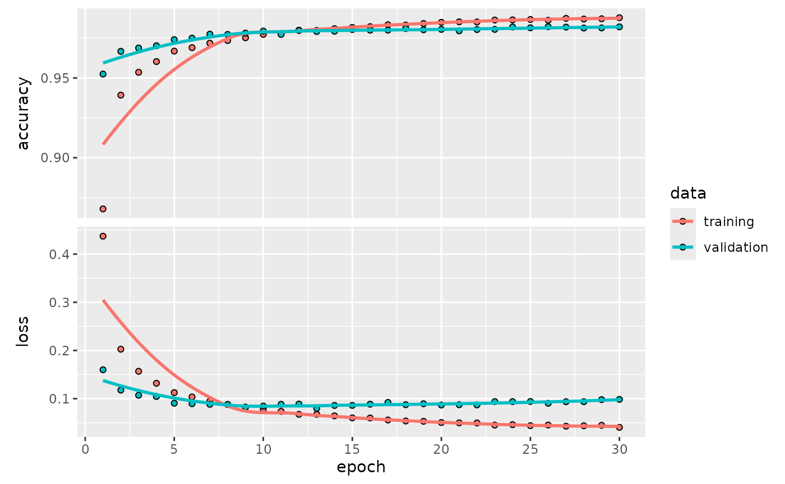
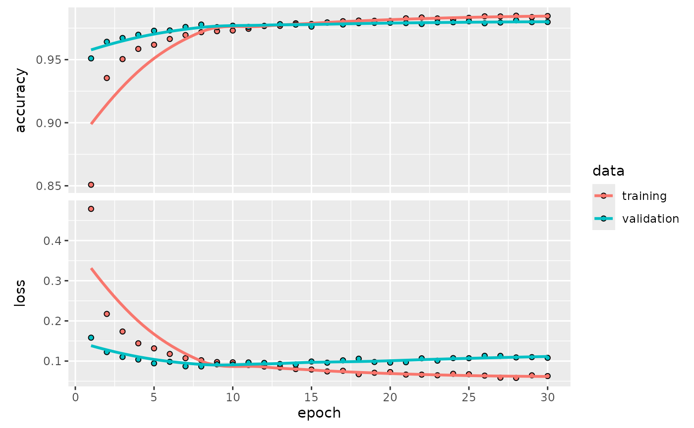

# Getting Started with kerasnip

## The Core Idea: From Keras Layers to Tidymodels Specs

The `keras3` package allows for building deep learning models
layer-by-layer, which is a powerful and flexible approach. However, the
`tidymodels` ecosystem is designed around declarative model
specifications, where you define *what* model you want and which of its
parameters you want to tune, rather than building it imperatively.

`kerasnip` bridges this gap with a simple but powerful concept: **layer
blocks**. You define the components of your neural network (e.g., an
input block, a dense block, a dropout block) as simple R functions.
`kerasnip` then uses these blocks as building materials to create a
brand new `parsnip` model specification function for you.

This new function behaves just like any other `parsnip` model (e.g.,
[`rand_forest()`](https://parsnip.tidymodels.org/reference/rand_forest.html)
or
[`linear_reg()`](https://parsnip.tidymodels.org/reference/linear_reg.html)),
making it easy to integrate into `tidymodels` workflows.

## Installation

You can install the development version of `kerasnip` from GitHub. You
will also need `keras3`.

``` r
install.packages("pak")
pak::pak("davidrsch/kerasnip")
pak::pak("rstudio/keras3")

# Install the backend
keras3::install_keras()
```

We’ll start by loading `kerasnip`, `tidymodels` and `keras3`:

``` r
library(kerasnip)
library(tidymodels)
#> ── Attaching packages ────────────────────────────────────── tidymodels 1.4.1 ──
#> ✔ broom        1.0.11     ✔ recipes      1.3.1 
#> ✔ dials        1.4.2      ✔ rsample      1.3.1 
#> ✔ dplyr        1.1.4      ✔ tailor       0.1.0 
#> ✔ ggplot2      4.0.1      ✔ tidyr        1.3.1 
#> ✔ infer        1.0.9      ✔ tune         2.0.1 
#> ✔ modeldata    1.5.1      ✔ workflows    1.3.0 
#> ✔ parsnip      1.4.0      ✔ workflowsets 1.1.1 
#> ✔ purrr        1.2.0      ✔ yardstick    1.3.2
#> ── Conflicts ───────────────────────────────────────── tidymodels_conflicts() ──
#> ✖ purrr::discard() masks scales::discard()
#> ✖ dplyr::filter()  masks stats::filter()
#> ✖ dplyr::lag()     masks stats::lag()
#> ✖ recipes::step()  masks stats::step()
library(keras3)
#> 
#> Attaching package: 'keras3'
#> The following object is masked from 'package:yardstick':
#> 
#>     get_weights
```

## A `kerasnip` MNIST Example

Let’s replicate the classic Keras introductory example, training a
simple MLP on the MNIST dataset, but using the `kerasnip` workflow. This
will demonstrate how to translate a standard Keras model into a
reusable, modular `parsnip` specification.

If you’re familiar with Keras, you’ll recognize the structure; if not,
this is a perfect place to start. We’ll begin by learning the basics
through a simple task: recognizing handwritten digits from the MNIST
dataset.

The MNIST dataset contains 28×28 pixel grayscale images of handwritten
digits, like these:


MINIST

Each image comes with a label indicating which digit it represents. For
example, the labels for the images above might be 5, 0, 4, and 1.

### Preparing the Data

This step is identical to any other Keras model. We load the MNIST
dataset, reshape the predictors, and convert the outcome to a factor for
`tidymodels`.

``` r
mnist <- dataset_mnist()
#> Downloading data from https://storage.googleapis.com/tensorflow/tf-keras-datasets/mnist.npz
#>        0/11490434 ━━━━━━━━━━━━━━━━━━━━ 0s 0s/step11490434/11490434 ━━━━━━━━━━━━━━━━━━━━ 0s 0us/step
x_train <- mnist$train$x
y_train <- mnist$train$y
x_test <- mnist$test$x
y_test <- mnist$test$y

# Reshape
x_train <- array_reshape(x_train, c(nrow(x_train), 784))
x_test <- array_reshape(x_test, c(nrow(x_test), 784))
# Rescale
x_train <- x_train / 255
x_test <- x_test / 255

# Convert outcomes to factors for tidymodels
# kerasnip will handle y convertion internally using keras3::to_categorical()
y_train_factor <- factor(y_train)
y_test_factor <- factor(y_test)

# For tidymodels, it's best to work with data frames
# Use I() to keep the matrix structure of x within the data frame
train_df <- data.frame(x = I(x_train), y = y_train_factor)
test_df <- data.frame(x = I(x_test), y = y_test_factor)
```

### The Standard Keras Approach (for comparison)

Before diving into the `kerasnip` workflow, let’s quickly look at how
this same model is built using standard `keras3` code. This will help
highlight the different approach `kerasnip` enables.

``` r
# The standard Keras3 approach
model <- keras_model_sequential(input_shape = 784) |>
  layer_dense(units = 256, activation = "relu") |>
  layer_dropout(rate = 0.4) |>
  layer_dense(units = 128, activation = "relu") |>
  layer_dropout(rate = 0.3) |>
  layer_dense(units = 10, activation = "softmax")

summary(model)

model |>
  compile(
    loss = "categorical_crossentropy",
    optimizer = optimizer_rmsprop(),
    metrics = "accuracy"
  )

# The model would then be trained with model |> fit(...)
```

The code above is imperative: you define each layer and add it to the
model step-by-step. Now, let’s see how `kerasnip` approaches this by
defining reusable components for a declarative, `tidymodels`-friendly
workflow.

### Defining the Model with Reusable Blocks

The original Keras example interleaves
[`layer_dense()`](https://keras3.posit.co/reference/layer_dense.html)
and
[`layer_dropout()`](https://keras3.posit.co/reference/layer_dropout.html).
With `kerasnip`, we can encapsulate this pattern into a single, reusable
block. This makes the overall architecture cleaner and more modular.

``` r
# An input block to initialize the model.
# The 'model' argument is supplied implicitly by the kerasnip backend.
mlp_input_block <- function(model, input_shape) {
  keras_model_sequential(input_shape = input_shape)
}

# A reusable "module" that combines a dense layer and a dropout layer.
# All arguments that should be tunable need a default value.
dense_dropout_block <- function(model, units = 128, rate = 0.1) {
  model |>
    layer_dense(units = units, activation = "relu") |>
    layer_dropout(rate = rate)
}

# The output block for classification.
mlp_output_block <- function(model, num_classes) {
  model |> layer_dense(units = num_classes, activation = "softmax")
}
```

Now, we use
[`create_keras_sequential_spec()`](https://davidrsch.github.io/kerasnip/reference/create_keras_sequential_spec.md)
to generate our `parsnip` model function.

``` r
create_keras_sequential_spec(
  model_name = "mnist_mlp",
  layer_blocks = list(
    input = mlp_input_block,
    hidden_1 = dense_dropout_block,
    hidden_2 = dense_dropout_block,
    output = mlp_output_block
  ),
  mode = "classification"
)
```

### Building and Fitting the Model

We can now use our new `mnist_mlp()` function. Notice how its arguments,
such as `hidden_1_units` and `hidden_1_rate`, were automatically
generated by `kerasnip`. The names are created by combining the name of
the layer block (e.g., `hidden_1`) with the arguments of that block’s
function (e.g., `units`, `rate`).

To replicate the `keras3` example, we’ll use both `hidden` blocks and
provide their parameters.

``` r
mlp_spec <- mnist_mlp(
  hidden_1_units = 256,
  hidden_1_rate = 0.4,
  hidden_2_rate = 0.3,
  hidden_2_units =  128,
  compile_loss = "categorical_crossentropy",
  compile_optimizer = optimizer_rmsprop(),
  compile_metrics = c("accuracy"),
  fit_epochs = 30,
  fit_batch_size = 128,
  fit_validation_split = 0.2
) |>
  set_engine("keras")

# Fit the model
mlp_fit <- fit(mlp_spec, y ~ x, data = train_df)
```

``` r
mlp_fit |>
  extract_keras_model() |>
  summary()
#> Model: "sequential"
#> ┏━━━━━━━━━━━━━━━━━━━━━━━━━━━━━━━━━━━┳━━━━━━━━━━━━━━━━━━━━━━━━━━┳━━━━━━━━━━━━━━━┓
#> ┃ Layer (type)                      ┃ Output Shape             ┃       Param # ┃
#> ┡━━━━━━━━━━━━━━━━━━━━━━━━━━━━━━━━━━━╇━━━━━━━━━━━━━━━━━━━━━━━━━━╇━━━━━━━━━━━━━━━┩
#> │ dense (Dense)                     │ (None, 256)              │       200,960 │
#> ├───────────────────────────────────┼──────────────────────────┼───────────────┤
#> │ dropout (Dropout)                 │ (None, 256)              │             0 │
#> ├───────────────────────────────────┼──────────────────────────┼───────────────┤
#> │ dense_1 (Dense)                   │ (None, 128)              │        32,896 │
#> ├───────────────────────────────────┼──────────────────────────┼───────────────┤
#> │ dropout_1 (Dropout)               │ (None, 128)              │             0 │
#> ├───────────────────────────────────┼──────────────────────────┼───────────────┤
#> │ dense_2 (Dense)                   │ (None, 10)               │         1,290 │
#> └───────────────────────────────────┴──────────────────────────┴───────────────┘
#>  Total params: 470,294 (1.79 MB)
#>  Trainable params: 235,146 (918.54 KB)
#>  Non-trainable params: 0 (0.00 B)
#>  Optimizer params: 235,148 (918.55 KB)
```

``` r
mlp_fit |>
  extract_keras_model() |>
  plot(show_shapes = TRUE)
```


model

``` r
mlp_fit |>
  extract_keras_history() |>
  plot()
```



### Evaluating Model Performance

The
[`keras_evaluate()`](https://davidrsch.github.io/kerasnip/reference/keras_evaluate.md)
function provides a straightforward way to assess the model’s
performance on a test set, using the underlying
[`keras3::evaluate()`](https://rdrr.io/pkg/tensorflow/man/evaluate.html)
method. It returns the loss and any other metrics that were specified
during the model compilation step.

``` r
mlp_fit |> keras_evaluate(x_test, y_test)
#> 313/313 - 0s - 1ms/step - accuracy: 0.9806 - loss: 0.1053
#> $accuracy
#> [1] 0.9806
#> 
#> $loss
#> [1] 0.1052505
```

### Making Predictions

Once the model is trained, we can use the standard `tidymodels`
[`predict()`](https://rdrr.io/r/stats/predict.html) function to generate
predictions on new data. By default,
[`predict()`](https://rdrr.io/r/stats/predict.html) on a `parsnip`
classification model returns the predicted class labels.

``` r
# Predict the class for the first 5 images in the test set
class_preds <- mlp_fit |>
  predict(new_data = head(select(test_df, x)))
#> 1/1 - 0s - 39ms/step
class_preds
#> # A tibble: 6 × 1
#>   .pred_class
#>   <fct>      
#> 1 7          
#> 2 2          
#> 3 1          
#> 4 0          
#> 5 4          
#> 6 1
```

To get the underlying probabilities for each class, we can set
`type = "prob"`. This returns a tibble with a probability column for
each of the 10 classes (0-9).

``` r
# Predict probabilities for the first 5 images
prob_preds <- mlp_fit |>
  predict(new_data = head(select(test_df, x)), type = "prob")
#> 1/1 - 0s - 21ms/step
prob_preds
#> # A tibble: 6 × 10
#>    .pred_0  .pred_1  .pred_2  .pred_3   .pred_4  .pred_5  .pred_6  .pred_7
#>      <dbl>    <dbl>    <dbl>    <dbl>     <dbl>    <dbl>    <dbl>    <dbl>
#> 1 1.27e-21 5.20e-16 1.20e-10 2.20e-11 4.44 e-22 1.76e-18 1.73e-31 1   e+ 0
#> 2 2.00e-17 2.19e-12 1   e+ 0 9.84e-12 2.23 e-22 1.22e-19 2.97e-21 1.70e-19
#> 3 1.85e-13 1   e+ 0 2.77e-10 2.27e-13 1.12 e- 9 1.24e-12 5.58e-12 5.87e- 9
#> 4 1   e+ 0 1.82e-16 1.63e-11 4.91e-14 1.58 e-13 1.18e-11 8.26e-11 6.60e-12
#> 5 1.16e- 7 1.52e-10 1.10e- 7 4.22e-12 1.000e+ 0 2.93e-11 1.38e- 9 2.60e- 6
#> 6 1.98e-14 1   e+ 0 1.44e-11 5.52e-14 3.38 e-10 4.75e-14 4.12e-14 4.65e- 9
#> # ℹ 2 more variables: .pred_8 <dbl>, .pred_9 <dbl>
```

We can then compare the predicted class to the actual class for these
images to see how the model is performing.

``` r
# Combine predictions with actuals for comparison
comparison <- bind_cols(
  class_preds,
  prob_preds
) |>
  bind_cols(
    head(test_df[, "y", drop = FALSE])
  )
comparison
#> # A tibble: 6 × 12
#>   .pred_class  .pred_0  .pred_1  .pred_2  .pred_3   .pred_4  .pred_5  .pred_6
#>   <fct>          <dbl>    <dbl>    <dbl>    <dbl>     <dbl>    <dbl>    <dbl>
#> 1 7           1.27e-21 5.20e-16 1.20e-10 2.20e-11 4.44 e-22 1.76e-18 1.73e-31
#> 2 2           2.00e-17 2.19e-12 1   e+ 0 9.84e-12 2.23 e-22 1.22e-19 2.97e-21
#> 3 1           1.85e-13 1   e+ 0 2.77e-10 2.27e-13 1.12 e- 9 1.24e-12 5.58e-12
#> 4 0           1   e+ 0 1.82e-16 1.63e-11 4.91e-14 1.58 e-13 1.18e-11 8.26e-11
#> 5 4           1.16e- 7 1.52e-10 1.10e- 7 4.22e-12 1.000e+ 0 2.93e-11 1.38e- 9
#> 6 1           1.98e-14 1   e+ 0 1.44e-11 5.52e-14 3.38 e-10 4.75e-14 4.12e-14
#> # ℹ 4 more variables: .pred_7 <dbl>, .pred_8 <dbl>, .pred_9 <dbl>, y <fct>
```

## Example 2: Tuning the Model Architecture

Now we’ll showcase the main strength of `kerasnip`: tuning the network
architecture itself. We can treat the number of layers, and the
parameters of those layers, as hyperparameters to be optimized by
`tune`.

Using the `mnist_mlp` spec we just created, let’s define a tunable
model.

``` r
# Define a tunable specification
# We set num_hidden_2 = 0 to disable the second hidden block
# for this tuning example
tune_spec <- mnist_mlp(
  num_hidden_1 = tune(),
  hidden_1_units = tune(),
  hidden_1_rate = tune(),
  num_hidden_2 = 0,
  compile_loss = "categorical_crossentropy",
  compile_optimizer = optimizer_rmsprop(),
  compile_metrics = c("accuracy"),
  fit_epochs = 30,
  fit_batch_size = 128,
  fit_validation_split = 0.2
) |>
  set_engine("keras")

# Create a workflow
tune_wf <- workflow(y ~ x, tune_spec)
```

Next, we define the search space for our tunable parameters using
`dials`.

``` r
# Define the tuning grid
params <- extract_parameter_set_dials(tune_wf) |>
  update(
    num_hidden_1 = dials::num_terms(c(1, 3)),
    hidden_1_units = dials::hidden_units(c(64, 256)),
    hidden_1_rate = dials::dropout(c(0.2, 0.4))
  )
grid <- grid_regular(params, levels = 3)
grid
#> # A tibble: 27 × 3
#>    num_hidden_1 hidden_1_units hidden_1_rate
#>           <int>          <int>         <dbl>
#>  1            1             64           0.2
#>  2            2             64           0.2
#>  3            3             64           0.2
#>  4            1            160           0.2
#>  5            2            160           0.2
#>  6            3            160           0.2
#>  7            1            256           0.2
#>  8            2            256           0.2
#>  9            3            256           0.2
#> 10            1             64           0.3
#> # ℹ 17 more rows
```

``` r
# Using only the first 100 rows for speed. The real call
# should be: folds <- vfold_cv(train_df, v = 3)
folds <- vfold_cv(train_df[1:100, ], v = 3)

tune_res <- tune_grid(
  tune_wf,
  resamples = folds,
  grid = grid,
  metrics = metric_set(accuracy),
  control = control_grid(save_pred = FALSE, save_workflow = TRUE)
)
#> 2/2 - 0s - 24ms/step
#> 2/2 - 0s - 29ms/step
#> 2/2 - 0s - 32ms/step
#> 2/2 - 0s - 24ms/step
#> 2/2 - 0s - 28ms/step
#> 2/2 - 0s - 32ms/step
#> 2/2 - 0s - 25ms/step
#> 2/2 - 0s - 28ms/step
#> 2/2 - 0s - 33ms/step
#> 2/2 - 0s - 26ms/step
#> 2/2 - 0s - 28ms/step
#> 2/2 - 0s - 32ms/step
#> 2/2 - 0s - 25ms/step
#> 2/2 - 0s - 28ms/step
#> 2/2 - 0s - 33ms/step
#> 2/2 - 0s - 24ms/step
#> 2/2 - 0s - 29ms/step
#> 2/2 - 0s - 32ms/step
#> 2/2 - 0s - 24ms/step
#> 2/2 - 0s - 28ms/step
#> 2/2 - 0s - 33ms/step
#> 2/2 - 0s - 24ms/step
#> 2/2 - 0s - 29ms/step
#> 2/2 - 0s - 32ms/step
#> 2/2 - 0s - 24ms/step
#> 2/2 - 0s - 28ms/step
#> 2/2 - 0s - 32ms/step
#> 2/2 - 0s - 26ms/step
#> 2/2 - 0s - 29ms/step
#> 2/2 - 0s - 32ms/step
#> 2/2 - 0s - 26ms/step
#> 2/2 - 0s - 28ms/step
#> 2/2 - 0s - 33ms/step
#> 2/2 - 0s - 25ms/step
#> 2/2 - 0s - 29ms/step
#> 2/2 - 0s - 32ms/step
#> 2/2 - 0s - 24ms/step
#> 2/2 - 0s - 28ms/step
#> 2/2 - 0s - 32ms/step
#> 2/2 - 0s - 26ms/step
#> 2/2 - 0s - 28ms/step
#> 2/2 - 0s - 33ms/step
#> 2/2 - 0s - 24ms/step
#> 2/2 - 0s - 33ms/step
#> 2/2 - 0s - 34ms/step
#> 2/2 - 0s - 24ms/step
#> 2/2 - 0s - 29ms/step
#> 2/2 - 0s - 32ms/step
#> 2/2 - 0s - 25ms/step
#> 2/2 - 0s - 28ms/step
#> 2/2 - 0s - 33ms/step
#> 2/2 - 0s - 25ms/step
#> 2/2 - 0s - 29ms/step
#> 2/2 - 0s - 32ms/step
#> 2/2 - 0s - 24ms/step
#> 2/2 - 0s - 29ms/step
#> 2/2 - 0s - 32ms/step
#> 2/2 - 0s - 24ms/step
#> 2/2 - 0s - 29ms/step
#> 2/2 - 0s - 33ms/step
#> 2/2 - 0s - 24ms/step
#> 2/2 - 0s - 31ms/step
#> 2/2 - 0s - 33ms/step
#> 2/2 - 0s - 24ms/step
#> 2/2 - 0s - 29ms/step
#> 2/2 - 0s - 34ms/step
#> 2/2 - 0s - 24ms/step
#> 2/2 - 0s - 28ms/step
#> 2/2 - 0s - 32ms/step
#> 2/2 - 0s - 24ms/step
#> 2/2 - 0s - 28ms/step
#> 2/2 - 0s - 32ms/step
#> 2/2 - 0s - 24ms/step
#> 2/2 - 0s - 27ms/step
#> 2/2 - 0s - 33ms/step
#> 2/2 - 0s - 24ms/step
#> 2/2 - 0s - 29ms/step
#> 2/2 - 0s - 33ms/step
#> 2/2 - 0s - 24ms/step
#> 2/2 - 0s - 28ms/step
#> 2/2 - 0s - 33ms/step
```

Finally, we can inspect the results to find which architecture performed
the best. First, a summary table:

``` r
# Show the summary table of the best models
show_best(tune_res, metric = "accuracy")
#> # A tibble: 5 × 9
#>   num_hidden_1 hidden_1_units hidden_1_rate .metric  .estimator  mean     n
#>          <int>          <int>         <dbl> <chr>    <chr>      <dbl> <int>
#> 1            1            256         0.2   accuracy multiclass 0.810     3
#> 2            2            256         0.2   accuracy multiclass 0.810     3
#> 3            2            256         0.400 accuracy multiclass 0.800     3
#> 4            2            160         0.2   accuracy multiclass 0.790     3
#> 5            2            160         0.3   accuracy multiclass 0.780     3
#> # ℹ 2 more variables: std_err <dbl>, .config <chr>
```

Now that we’ve identified the best-performing hyperparameters, our final
step is to create and train the final model. We use
[`select_best()`](https://tune.tidymodels.org/reference/show_best.html)
to get the top parameters,
[`finalize_workflow()`](https://tune.tidymodels.org/reference/finalize_model.html)
to update our workflow with them, and then
[`fit()`](https://generics.r-lib.org/reference/fit.html) one last time
on our full training dataset.

``` r
# Select the best hyperparameters
best_hps <- select_best(tune_res, metric = "accuracy")

# Finalize the workflow with the best hyperparameters
final_wf <- finalize_workflow(tune_wf, best_hps)

# Fit the final model on the full training data
final_fit <- fit(final_wf, data = train_df)
```

We can now inspect our final, tuned model.

``` r
# Print the model summary
final_fit |>
  extract_fit_parsnip() |>
  extract_keras_model() |>
  summary()
#> Model: "sequential_82"
#> ┏━━━━━━━━━━━━━━━━━━━━━━━━━━━━━━━━━━━┳━━━━━━━━━━━━━━━━━━━━━━━━━━┳━━━━━━━━━━━━━━━┓
#> ┃ Layer (type)                      ┃ Output Shape             ┃       Param # ┃
#> ┡━━━━━━━━━━━━━━━━━━━━━━━━━━━━━━━━━━━╇━━━━━━━━━━━━━━━━━━━━━━━━━━╇━━━━━━━━━━━━━━━┩
#> │ dense_246 (Dense)                 │ (None, 256)              │       200,960 │
#> ├───────────────────────────────────┼──────────────────────────┼───────────────┤
#> │ dropout_164 (Dropout)             │ (None, 256)              │             0 │
#> ├───────────────────────────────────┼──────────────────────────┼───────────────┤
#> │ dense_247 (Dense)                 │ (None, 10)               │         2,570 │
#> └───────────────────────────────────┴──────────────────────────┴───────────────┘
#>  Total params: 407,062 (1.55 MB)
#>  Trainable params: 203,530 (795.04 KB)
#>  Non-trainable params: 0 (0.00 B)
#>  Optimizer params: 203,532 (795.05 KB)

# Plot the training history
final_fit |>
  extract_fit_parsnip() |>
  extract_keras_history() |>
  plot()
```



This result shows that `tune` has tested various network depths, widths,
and dropout rates, successfully finding the best-performing combination
within the search space. By using `kerasnip`, we were able to integrate
this complex architectural tuning directly into a standard `tidymodels`
workflow.
