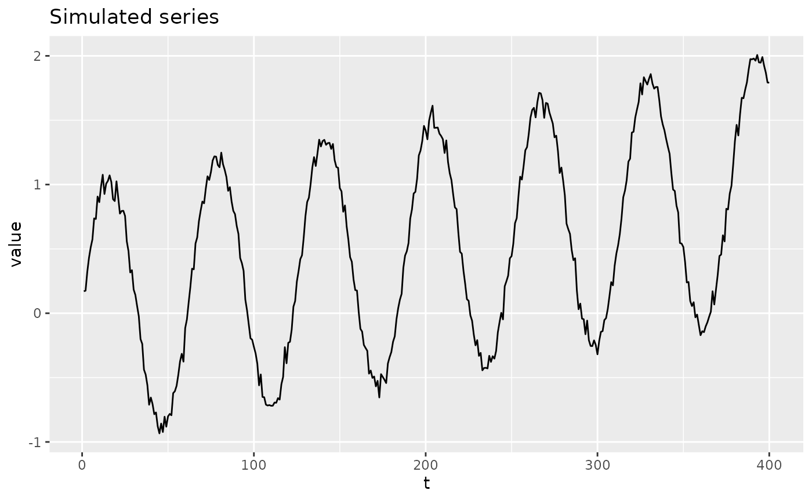
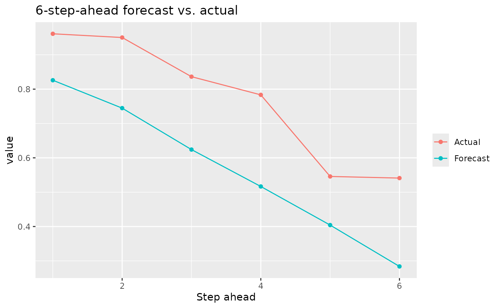
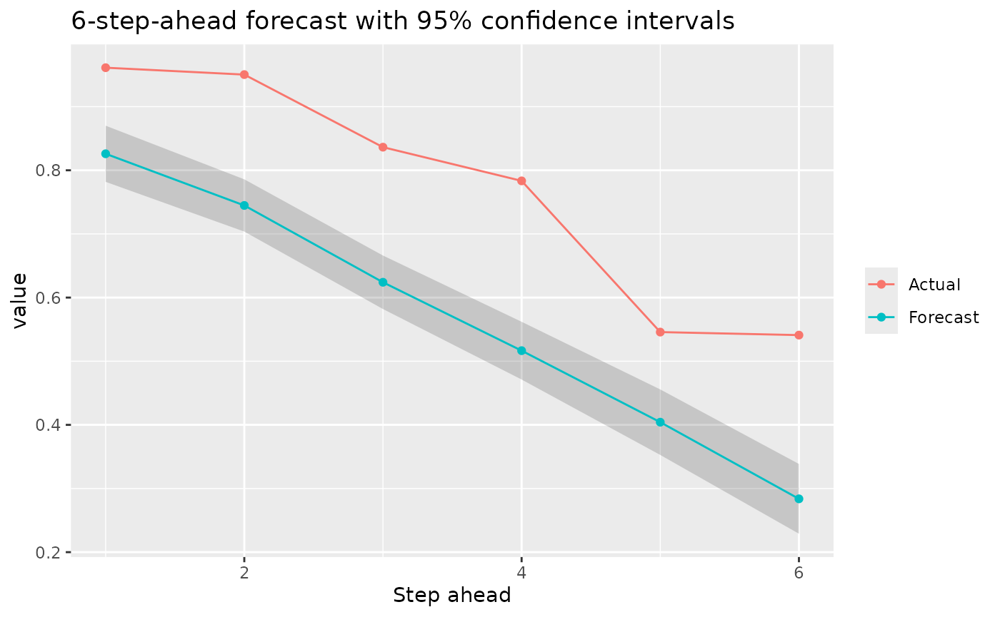
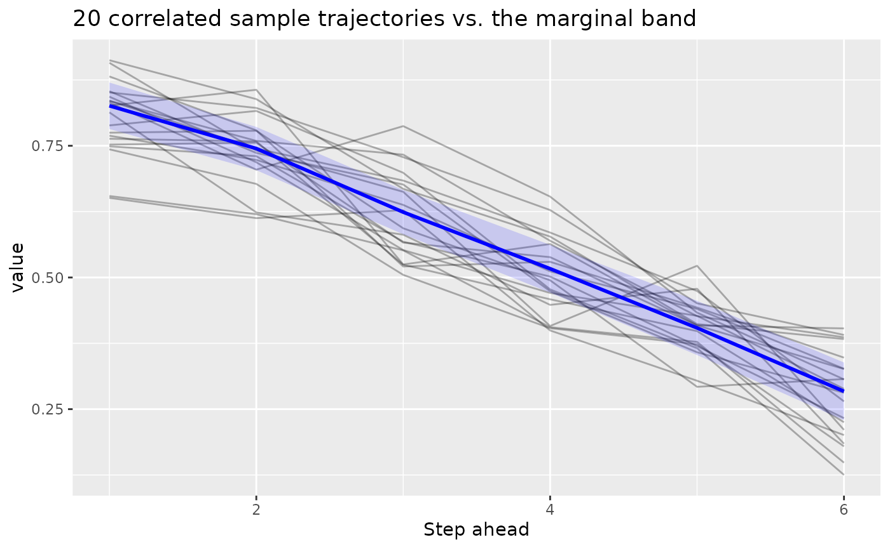

# Multi-Step Time Series Forecasting with kerasnip

This vignette shows how to build a Keras recurrent model with `kerasnip`
that forecasts several future steps of a time series at once, using the
“single-shot” multi-step pattern from Keras/TensorFlow’s own [time
series forecasting
tutorial](https://www.tensorflow.org/tutorials/structured_data/time_series),
adapted to the `tidymodels` ecosystem.

## The Building Blocks

Two ingredients turn flat, ordered tabular data into the shapes an
RNN-based forecaster needs:

- [`step_sequence()`](https://davidrsch.github.io/kerasnip/reference/step_sequence.md)
  slides a window of `timesteps` past rows into a single list-column of
  `(timesteps, features)` matrices: the `(samples, timesteps, features)`
  shape
  [`keras3::layer_lstm()`](https://keras3.posit.co/reference/layer_lstm.html)
  /
  [`keras3::layer_gru()`](https://keras3.posit.co/reference/layer_gru.html)
  expect as input.
- [`step_lead()`](https://davidrsch.github.io/kerasnip/reference/step_lead.md)
  builds the forecast target: one column per future step
  (`lead_1_<var>`, `lead_2_<var>`, …). Unlike
  [`recipes::step_lag()`](https://recipes.tidymodels.org/reference/step_lag.html),
  which only supports *past* shifts,
  [`step_lead()`](https://davidrsch.github.io/kerasnip/reference/step_lead.md)
  shifts *forward*, which is what a multi-step-ahead target needs.

When both steps draw on the same raw column,
**[`step_lead()`](https://davidrsch.github.io/kerasnip/reference/step_lead.md)
must come first**:
[`step_sequence()`](https://davidrsch.github.io/kerasnip/reference/step_sequence.md)
consumes (and drops) its source column once it has built the window, so
[`step_lead()`](https://davidrsch.github.io/kerasnip/reference/step_lead.md)
needs to see the raw column while it still exists.

The resulting outcome columns (`lead_1_<var>`, `lead_2_<var>`, …) are
all numeric and map to a *single* `output` block sized
`units = horizon`: one Keras output node predicting the whole vector of
future values in one forward pass, sharing one loss. This is different
from the multi-output models in
[`vignette("functional_api")`](https://davidrsch.github.io/kerasnip/articles/functional_api.md),
where each outcome column becomes its own independently-configured head;
here there is only one `output` block, so `kerasnip` packs the numeric
outcome columns into a single `(samples, horizon)` matrix target instead
of splitting them.

## Step 1: Load Libraries and Simulate a Series

``` r

library(kerasnip)
library(tidymodels)
#> ── Attaching packages ────────────────────────────────────── tidymodels 1.5.0 ──
#> ✔ broom        1.0.13     ✔ recipes      1.3.3 
#> ✔ dials        1.4.4      ✔ rsample      1.3.2 
#> ✔ dplyr        1.2.1      ✔ tailor       0.1.0 
#> ✔ ggplot2      4.0.3      ✔ tidyr        1.3.2 
#> ✔ infer        1.1.0      ✔ tune         2.1.0 
#> ✔ modeldata    1.5.1      ✔ workflows    1.3.0 
#> ✔ parsnip      1.6.0      ✔ workflowsets 1.1.1 
#> ✔ purrr        1.2.2      ✔ yardstick    1.4.0
#> ── Conflicts ───────────────────────────────────────── tidymodels_conflicts() ──
#> ✖ purrr::discard() masks scales::discard()
#> ✖ dplyr::filter()  masks stats::filter()
#> ✖ dplyr::lag()     masks stats::lag()
#> ✖ recipes::step()  masks stats::step()
library(keras3)
#> 
#> Attaching package: 'keras3'
#> The following object is masked from 'package:yardstick':
#> 
#>     get_weights
#> The following object is masked from 'package:infer':
#> 
#>     generate

# Silence the startup messages from remove_keras_spec
options(kerasnip.show_removal_messages = FALSE)
```

A small synthetic series (a noisy sine wave riding on a slow trend)
stands in for a real dataset, so the vignette has no external data
dependency.

``` r

set.seed(42)
n <- 400
t <- seq_len(n)
value <- sin(t / 10) + t / 400 + rnorm(n, sd = 0.05)
series <- tibble::tibble(value = value)

timesteps <- 24 # how much past history each window sees
horizon <- 6 # how many future steps to forecast at once

autoplot_data <- tibble::tibble(t = t, value = value)
ggplot(autoplot_data, aes(t, value)) +
  geom_line() +
  labs(title = "Simulated series", x = "t", y = "value")
```



Because forecasting is temporally ordered, the train/test split must
respect time:
[`rsample::initial_time_split()`](https://rsample.tidymodels.org/reference/initial_split.html)
takes the first proportion of rows for training and the remainder for
testing, rather than a random shuffle.

``` r

split <- rsample::initial_time_split(series, prop = 0.8)
train_data <- rsample::training(split)
test_data <- rsample::testing(split)
```

## Step 2: Build the Recipe

[`step_naomit()`](https://recipes.tidymodels.org/reference/step_naomit.html)
defaults to `skip = TRUE`, so the rows it drops (those without a
complete future window) are only dropped when *training*; at predict
time, future values are legitimately unknown, and the row is kept.

Both the window (predictor) and the lead columns (outcome) are *derived*
from `value` by the recipe steps themselves, rather than existing as
separate raw columns, so the recipe is built with `recipe(train_data)`
(no formula) and each step assigns the role of the column(s) it creates
([`step_lead()`](https://davidrsch.github.io/kerasnip/reference/step_lead.md)
defaults to `role = "outcome"`,
[`step_sequence()`](https://davidrsch.github.io/kerasnip/reference/step_sequence.md)
to `role = "predictor"`).

``` r

rec <- recipe(train_data) |>
  step_lead(value, lead = seq_len(horizon), prefix = "lead_") |>
  step_naomit(starts_with("lead_")) |>
  step_sequence(value, timesteps = timesteps, new_col = "window")
```

## Step 3: Define Layer Blocks and the Model Specification

The input block declares the `(timesteps, features)` shape, an LSTM
layer summarizes the window, and a single `output` dense block emits all
`horizon` forecasted values at once.

``` r

input_block <- function(input_shape) {
  layer_input(shape = input_shape, name = "window_input")
}
lstm_block <- function(tensor, units = 32) {
  tensor |> layer_lstm(units = units)
}
# `units` needs a default to work around a doc-generator quirk when handling
# args with no default; it is always overridden via `output_units` below.
output_block <- function(tensor, units = 1) {
  tensor |> layer_dense(units = units)
}

model_name <- "multistep_lstm_spec"
on.exit(remove_keras_spec(model_name), add = TRUE)

create_keras_functional_spec(
  model_name = model_name,
  layer_blocks = list(
    window = input_block,
    lstm = inp_spec(lstm_block, "window"),
    output = inp_spec(output_block, "lstm")
  ),
  mode = "regression"
)
```

## Step 4: Fit and Forecast

`output_units` is set to `horizon` so the single output head predicts
the full vector of future steps in one pass.

``` r

spec <- multistep_lstm_spec(
  lstm_units = 32,
  output_units = horizon,
  fit_epochs = 30,
  fit_verbose = 0
) |>
  set_engine("keras")

wf <- workflow(rec, spec)
fit_obj <- fit(wf, data = train_data)
#> 10/10 - 0s - 36ms/step
```

[`predict()`](https://rdrr.io/r/stats/predict.html) returns a nested
`.pred` list-column: one row per input sample, each holding a small
tibble of `.step` (1 to `horizon`) and `.pred` (the forecasted value at
that step). This mirrors how the `censored` package nests multiple
survival-probability values per row (`.pred` / `.eval_time` /
`.pred_survival`), nesting over forecast step instead of evaluation
time.

``` r

preds <- predict(fit_obj, new_data = test_data)
#> 2/2 - 0s - 94ms/step
preds
#> # A tibble: 57 × 1
#>    .pred           
#>    <list>          
#>  1 <tibble [6 × 2]>
#>  2 <tibble [6 × 2]>
#>  3 <tibble [6 × 2]>
#>  4 <tibble [6 × 2]>
#>  5 <tibble [6 × 2]>
#>  6 <tibble [6 × 2]>
#>  7 <tibble [6 × 2]>
#>  8 <tibble [6 × 2]>
#>  9 <tibble [6 × 2]>
#> 10 <tibble [6 × 2]>
#> # ℹ 47 more rows

preds$.pred[[1]]
#> # A tibble: 6 × 2
#>   .step .pred
#>   <int> <dbl>
#> 1     1 0.826
#> 2     2 0.745
#> 3     3 0.624
#> 4     4 0.517
#> 5     5 0.404
#> 6     6 0.284
```

## Step 5: Visualize the Forecast

Unnesting `.pred` turns the forecast horizon for one starting point into
a plain tibble, easy to compare against the actual future values.

``` r

one_forecast <- preds |>
  dplyr::slice(1) |>
  tidyr::unnest(.pred)

actual_future <- test_data$value[seq_len(horizon) + timesteps - 1]

comparison <- one_forecast |>
  dplyr::mutate(actual = actual_future)

ggplot(comparison, aes(.step)) +
  geom_line(aes(y = .pred, color = "Forecast")) +
  geom_point(aes(y = .pred, color = "Forecast")) +
  geom_line(aes(y = actual, color = "Actual")) +
  geom_point(aes(y = actual, color = "Actual")) +
  labs(
    title = "6-step-ahead forecast vs. actual",
    x = "Step ahead",
    y = "value",
    color = NULL
  )
```



## Step 6: Uncertainty Intervals

`type = "conf_int"` and `type = "pred_int"` also work for this
vector-valued output. Each forecast step gets its *own* last-layer
Laplace posterior (its own prior precision and observation noise),
sharing the same penultimate feature representation. This is the same
independent-per-output treatment `kerasnip` already uses for separately
named multi-output heads, generalized from “multiple Dense layers” to
“multiple units of one Dense layer”. It lets uncertainty differ (and
typically grow) across the horizon instead of a single pooled width
applied to every step alike.

``` r

preds_ci <- predict(fit_obj, new_data = test_data, type = "conf_int")
#> 2/2 - 0s - 12ms/step
#> 2/2 - 0s - 12ms/step
#> 2/2 - 0s - 12ms/step
#> 2/2 - 0s - 12ms/step
#> 2/2 - 0s - 12ms/step
#> 2/2 - 0s - 12ms/step

comparison_ci <- preds_ci |>
  dplyr::slice(1) |>
  tidyr::unnest(.pred) |>
  dplyr::mutate(actual = actual_future)

ggplot(comparison_ci, aes(.step)) +
  geom_ribbon(aes(ymin = .pred_lower, ymax = .pred_upper), alpha = 0.2) +
  geom_line(aes(y = .pred, color = "Forecast")) +
  geom_point(aes(y = .pred, color = "Forecast")) +
  geom_line(aes(y = actual, color = "Actual")) +
  geom_point(aes(y = actual, color = "Actual")) +
  labs(
    title = "6-step-ahead forecast with 95% confidence intervals",
    x = "Step ahead",
    y = "value",
    color = NULL
  )
```



These are *marginal* per-step intervals: each step’s uncertainty is
computed on its own, without modeling how errors at different steps
co-move (e.g. an under-forecast at step 3 tending to also mean an
under-forecast at step 4).

## Step 7: Joint (Correlated) Prediction Intervals

`predict(..., type = "pred_int", joint = TRUE)` captures that
co-movement. Instead of a single symmetric band per step, each forecast
step’s own epistemic (weight) uncertainty is combined with a noise term
that is sampled *jointly* across steps, using the empirical covariance
of training residuals across the forecast horizon (the classic
“seemingly unrelated regression” treatment of several linear outputs
sharing one design matrix). The result is a set of correlated,
internally-consistent sample trajectories rather than independent
per-step guesses.

Rather than pre-summarizing these into another
`.pred_lower`/`.pred_upper` band, the result is returned as raw draws
tagged with a `.draw` column, the same convention `tidybayes` and the
wider tidyverse Bayesian ecosystem use for “several posterior/predictive
samples per observation”, so you can compute whatever joint or marginal
summary you need with standard `dplyr`/`tidyr` tools.

``` r

preds_joint <- predict(
  fit_obj,
  new_data = test_data,
  type = "pred_int",
  joint = TRUE,
  n_draws = 200
)
#> 2/2 - 0s - 12ms/step

one_row_draws <- preds_joint$.pred[[1]]
one_row_draws
#> # A tibble: 1,200 × 3
#>    .draw .step .pred
#>    <int> <int> <dbl>
#>  1     1     1 0.835
#>  2     2     1 0.769
#>  3     3     1 0.851
#>  4     4     1 0.835
#>  5     5     1 0.743
#>  6     6     1 0.912
#>  7     7     1 0.655
#>  8     8     1 0.749
#>  9     9     1 0.813
#> 10    10     1 0.763
#> # ℹ 1,190 more rows

# Draws at different steps are correlated, unlike the marginal intervals above.
one_row_draws |>
  tidyr::pivot_wider(names_from = .step, values_from = .pred, names_prefix = "step_") |>
  dplyr::select(step_1, step_2) |>
  cor()
#>           step_1    step_2
#> step_1 1.0000000 0.3758853
#> step_2 0.3758853 1.0000000
```

A handful of individual sampled trajectories, plotted alongside the
marginal band from Step 6, shows what the correlation buys you: real
trajectories tend to stay consistently above or below the mean forecast
across steps, rather than jittering independently step to step the way
the marginal band alone would suggest.

``` r

sample_paths <- one_row_draws |>
  dplyr::filter(.draw <= 20)

ggplot(sample_paths, aes(.step, .pred, group = .draw)) +
  geom_line(alpha = 0.3) +
  geom_ribbon(
    data = comparison_ci,
    aes(x = .step, y = .pred, ymin = .pred_lower, ymax = .pred_upper),
    inherit.aes = FALSE,
    alpha = 0.15,
    fill = "blue"
  ) +
  geom_line(
    data = comparison_ci,
    aes(x = .step, y = .pred),
    inherit.aes = FALSE,
    color = "blue",
    linewidth = 1
  ) +
  labs(
    title = "20 correlated sample trajectories vs. the marginal band",
    x = "Step ahead",
    y = "value"
  )
```



Epistemic (weight) uncertainty is still treated independently per step
even here; only the aleatoric noise term carries cross-step correlation.
A fully joint treatment of epistemic uncertainty too would need a joint
(Kronecker-factored) posterior over the entire last-layer weight matrix,
which is not implemented. `joint = TRUE` is only available for
`type = "pred_int"`; `type = "conf_int"` reflects epistemic uncertainty
only, which this implementation has no estimated cross-step correlation
source for.

## Limitations

This is a v1 building block, not a full forecasting framework. In
particular:

- **One ordered series at a time.**
  [`step_sequence()`](https://davidrsch.github.io/kerasnip/reference/step_sequence.md)
  windows the incoming data as a single series; grouped/panel
  forecasting (many independent series, e.g. per-store or per-sensor) is
  not handled automatically and would need windowing done per group
  before this recipe.
- **Fixed window and horizon.** `timesteps` and `horizon` (via
  `output_units`) are set once per spec, not tuned automatically across
  varying window lengths.
- **Epistemic uncertainty is always per-step.** `joint = TRUE` (Step 7)
  correlates the aleatoric noise across steps, but each step’s own
  model-weight uncertainty is still computed independently.

## Conclusion

[`step_sequence()`](https://davidrsch.github.io/kerasnip/reference/step_sequence.md)
and
[`step_lead()`](https://davidrsch.github.io/kerasnip/reference/step_lead.md)
let a standard `tidymodels` recipe produce the
`(samples, timesteps, features)` input and `(samples, horizon)` target
shapes a recurrent `kerasnip` model needs, so a multi-step forecaster
fits into the same `recipe() |> workflow() |> fit() |> predict()` flow
as any other model in this package.
