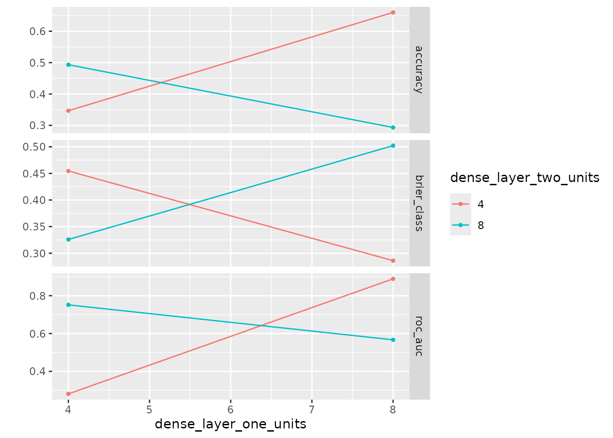

# Tuning Multiple Similar Parameters: Ensuring \`autoplot\` Uniqueness

## Introduction

When using `kerasnip` to define and tune Keras models within the
`tidymodels` framework, you might encounter situations where you want to
tune multiple parameters that, by default, map to the same underlying
`dials` parameter type. A common example is tuning the number of units
in multiple `layer_dense` blocks within the same model.

While `kerasnip` intelligently maps these parameters (e.g.,
`dense1_units` and `dense2_units` both map to
[`dials::hidden_units()`](https://dials.tidymodels.org/reference/dropout.html)),
this can lead to ambiguity when visualizing tuning results with
[`ggplot2::autoplot()`](https://ggplot2.tidyverse.org/reference/autoplot.html).
Without a way to distinguish between these otherwise identical parameter
types,
[`autoplot()`](https://ggplot2.tidyverse.org/reference/autoplot.html)
may produce errors or misleading plots.

This vignette demonstrates how to explicitly provide unique identifiers
to your tuned parameters, ensuring
[`autoplot()`](https://ggplot2.tidyverse.org/reference/autoplot.html)
can correctly visualize the results for each distinct parameter.

## The Problem (Implicit)

Consider a model with two dense layers, each with a `units` parameter.
If you were to define them for tuning without unique `id`s,
[`autoplot()`](https://ggplot2.tidyverse.org/reference/autoplot.html)
would encounter an issue because it cannot distinguish between the two
parameters.

For example, if you were to run `ggplot2::autoplot(tune_res)` without
unique `id`s, you might encounter an error similar to this:

``` r
#> Error in `dplyr::rename()`:
#> ! Names must be unique.
#> ✖ These names are duplicated:
#>   * "# Hidden Units" at locations 1 and 2.
```

This error clearly indicates that
[`autoplot()`](https://ggplot2.tidyverse.org/reference/autoplot.html) is
trying to rename columns for plotting, but it finds duplicate names like
“# Hidden Units” because both `dense1_units` and `dense2_units` are
generically identified as `hidden_units` by `dials` without further
distinction. This makes it impossible for
[`autoplot()`](https://ggplot2.tidyverse.org/reference/autoplot.html) to
differentiate their tuning results.

## The Solution: Using Unique `id`s with `tune()`

The solution is to provide a unique `id` argument to the
[`tune()`](https://hardhat.tidymodels.org/reference/tune.html) function
for each parameter you wish to distinguish.

Let’s define a simple sequential Keras model with two dense layers:

``` r
library(kerasnip)
library(keras3)
library(parsnip)
#> 
#> Attaching package: 'parsnip'
#> The following object is masked from 'package:kerasnip':
#> 
#>     get_model_env
library(dials)
#> Loading required package: scales
library(workflows)
library(recipes)
#> Loading required package: dplyr
#> 
#> Attaching package: 'dplyr'
#> The following objects are masked from 'package:stats':
#> 
#>     filter, lag
#> The following objects are masked from 'package:base':
#> 
#>     intersect, setdiff, setequal, union
#> 
#> Attaching package: 'recipes'
#> The following object is masked from 'package:stats':
#> 
#>     step
library(rsample)
library(tune)
library(ggplot2)

# Define a spec with multiple hidden unit parameters
model_name <- "autoplot_unique_spec"
# Clean up the spec if it already exists from a previous run
if (exists(model_name, mode = "function")) {
  suppressMessages(remove_keras_spec(model_name))
}

input_block <- function(model, input_shape) {
  keras3::keras_model_sequential(input_shape = input_shape)
}

dense_block <- function(model, units = 10) {
  model |> keras3::layer_dense(units = units)
}

output_block <- function(model, num_classes) {
  model |>
    keras3::layer_dense(units = num_classes, activation = "softmax")
}

create_keras_sequential_spec(
  model_name = model_name,
  layer_blocks = list(
    input = input_block,
    dense1 = dense_block,
    dense2 = dense_block,
    output = output_block
  ),
  mode = "classification"
)

# Now, create the model specification and assign unique IDs for tuning
tune_spec <- autoplot_unique_spec(
  dense1_units = tune(id = "dense_layer_one_units"),
  dense2_units = tune(id = "dense_layer_two_units")
) |>
  set_engine("keras")

print(tune_spec)
#> autoplot unique spec Model Specification (classification)
#> 
#> Main Arguments:
#>   num_input = structure(list(), class = "rlang_zap")
#>   num_dense1 = structure(list(), class = "rlang_zap")
#>   num_dense2 = structure(list(), class = "rlang_zap")
#>   num_output = structure(list(), class = "rlang_zap")
#>   dense1_units = tune(id = "dense_layer_one_units")
#>   dense2_units = tune(id = "dense_layer_two_units")
#>   learn_rate = structure(list(), class = "rlang_zap")
#>   fit_batch_size = structure(list(), class = "rlang_zap")
#>   fit_epochs = structure(list(), class = "rlang_zap")
#>   fit_callbacks = structure(list(), class = "rlang_zap")
#>   fit_validation_split = structure(list(), class = "rlang_zap")
#>   fit_validation_data = structure(list(), class = "rlang_zap")
#>   fit_shuffle = structure(list(), class = "rlang_zap")
#>   fit_class_weight = structure(list(), class = "rlang_zap")
#>   fit_sample_weight = structure(list(), class = "rlang_zap")
#>   fit_initial_epoch = structure(list(), class = "rlang_zap")
#>   fit_steps_per_epoch = structure(list(), class = "rlang_zap")
#>   fit_validation_steps = structure(list(), class = "rlang_zap")
#>   fit_validation_batch_size = structure(list(), class = "rlang_zap")
#>   fit_validation_freq = structure(list(), class = "rlang_zap")
#>   fit_verbose = structure(list(), class = "rlang_zap")
#>   fit_view_metrics = structure(list(), class = "rlang_zap")
#>   compile_optimizer = structure(list(), class = "rlang_zap")
#>   compile_loss = structure(list(), class = "rlang_zap")
#>   compile_metrics = structure(list(), class = "rlang_zap")
#>   compile_loss_weights = structure(list(), class = "rlang_zap")
#>   compile_weighted_metrics = structure(list(), class = "rlang_zap")
#>   compile_run_eagerly = structure(list(), class = "rlang_zap")
#>   compile_steps_per_execution = structure(list(), class = "rlang_zap")
#>   compile_jit_compile = structure(list(), class = "rlang_zap")
#>   compile_auto_scale_loss = structure(list(), class = "rlang_zap")
#> 
#> Computational engine: keras
```

Notice how `dense1_units` and `dense2_units` are both passed to
[`tune()`](https://hardhat.tidymodels.org/reference/tune.html), but each
is given a distinct `id`. This `id` acts as a label that
[`autoplot()`](https://ggplot2.tidyverse.org/reference/autoplot.html)
can use to differentiate the parameters.

### Setting up the Tuning Workflow

Next, we’ll set up a `tidymodels` workflow, define the parameter ranges,
and create a tuning grid.

``` r
# Set up workflow and tuning grid
rec <- recipes::recipe(Species ~ ., data = iris)
tune_wf <- workflows::workflow(rec, tune_spec)

params <- tune::extract_parameter_set_dials(tune_wf)

# Update the parameter ranges using kerasnip::hidden_units
# The `id`s provided in tune() are automatically detected and used here.
params <- params |>
  update(
    dense_layer_one_units = hidden_units(range = c(4L, 8L)),
    dense_layer_two_units = hidden_units(range = c(4L, 8L))
  )

grid <- dials::grid_regular(params, levels = 2)
control <- tune::control_grid(save_pred = FALSE, verbose = FALSE)

print(grid)
#> # A tibble: 4 × 2
#>   dense_layer_one_units dense_layer_two_units
#>                   <int>                 <int>
#> 1                     4                     4
#> 2                     8                     4
#> 3                     4                     8
#> 4                     8                     8
```

### Running the Tuning Process

Now, we run
[`tune::tune_grid`](https://tune.tidymodels.org/reference/tune_grid.html)
to perform the actual tuning. For demonstration purposes, we’ll use a
small number of resamples and a simple dataset.

``` r
# Run tuning
tune_res <- tune::tune_grid(
  tune_wf,
  resamples = rsample::vfold_cv(iris, v = 2),
  grid = grid,
  control = control
)
#> 3/3 - 0s - 18ms/step
#> 3/3 - 0s - 7ms/step
#> 3/3 - 0s - 18ms/step
#> 3/3 - 0s - 7ms/step
#> 3/3 - 0s - 18ms/step
#> 3/3 - 0s - 7ms/step
#> 3/3 - 0s - 19ms/step
#> 3/3 - 0s - 7ms/step
#> 3/3 - 0s - 17ms/step
#> 3/3 - 0s - 7ms/step
#> 3/3 - 0s - 17ms/step
#> 3/3 - 0s - 7ms/step
#> 3/3 - 0s - 17ms/step
#> 3/3 - 0s - 7ms/step
#> 3/3 - 0s - 18ms/step
#> 3/3 - 0s - 7ms/step

print(tune_res)
#> # Tuning results
#> # 2-fold cross-validation 
#> # A tibble: 2 × 4
#>   splits          id    .metrics          .notes          
#>   <list>          <chr> <list>            <list>          
#> 1 <split [75/75]> Fold1 <tibble [12 × 6]> <tibble [0 × 4]>
#> 2 <split [75/75]> Fold2 <tibble [12 × 6]> <tibble [0 × 4]>
```

### Visualizing Results with `autoplot()`

With the tuning complete, we can now use
[`ggplot2::autoplot()`](https://ggplot2.tidyverse.org/reference/autoplot.html)
to visualize the results. Because we provided unique `id`s,
[`autoplot()`](https://ggplot2.tidyverse.org/reference/autoplot.html)
can correctly generate separate plots for each tuned parameter.

``` r
# Assert that autoplot works without error
ggplot2::autoplot(tune_res)
```



As you can see,
[`autoplot()`](https://ggplot2.tidyverse.org/reference/autoplot.html)
successfully generates a plot showing the performance across the
different values for `dense_layer_one_units` and `dense_layer_two_units`
independently.

## Why Unique `id`s are Necessary

Internally, `kerasnip` maps arguments like `units` from your
`layer_blocks` functions to appropriate `dials` parameter objects (e.g.,
[`dials::hidden_units()`](https://dials.tidymodels.org/reference/dropout.html)).
When multiple such arguments exist, they all point to the *same type* of
`dials` parameter.

The `id` argument in
[`tune()`](https://hardhat.tidymodels.org/reference/tune.html) serves as
a unique identifier that `tune` and
[`ggplot2::autoplot()`](https://ggplot2.tidyverse.org/reference/autoplot.html)
use to distinguish between different instances of these parameter types.
Without it,
[`autoplot()`](https://ggplot2.tidyverse.org/reference/autoplot.html)
would see multiple parameters of type `hidden_units` and wouldn’t know
how to plot them separately, leading to errors or combining them
incorrectly.

## Best Practices

- **Always use unique `id`s:** When tuning multiple parameters that are
  conceptually similar (e.g., `units` in different layers, `rate` in
  different dropout layers), always provide a descriptive and unique
  `id` to the
  [`tune()`](https://hardhat.tidymodels.org/reference/tune.html)
  function.
- **Descriptive `id`s:** Choose `id`s that clearly indicate which part
  of the model the parameter belongs to (e.g., `dense_layer_one_units`,
  `conv_filter_size`). This improves readability and understanding of
  your tuning results.

By following this practice, you ensure that your `kerasnip` models are
robustly tunable and that their results can be clearly visualized using
the `tidymodels` ecosystem.
