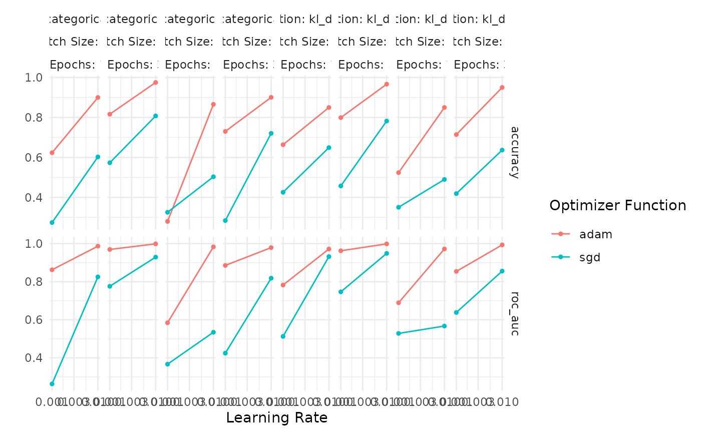

# Tuning Fit and Compile Arguments

## Introduction

While `kerasnip` makes it easy to tune the architecture of a Keras model
(e.g., the number of layers or the number of units in a layer), it is
often just as important to tune the parameters that control the training
process itself. `kerasnip` exposes these parameters through special
`fit_*` and `compile_*` arguments in the model specification.

This vignette provides a comprehensive example of how to tune these
arguments within a `tidymodels` workflow. We will tune:

- **`fit_epochs`**: The number of training epochs.
- **`fit_batch_size`**: The number of samples per gradient update.
- **`compile_optimizer`**: The optimization algorithm (e.g., “adam”,
  “sgd”).
- **`compile_loss`**: The loss function used for training.
- **`learn_rate`**: The learning rate for the optimizer.

## Setup

First, we load the necessary packages.

``` r
library(kerasnip)
library(tidymodels)
#> ── Attaching packages ────────────────────────────────────── tidymodels 1.5.0 ──
#> ✔ broom        1.0.12     ✔ recipes      1.3.2 
#> ✔ dials        1.4.3      ✔ rsample      1.3.2 
#> ✔ dplyr        1.2.1      ✔ tailor       0.1.0 
#> ✔ ggplot2      4.0.3      ✔ tidyr        1.3.2 
#> ✔ infer        1.1.0      ✔ tune         2.1.0 
#> ✔ modeldata    1.5.1      ✔ workflows    1.3.0 
#> ✔ parsnip      1.5.0      ✔ workflowsets 1.1.1 
#> ✔ purrr        1.2.2      ✔ yardstick    1.4.0
#> ── Conflicts ───────────────────────────────────────── tidymodels_conflicts() ──
#> ✖ purrr::discard() masks scales::discard()
#> ✖ dplyr::filter()  masks stats::filter()
#> ✖ dplyr::lag()     masks stats::lag()
#> ✖ recipes::step()  masks stats::step()
library(keras3)
#> 
#> Attaching package: 'keras3'
#> The following object is masked from 'package:yardstick':
#> 
#>     get_weights
#> The following object is masked from 'package:infer':
#> 
#>     generate
```

## Data Preparation

We will use the classic `iris` dataset for this example. It’s a simple,
small dataset, which is ideal for demonstrating the tuning process
without long training times.

``` r
# Split data into training and testing sets
set.seed(123)
iris_split <- initial_split(iris, prop = 0.8, strata = Species)
iris_train <- training(iris_split)
iris_test <- testing(iris_split)

# Create cross-validation folds for tuning
iris_folds <- vfold_cv(iris_train, v = 3, strata = Species)
```

## Define a `kerasnip` Model

We’ll create a very simple sequential model with a single dense layer.
This keeps the focus on tuning the `fit_*` and `compile_*` arguments
rather than the model architecture.

``` r
# Define layer blocks
input_block <- function(model, input_shape) {
  keras_model_sequential(input_shape = input_shape)
}
dense_block <- function(model, units = 10) {
  model |> layer_dense(units = units, activation = "relu")
}
output_block <- function(model, num_classes) {
  model |> layer_dense(units = num_classes, activation = "softmax")
}

# Create the kerasnip model specification function
create_keras_sequential_spec(
  model_name = "iris_mlp",
  layer_blocks = list(
    input = input_block,
    dense = dense_block,
    output = output_block
  ),
  mode = "classification"
)
```

## Define the Tunable Specification

Now, we create an instance of our `iris_mlp` model. We set the arguments
we want to optimize to
[`tune()`](https://hardhat.tidymodels.org/reference/tune.html).

``` r
# Define the tunable model specification
tune_spec <- iris_mlp(
  dense_units = 16, # Keep architecture fixed for this example
  fit_epochs = tune(),
  fit_batch_size = tune(),
  compile_optimizer = tune(),
  compile_loss = tune(),
  learn_rate = tune()
) |>
  set_engine("keras")

print(tune_spec)
#> iris mlp Model Specification (classification)
#> 
#> Main Arguments:
#>   num_input = structure(list(), class = "rlang_zap")
#>   num_dense = structure(list(), class = "rlang_zap")
#>   num_output = structure(list(), class = "rlang_zap")
#>   dense_units = 16
#>   learn_rate = tune()
#>   fit_batch_size = tune()
#>   fit_epochs = tune()
#>   fit_callbacks = structure(list(), class = "rlang_zap")
#>   fit_validation_split = structure(list(), class = "rlang_zap")
#>   fit_validation_data = structure(list(), class = "rlang_zap")
#>   fit_shuffle = structure(list(), class = "rlang_zap")
#>   fit_class_weight = structure(list(), class = "rlang_zap")
#>   fit_sample_weight = structure(list(), class = "rlang_zap")
#>   fit_initial_epoch = structure(list(), class = "rlang_zap")
#>   fit_steps_per_epoch = structure(list(), class = "rlang_zap")
#>   fit_validation_steps = structure(list(), class = "rlang_zap")
#>   fit_validation_batch_size = structure(list(), class = "rlang_zap")
#>   fit_validation_freq = structure(list(), class = "rlang_zap")
#>   fit_verbose = structure(list(), class = "rlang_zap")
#>   fit_view_metrics = structure(list(), class = "rlang_zap")
#>   compile_optimizer = tune()
#>   compile_loss = tune()
#>   compile_metrics = structure(list(), class = "rlang_zap")
#>   compile_loss_weights = structure(list(), class = "rlang_zap")
#>   compile_weighted_metrics = structure(list(), class = "rlang_zap")
#>   compile_run_eagerly = structure(list(), class = "rlang_zap")
#>   compile_steps_per_execution = structure(list(), class = "rlang_zap")
#>   compile_jit_compile = structure(list(), class = "rlang_zap")
#>   compile_auto_scale_loss = structure(list(), class = "rlang_zap")
#> 
#> Computational engine: keras
```

## Create Workflow and Tuning Grid

Next, we create a `workflow` and define the search space for our
hyperparameters using `dials`. `kerasnip` provides special `dials`
parameter functions for `optimizer` and `loss`.

``` r
# Create a simple recipe
iris_recipe <- recipe(Species ~ ., data = iris_train) |>
  step_normalize(all_numeric_predictors())

# Create the workflow
tune_wf <- workflow() |>
  add_recipe(iris_recipe) |>
  add_model(tune_spec)

# Define the tuning grid
params <- extract_parameter_set_dials(tune_wf) |>
  update(
    fit_epochs = epochs(c(10, 30)),
    fit_batch_size = batch_size(c(16, 64), trans = NULL),
    compile_optimizer = optimizer_function(values = c("adam", "sgd", "rmsprop")),
    compile_loss = loss_function_keras(values = c("categorical_crossentropy", "kl_divergence")),
    learn_rate = learn_rate(c(0.001, 0.01), trans = NULL)
  )

set.seed(456)
tuning_grid <- grid_regular(params, levels = 2)

tuning_grid
#> # A tibble: 32 × 5
#>    learn_rate fit_batch_size fit_epochs compile_optimizer compile_loss          
#>         <dbl>          <int>      <int> <chr>             <chr>                 
#>  1      0.001             16         10 adam              categorical_crossentr…
#>  2      0.01              16         10 adam              categorical_crossentr…
#>  3      0.001             64         10 adam              categorical_crossentr…
#>  4      0.01              64         10 adam              categorical_crossentr…
#>  5      0.001             16         30 adam              categorical_crossentr…
#>  6      0.01              16         30 adam              categorical_crossentr…
#>  7      0.001             64         30 adam              categorical_crossentr…
#>  8      0.01              64         30 adam              categorical_crossentr…
#>  9      0.001             16         10 sgd               categorical_crossentr…
#> 10      0.01              16         10 sgd               categorical_crossentr…
#> # ℹ 22 more rows
```

## Tune the Model

With the workflow and grid defined, we can now run the hyperparameter
tuning using
[`tune_grid()`](https://tune.tidymodels.org/reference/tune_grid.html).

``` r
tune_res <- tune_grid(
  tune_wf,
  resamples = iris_folds,
  grid = tuning_grid,
  metrics = metric_set(accuracy, roc_auc),
  control = control_grid(save_pred = FALSE, save_workflow = TRUE, verbose = FALSE)
)
#> 2/2 - 0s - 24ms/step
#> 2/2 - 0s - 10ms/step
#> 2/2 - 0s - 23ms/step
#> 2/2 - 0s - 10ms/step
#> 2/2 - 0s - 23ms/step
#> 2/2 - 0s - 10ms/step
#> 2/2 - 0s - 23ms/step
#> 2/2 - 0s - 10ms/step
#> 2/2 - 0s - 23ms/step
#> 2/2 - 0s - 10ms/step
#> 2/2 - 0s - 23ms/step
#> 2/2 - 0s - 11ms/step
#> 2/2 - 0s - 23ms/step
#> 2/2 - 0s - 10ms/step
#> 2/2 - 0s - 23ms/step
#> 2/2 - 0s - 10ms/step
#> 2/2 - 0s - 23ms/step
#> 2/2 - 0s - 11ms/step
#> 2/2 - 0s - 23ms/step
#> 2/2 - 0s - 10ms/step
#> 2/2 - 0s - 23ms/step
#> 2/2 - 0s - 10ms/step
#> 2/2 - 0s - 22ms/step
#> 2/2 - 0s - 10ms/step
#> 2/2 - 0s - 23ms/step
#> 2/2 - 0s - 10ms/step
#> 2/2 - 0s - 23ms/step
#> 2/2 - 0s - 10ms/step
#> 2/2 - 0s - 24ms/step
#> 2/2 - 0s - 11ms/step
#> 2/2 - 0s - 23ms/step
#> 2/2 - 0s - 11ms/step
#> 2/2 - 0s - 23ms/step
#> 2/2 - 0s - 10ms/step
#> 2/2 - 0s - 23ms/step
#> 2/2 - 0s - 11ms/step
#> 2/2 - 0s - 23ms/step
#> 2/2 - 0s - 10ms/step
#> 2/2 - 0s - 23ms/step
#> 2/2 - 0s - 11ms/step
#> 2/2 - 0s - 23ms/step
#> 2/2 - 0s - 10ms/step
#> 2/2 - 0s - 23ms/step
#> 2/2 - 0s - 10ms/step
#> 2/2 - 0s - 23ms/step
#> 2/2 - 0s - 10ms/step
#> 2/2 - 0s - 23ms/step
#> 2/2 - 0s - 10ms/step
#> 2/2 - 0s - 23ms/step
#> 2/2 - 0s - 10ms/step
#> 2/2 - 0s - 24ms/step
#> 2/2 - 0s - 10ms/step
#> 2/2 - 0s - 23ms/step
#> 2/2 - 0s - 10ms/step
#> 2/2 - 0s - 23ms/step
#> 2/2 - 0s - 10ms/step
#> 2/2 - 0s - 23ms/step
#> 2/2 - 0s - 10ms/step
#> 2/2 - 0s - 24ms/step
#> 2/2 - 0s - 11ms/step
#> 2/2 - 0s - 23ms/step
#> 2/2 - 0s - 11ms/step
#> 2/2 - 0s - 23ms/step
#> 2/2 - 0s - 11ms/step
#> 2/2 - 0s - 23ms/step
#> 2/2 - 0s - 10ms/step
#> 2/2 - 0s - 23ms/step
#> 2/2 - 0s - 11ms/step
#> 2/2 - 0s - 23ms/step
#> 2/2 - 0s - 10ms/step
#> 2/2 - 0s - 23ms/step
#> 2/2 - 0s - 10ms/step
#> 2/2 - 0s - 23ms/step
#> 2/2 - 0s - 10ms/step
#> 2/2 - 0s - 23ms/step
#> 2/2 - 0s - 10ms/step
#> 2/2 - 0s - 23ms/step
#> 2/2 - 0s - 10ms/step
#> 2/2 - 0s - 23ms/step
#> 2/2 - 0s - 10ms/step
#> 2/2 - 0s - 22ms/step
#> 2/2 - 0s - 10ms/step
#> 2/2 - 0s - 23ms/step
#> 2/2 - 0s - 10ms/step
#> 2/2 - 0s - 23ms/step
#> 2/2 - 0s - 10ms/step
#> 2/2 - 0s - 23ms/step
#> 2/2 - 0s - 10ms/step
#> 2/2 - 0s - 23ms/step
#> 2/2 - 0s - 10ms/step
#> 2/2 - 0s - 23ms/step
#> 2/2 - 0s - 11ms/step
#> 2/2 - 0s - 23ms/step
#> 2/2 - 0s - 10ms/step
#> 2/2 - 0s - 23ms/step
#> 2/2 - 0s - 10ms/step
#> 2/2 - 0s - 24ms/step
#> 2/2 - 0s - 10ms/step
#> 2/2 - 0s - 24ms/step
#> 2/2 - 0s - 10ms/step
#> 2/2 - 0s - 23ms/step
#> 2/2 - 0s - 10ms/step
#> 2/2 - 0s - 23ms/step
#> 2/2 - 0s - 10ms/step
#> 2/2 - 0s - 23ms/step
#> 2/2 - 0s - 11ms/step
#> 2/2 - 0s - 23ms/step
#> 2/2 - 0s - 10ms/step
#> 2/2 - 0s - 23ms/step
#> 2/2 - 0s - 10ms/step
#> 2/2 - 0s - 23ms/step
#> 2/2 - 0s - 10ms/step
#> 2/2 - 0s - 23ms/step
#> 2/2 - 0s - 10ms/step
#> 2/2 - 0s - 23ms/step
#> 2/2 - 0s - 10ms/step
#> 2/2 - 0s - 23ms/step
#> 2/2 - 0s - 10ms/step
#> 2/2 - 0s - 23ms/step
#> 2/2 - 0s - 10ms/step
#> 2/2 - 0s - 23ms/step
#> 2/2 - 0s - 10ms/step
#> 2/2 - 0s - 22ms/step
#> 2/2 - 0s - 10ms/step
#> 2/2 - 0s - 23ms/step
#> 2/2 - 0s - 10ms/step
#> 2/2 - 0s - 23ms/step
#> 2/2 - 0s - 10ms/step
#> 2/2 - 0s - 23ms/step
#> 2/2 - 0s - 10ms/step
#> 2/2 - 0s - 23ms/step
#> 2/2 - 0s - 11ms/step
#> 2/2 - 0s - 23ms/step
#> 2/2 - 0s - 10ms/step
#> 2/2 - 0s - 23ms/step
#> 2/2 - 0s - 10ms/step
#> 2/2 - 0s - 25ms/step
#> 2/2 - 0s - 12ms/step
#> 2/2 - 0s - 24ms/step
#> 2/2 - 0s - 11ms/step
#> 2/2 - 0s - 23ms/step
#> 2/2 - 0s - 11ms/step
#> 2/2 - 0s - 23ms/step
#> 2/2 - 0s - 11ms/step
#> 2/2 - 0s - 24ms/step
#> 2/2 - 0s - 11ms/step
#> 2/2 - 0s - 23ms/step
#> 2/2 - 0s - 10ms/step
#> 2/2 - 0s - 23ms/step
#> 2/2 - 0s - 11ms/step
#> 2/2 - 0s - 23ms/step
#> 2/2 - 0s - 10ms/step
#> 2/2 - 0s - 23ms/step
#> 2/2 - 0s - 11ms/step
#> 2/2 - 0s - 23ms/step
#> 2/2 - 0s - 10ms/step
#> 2/2 - 0s - 23ms/step
#> 2/2 - 0s - 10ms/step
#> 2/2 - 0s - 24ms/step
#> 2/2 - 0s - 11ms/step
#> 2/2 - 0s - 23ms/step
#> 2/2 - 0s - 11ms/step
#> 2/2 - 0s - 23ms/step
#> 2/2 - 0s - 10ms/step
#> 2/2 - 0s - 23ms/step
#> 2/2 - 0s - 10ms/step
#> 2/2 - 0s - 23ms/step
#> 2/2 - 0s - 10ms/step
#> 2/2 - 0s - 23ms/step
#> 2/2 - 0s - 10ms/step
#> 2/2 - 0s - 24ms/step
#> 2/2 - 0s - 10ms/step
#> 2/2 - 0s - 23ms/step
#> 2/2 - 0s - 11ms/step
#> 2/2 - 0s - 24ms/step
#> 2/2 - 0s - 11ms/step
#> 2/2 - 0s - 23ms/step
#> 2/2 - 0s - 10ms/step
#> 2/2 - 0s - 23ms/step
#> 2/2 - 0s - 10ms/step
#> 2/2 - 0s - 23ms/step
#> 2/2 - 0s - 10ms/step
#> 2/2 - 0s - 22ms/step
#> 2/2 - 0s - 10ms/step
#> 2/2 - 0s - 23ms/step
#> 2/2 - 0s - 10ms/step
#> 2/2 - 0s - 23ms/step
#> 2/2 - 0s - 11ms/step
#> 2/2 - 0s - 24ms/step
#> 2/2 - 0s - 11ms/step
#> 2/2 - 0s - 24ms/step
#> 2/2 - 0s - 11ms/step
```

## Inspect the Results

Let’s examine the results to see how the different combinations of
fitting and compilation parameters performed.

``` r
# Show the best performing models based on accuracy
show_best(tune_res, metric = "accuracy")
#> # A tibble: 5 × 11
#>   learn_rate fit_batch_size fit_epochs compile_optimizer compile_loss    .metric
#>        <dbl>          <int>      <int> <chr>             <chr>           <chr>  
#> 1       0.01             16         30 adam              categorical_cr… accura…
#> 2       0.01             16         30 adam              kl_divergence   accura…
#> 3       0.01             64         30 adam              kl_divergence   accura…
#> 4       0.01             64         30 adam              categorical_cr… accura…
#> 5       0.01             16         10 adam              categorical_cr… accura…
#> # ℹ 5 more variables: .estimator <chr>, mean <dbl>, n <int>, std_err <dbl>,
#> #   .config <chr>

# Plot the results
autoplot(tune_res) + theme_minimal()
```



``` r

# Select the best hyperparameters
best_params <- select_best(tune_res, metric = "accuracy")
print(best_params)
#> # A tibble: 1 × 6
#>   learn_rate fit_batch_size fit_epochs compile_optimizer compile_loss    .config
#>        <dbl>          <int>      <int> <chr>             <chr>           <chr>  
#> 1       0.01             16         30 adam              categorical_cr… pre0_m…
```

The results show that `tune` has successfully explored different
optimizers, loss functions, learning rates, epochs, and batch sizes,
identifying the combination that yields the best accuracy.

## Finalize and Fit

Finally, we finalize our workflow with the best-performing
hyperparameters and fit the model one last time on the full training
dataset.

``` r
# Finalize the workflow
final_wf <- finalize_workflow(tune_wf, best_params)

# Fit the final model
final_fit <- fit(final_wf, data = iris_train)

print(final_fit)
#> ══ Workflow [trained] ══════════════════════════════════════════════════════════
#> Preprocessor: Recipe
#> Model: iris_mlp()
#> 
#> ── Preprocessor ────────────────────────────────────────────────────────────────
#> 1 Recipe Step
#> 
#> • step_normalize()
#> 
#> ── Model ───────────────────────────────────────────────────────────────────────
#> $fit
#> Model: "sequential_96"
#> ┏━━━━━━━━━━━━━━━━━━━━━━━━━━━━━━━━━━━┳━━━━━━━━━━━━━━━━━━━━━━━━━━┳━━━━━━━━━━━━━━━┓
#> ┃ Layer (type)                      ┃ Output Shape             ┃       Param # ┃
#> ┡━━━━━━━━━━━━━━━━━━━━━━━━━━━━━━━━━━━╇━━━━━━━━━━━━━━━━━━━━━━━━━━╇━━━━━━━━━━━━━━━┩
#> │ dense_192 (Dense)                 │ (None, 16)               │            80 │
#> ├───────────────────────────────────┼──────────────────────────┼───────────────┤
#> │ dense_193 (Dense)                 │ (None, 3)                │            51 │
#> └───────────────────────────────────┴──────────────────────────┴───────────────┘
#>  Total params: 395 (1.55 KB)
#>  Trainable params: 131 (524.00 B)
#>  Non-trainable params: 0 (0.00 B)
#>  Optimizer params: 264 (1.04 KB)
#> 
#> $keras_bytes
#>     [1] 50 4b 03 04 14 00 00 00 00 00 00 00 21 00 ef 25 6d f0 40 00 00 00 40 00
#>    [25] 00 00 0d 00 00 00 6d 65 74 61 64 61 74 61 2e 6a 73 6f 6e 7b 22 6b 65 72
#>    [49] 61 73 5f 76 65 72 73 69 6f 6e 22 3a 20 22 33 2e 31 34 2e 30 22 2c 20 22
#>    [73] 64 61 74 65 5f 73 61 76 65 64 22 3a 20 22 32 30 32 36 2d 30 34 2d 32 38
#>    [97] 40 31 31 3a 30 30 3a 31 34 22 7d 50 4b 03 04 14 00 00 00 00 00 00 00 21
#>   [121] 00 0f 5b 9b 0f 7b 0b 00 00 7b 0b 00 00 0b 00 00 00 63 6f 6e 66 69 67 2e
#>   [145] 6a 73 6f 6e 7b 22 6d 6f 64 75 6c 65 22 3a 20 22 6b 65 72 61 73 22 2c 20
#>   [169] 22 63 6c 61 73 73 5f 6e 61 6d 65 22 3a 20 22 53 65 71 75 65 6e 74 69 61
#>   [193] 6c 22 2c 20 22 63 6f 6e 66 69 67 22 3a 20 7b 22 6e 61 6d 65 22 3a 20 22
#>   [217] 73 65 71 75 65 6e 74 69 61 6c 5f 39 36 22 2c 20 22 74 72 61 69 6e 61 62
#>   [241] 6c 65 22 3a 20 74 72 75 65 2c 20 22 64 74 79 70 65 22 3a 20 7b 22 6d 6f
#>   [265] 64 75 6c 65 22 3a 20 22 6b 65 72 61 73 22 2c 20 22 63 6c 61 73 73 5f 6e
#>   [289] 61 6d 65 22 3a 20 22 44 54 79 70 65 50 6f 6c 69 63 79 22 2c 20 22 63 6f
#>   [313] 6e 66 69 67 22 3a 20 7b 22 6e 61 6d 65 22 3a 20 22 66 6c 6f 61 74 33 32
#>   [337] 22 7d 2c 20 22 72 65 67 69 73 74 65 72 65 64 5f 6e 61 6d 65 22 3a 20 6e
#>   [361] 75 6c 6c 2c 20 22 73 68 61 72 65 64 5f 6f 62 6a 65 63 74 5f 69 64 22 3a
#>   [385] 20 31 34 30 33 36 32 36 36 39 39 37 32 33 30 34 7d 2c 20 22 6c 61 79 65
#>   [409] 72 73 22 3a 20 5b 7b 22 6d 6f 64 75 6c 65 22 3a 20 22 6b 65 72 61 73 2e
#>   [433] 6c 61 79 65 72 73 22 2c 20 22 63 6c 61 73 73 5f 6e 61 6d 65 22 3a 20 22
#>   [457] 49 6e 70 75 74 4c 61 79 65 72 22 2c 20 22 63 6f 6e 66 69 67 22 3a 20 7b
#>   [481] 22 62 61 74 63 68 5f 73 68 61 70 65 22 3a 20 5b 6e 75 6c 6c 2c 20 34 5d
#>   [505] 2c 20 22 64 74 79 70 65 22 3a 20 22 66 6c 6f 61 74 33 32 22 2c 20 22 73
#>   [529] 70 61 72 73 65 22 3a 20 66 61 6c 73 65 2c 20 22 72 61 67 67 65 64 22 3a
#>   [553] 20 66 61 6c 73 65 2c 20 22 6e 61 6d 65 22 3a 20 22 69 6e 70 75 74 5f 6c
#>   [577] 61 79 65 72 5f 39 36 22 2c 20 22 6f 70 74 69 6f 6e 61 6c 22 3a 20 66 61
#>   [601] 6c 73 65 7d 2c 20 22 72 65 67 69 73 74 65 72 65 64 5f 6e 61 6d 65 22 3a
#>   [625] 20 6e 75 6c 6c 7d 2c 20 7b 22 6d 6f 64 75 6c 65 22 3a 20 22 6b 65 72 61
#>   [649] 73 2e 6c 61 79 65 72 73 22 2c 20 22 63 6c 61 73 73 5f 6e 61 6d 65 22 3a
#>   [673] 20 22 44 65 6e 73 65 22 2c 20 22 63 6f 6e 66 69 67 22 3a 20 7b 22 6e 61
#>   [697] 6d 65 22 3a 20 22 64 65 6e 73 65 5f 31 39 32 22 2c 20 22 74 72 61 69 6e
#>   [721] 61 62 6c 65 22 3a 20 74 72 75 65 2c 20 22 64 74 79 70 65 22 3a 20 7b 22
#>   [745] 6d 6f 64 75 6c 65 22 3a 20 22 6b 65 72 61 73 22 2c 20 22 63 6c 61 73 73
#>   [769] 5f 6e 61 6d 65 22 3a 20 22 44 54 79 70 65 50 6f 6c 69 63 79 22 2c 20 22
#>   [793] 63 6f 6e 66 69 67 22 3a 20 7b 22 6e 61 6d 65 22 3a 20 22 66 6c 6f 61 74
#>   [817] 33 32 22 7d 2c 20 22 72 65 67 69 73 74 65 72 65 64 5f 6e 61 6d 65 22 3a
#> 
#> ...
#> and 970 more lines.
```

We can now use this `final_fit` object to make predictions on the test
set.

``` r
# Make predictions
predictions <- predict(final_fit, new_data = iris_test)
#> 1/1 - 0s - 34ms/step

# Evaluate performance
bind_cols(predictions, iris_test) |>
  accuracy(truth = Species, estimate = .pred_class)
#> # A tibble: 1 × 3
#>   .metric  .estimator .estimate
#>   <chr>    <chr>          <dbl>
#> 1 accuracy multiclass     0.967
```

## Conclusion

This vignette demonstrated how to tune the crucial `fit_*` and
`compile_*` arguments of a Keras model within the `tidymodels` framework
using `kerasnip`. By exposing these as tunable parameters, `kerasnip`
gives you full control over the training process, allowing you to
optimize not just the model’s architecture, but also how it learns.
