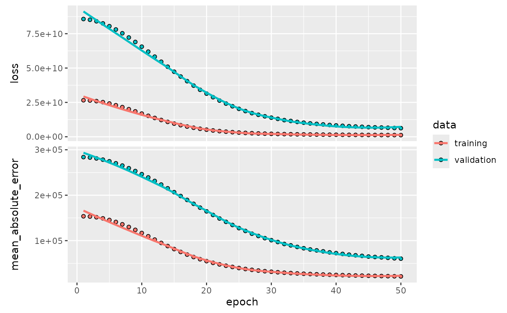

# Tidymodels Workflow with Functional Keras Models (Multi-Input)

## Introduction

This vignette demonstrates a complete `tidymodels` workflow for a
regression task using a Keras functional model defined with `kerasnip`.
We will use the Ames Housing dataset to predict house prices. A key
feature of this example is the use of a multi-input Keras model, where
numerical and categorical features are processed through separate input
branches.

`kerasnip` allows you to define complex Keras architectures, including
those with multiple inputs, and integrate them seamlessly into the
`tidymodels` ecosystem for robust modeling and tuning.

## Setup

First, we load the necessary packages.

``` r
library(kerasnip)
library(tidymodels)
#> ── Attaching packages ────────────────────────────────────── tidymodels 1.4.1 ──
#> ✔ broom        1.0.11     ✔ recipes      1.3.1 
#> ✔ dials        1.4.2      ✔ rsample      1.3.1 
#> ✔ dplyr        1.1.4      ✔ tailor       0.1.0 
#> ✔ ggplot2      4.0.1      ✔ tidyr        1.3.1 
#> ✔ infer        1.0.9      ✔ tune         2.0.1 
#> ✔ modeldata    1.5.1      ✔ workflows    1.3.0 
#> ✔ parsnip      1.4.0      ✔ workflowsets 1.1.1 
#> ✔ purrr        1.2.0      ✔ yardstick    1.3.2
#> ── Conflicts ───────────────────────────────────────── tidymodels_conflicts() ──
#> ✖ purrr::discard() masks scales::discard()
#> ✖ dplyr::filter()  masks stats::filter()
#> ✖ dplyr::lag()     masks stats::lag()
#> ✖ recipes::step()  masks stats::step()
library(keras3)
#> 
#> Attaching package: 'keras3'
#> The following object is masked from 'package:yardstick':
#> 
#>     get_weights
library(dplyr) # For data manipulation
library(ggplot2) # For plotting
library(future) # For parallel processing
#> 
#> Attaching package: 'future'
#> The following object is masked from 'package:keras3':
#> 
#>     %<-%
library(finetune) # For racing
```

## Data Preparation

We’ll use the Ames Housing dataset, which is available in the
`modeldata` package. We will then split the data into training and
testing sets.

``` r
# Select relevant columns and remove rows with missing values
ames_df <- ames |>
  select(
    Sale_Price,
    Gr_Liv_Area,
    Year_Built,
    Neighborhood,
    Bldg_Type,
    Overall_Cond,
    Total_Bsmt_SF,
    contains("SF")
  ) |>
  na.omit()

# Split data into training and testing sets
set.seed(123)
ames_split <- initial_split(ames_df, prop = 0.8, strata = Sale_Price)
ames_train <- training(ames_split)
ames_test <- testing(ames_split)

# Create cross-validation folds for tuning
ames_folds <- vfold_cv(ames_train, v = 5, strata = Sale_Price)
```

## Recipe for Preprocessing

We will create a `recipes` object to preprocess our data. This recipe
will: \* Predict `Sale_Price` using all other variables. \* Normalize
all numerical predictors. \* Create dummy variables for categorical
predictors. \* Collapse each group of predictors into a single matrix
column using
[`step_collapse()`](https://davidrsch.github.io/kerasnip/dev/reference/step_collapse.md).

This final step is crucial for the multi-input Keras model, as the
`kerasnip` functional API expects a list of matrices for multiple
inputs, where each matrix corresponds to a distinct input layer.

``` r
ames_recipe <- recipe(Sale_Price ~ ., data = ames_train) |>
  step_normalize(all_numeric_predictors()) |>
  step_collapse(all_numeric_predictors(), new_col = "numerical_input") |>
  step_dummy(Neighborhood) |>
  step_collapse(starts_with("Neighborhood"), new_col = "neighborhood_input") |>
  step_dummy(Bldg_Type) |>
  step_collapse(starts_with("Bldg_Type"), new_col = "bldg_input") |>
  step_dummy(Overall_Cond) |>
  step_collapse(starts_with("Overall_Cond"), new_col = "condition_input")
```

## Define Keras Functional Model with `kerasnip`

Now, we define our Keras functional model using `kerasnip`’s layer
blocks. This model will have four distinct input layers: one for
numerical features and three for categorical features. These branches
will be processed separately and then concatenated before the final
output layer.

``` r
# Define layer blocks for multi-input functional model

# Input blocks for numerical and categorical features
input_numerical <- function(input_shape) {
  layer_input(shape = input_shape, name = "numerical_input")
}

input_neighborhood <- function(input_shape) {
  layer_input(shape = input_shape, name = "neighborhood_input")
}

input_bldg <- function(input_shape) {
  layer_input(shape = input_shape, name = "bldg_input")
}

input_condition <- function(input_shape) {
  layer_input(shape = input_shape, name = "condition_input")
}

# Processing blocks for each input type
dense_numerical <- function(tensor, units = 32, activation = "relu") {
  tensor |>
    layer_dense(units = units, activation = activation)
}

dense_categorical <- function(tensor, units = 16, activation = "relu") {
  tensor |>
    layer_dense(units = units, activation = activation)
}

# Concatenation block
concatenate_features <- function(numeric, neighborhood, bldg, condition) {
  layer_concatenate(list(numeric, neighborhood, bldg, condition))
}

# Output block for regression
output_regression <- function(tensor) {
  layer_dense(tensor, units = 1, name = "output")
}

# Create the kerasnip model specification function
create_keras_functional_spec(
  model_name = "ames_functional_mlp",
  layer_blocks = list(
    numerical_input = input_numerical,
    neighborhood_input = input_neighborhood,
    bldg_input = input_bldg,
    condition_input = input_condition,
    processed_numerical = inp_spec(dense_numerical, "numerical_input"),
    processed_neighborhood = inp_spec(dense_categorical, "neighborhood_input"),
    processed_bldg = inp_spec(dense_categorical, "bldg_input"),
    processed_condition = inp_spec(dense_categorical, "condition_input"),
    combined_features = inp_spec(
      concatenate_features,
      c(
        numeric = "processed_numerical",
        neighborhood = "processed_neighborhood",
        bldg = "processed_bldg",
        condition = "processed_condition"
      )
    ),
    output = inp_spec(output_regression, "combined_features")
  ),
  mode = "regression"
)
```

## Model Specification

We’ll define our `ames_functional_mlp` model specification and set some
hyperparameters to
[`tune()`](https://hardhat.tidymodels.org/reference/tune.html). Note how
the arguments are prefixed with their corresponding block names (e.g.,
`processed_numerical_units`).

``` r
# Define the tunable model specification
functional_mlp_spec <- ames_functional_mlp(
  # Tunable parameters for numerical branch
  processed_numerical_units = tune(),
  # Tunable parameters for categorical branch
  processed_neighborhood_units = tune(),
  processed_bldg_units = tune(),
  processed_condition_units = tune(),
  # Fixed compilation and fitting parameters
  compile_loss = "mean_squared_error",
  compile_optimizer = "adam",
  compile_metrics = c("mean_absolute_error"),
  fit_epochs = 50,
  fit_batch_size = 32,
  fit_validation_split = 0.2,
  fit_callbacks = list(
    callback_early_stopping(monitor = "val_loss", patience = 5)
  )
) |>
  set_engine("keras")

print(functional_mlp_spec)
#> ames functional mlp Model Specification (regression)
#> 
#> Main Arguments:
#>   num_numerical_input = structure(list(), class = "rlang_zap")
#>   num_neighborhood_input = structure(list(), class = "rlang_zap")
#>   num_bldg_input = structure(list(), class = "rlang_zap")
#>   num_condition_input = structure(list(), class = "rlang_zap")
#>   num_processed_numerical = structure(list(), class = "rlang_zap")
#>   num_processed_neighborhood = structure(list(), class = "rlang_zap")
#>   num_processed_bldg = structure(list(), class = "rlang_zap")
#>   num_processed_condition = structure(list(), class = "rlang_zap")
#>   num_combined_features = structure(list(), class = "rlang_zap")
#>   num_output = structure(list(), class = "rlang_zap")
#>   processed_numerical_units = tune()
#>   processed_numerical_activation = structure(list(), class = "rlang_zap")
#>   processed_neighborhood_units = tune()
#>   processed_neighborhood_activation = structure(list(), class = "rlang_zap")
#>   processed_bldg_units = tune()
#>   processed_bldg_activation = structure(list(), class = "rlang_zap")
#>   processed_condition_units = tune()
#>   processed_condition_activation = structure(list(), class = "rlang_zap")
#>   learn_rate = structure(list(), class = "rlang_zap")
#>   fit_batch_size = 32
#>   fit_epochs = 50
#>   fit_callbacks = list(callback_early_stopping(monitor = "val_loss", patience = 5))
#>   fit_validation_split = 0.2
#>   fit_validation_data = structure(list(), class = "rlang_zap")
#>   fit_shuffle = structure(list(), class = "rlang_zap")
#>   fit_class_weight = structure(list(), class = "rlang_zap")
#>   fit_sample_weight = structure(list(), class = "rlang_zap")
#>   fit_initial_epoch = structure(list(), class = "rlang_zap")
#>   fit_steps_per_epoch = structure(list(), class = "rlang_zap")
#>   fit_validation_steps = structure(list(), class = "rlang_zap")
#>   fit_validation_batch_size = structure(list(), class = "rlang_zap")
#>   fit_validation_freq = structure(list(), class = "rlang_zap")
#>   fit_verbose = structure(list(), class = "rlang_zap")
#>   fit_view_metrics = structure(list(), class = "rlang_zap")
#>   compile_optimizer = adam
#>   compile_loss = mean_squared_error
#>   compile_metrics = c("mean_absolute_error")
#>   compile_loss_weights = structure(list(), class = "rlang_zap")
#>   compile_weighted_metrics = structure(list(), class = "rlang_zap")
#>   compile_run_eagerly = structure(list(), class = "rlang_zap")
#>   compile_steps_per_execution = structure(list(), class = "rlang_zap")
#>   compile_jit_compile = structure(list(), class = "rlang_zap")
#>   compile_auto_scale_loss = structure(list(), class = "rlang_zap")
#> 
#> Computational engine: keras
```

## Create Workflow

A `workflow` combines the recipe and the model specification.

``` r
ames_wf <- workflow() |>
  add_recipe(ames_recipe) |>
  add_model(functional_mlp_spec)

print(ames_wf)
#> ══ Workflow ════════════════════════════════════════════════════════════════════
#> Preprocessor: Recipe
#> Model: ames_functional_mlp()
#> 
#> ── Preprocessor ────────────────────────────────────────────────────────────────
#> 8 Recipe Steps
#> 
#> • step_normalize()
#> • step_collapse()
#> • step_dummy()
#> • step_collapse()
#> • step_dummy()
#> • step_collapse()
#> • step_dummy()
#> • step_collapse()
#> 
#> ── Model ───────────────────────────────────────────────────────────────────────
#> ames functional mlp Model Specification (regression)
#> 
#> Main Arguments:
#>   num_numerical_input = structure(list(), class = "rlang_zap")
#>   num_neighborhood_input = structure(list(), class = "rlang_zap")
#>   num_bldg_input = structure(list(), class = "rlang_zap")
#>   num_condition_input = structure(list(), class = "rlang_zap")
#>   num_processed_numerical = structure(list(), class = "rlang_zap")
#>   num_processed_neighborhood = structure(list(), class = "rlang_zap")
#>   num_processed_bldg = structure(list(), class = "rlang_zap")
#>   num_processed_condition = structure(list(), class = "rlang_zap")
#>   num_combined_features = structure(list(), class = "rlang_zap")
#>   num_output = structure(list(), class = "rlang_zap")
#>   processed_numerical_units = tune()
#>   processed_numerical_activation = structure(list(), class = "rlang_zap")
#>   processed_neighborhood_units = tune()
#>   processed_neighborhood_activation = structure(list(), class = "rlang_zap")
#>   processed_bldg_units = tune()
#>   processed_bldg_activation = structure(list(), class = "rlang_zap")
#>   processed_condition_units = tune()
#>   processed_condition_activation = structure(list(), class = "rlang_zap")
#>   learn_rate = structure(list(), class = "rlang_zap")
#>   fit_batch_size = 32
#>   fit_epochs = 50
#>   fit_callbacks = list(callback_early_stopping(monitor = "val_loss", patience = 5))
#>   fit_validation_split = 0.2
#>   fit_validation_data = structure(list(), class = "rlang_zap")
#>   fit_shuffle = structure(list(), class = "rlang_zap")
#>   fit_class_weight = structure(list(), class = "rlang_zap")
#>   fit_sample_weight = structure(list(), class = "rlang_zap")
#>   fit_initial_epoch = structure(list(), class = "rlang_zap")
#>   fit_steps_per_epoch = structure(list(), class = "rlang_zap")
#>   fit_validation_steps = structure(list(), class = "rlang_zap")
#>   fit_validation_batch_size = structure(list(), class = "rlang_zap")
#>   fit_validation_freq = structure(list(), class = "rlang_zap")
#>   fit_verbose = structure(list(), class = "rlang_zap")
#>   fit_view_metrics = structure(list(), class = "rlang_zap")
#>   compile_optimizer = adam
#>   compile_loss = mean_squared_error
#>   compile_metrics = c("mean_absolute_error")
#>   compile_loss_weights = structure(list(), class = "rlang_zap")
#>   compile_weighted_metrics = structure(list(), class = "rlang_zap")
#>   compile_run_eagerly = structure(list(), class = "rlang_zap")
#>   compile_steps_per_execution = structure(list(), class = "rlang_zap")
#>   compile_jit_compile = structure(list(), class = "rlang_zap")
#>   compile_auto_scale_loss = structure(list(), class = "rlang_zap")
#> 
#> Computational engine: keras
```

## Define Tuning Grid

We will create a regular grid for our hyperparameters.

``` r
# Define the tuning grid
params <- extract_parameter_set_dials(ames_wf) |>
  update(
    processed_numerical_units = hidden_units(range = c(32, 128)),
    processed_neighborhood_units = hidden_units(range = c(16, 64)),
    processed_bldg_units = hidden_units(range = c(16, 64)),
    processed_condition_units = hidden_units(range = c(16, 64))
  )
functional_mlp_grid <- grid_regular(params, levels = 3)

print(functional_mlp_grid)
#> # A tibble: 81 × 4
#>    processed_numerical_units processed_neighborhood_units processed_bldg_units
#>                        <int>                        <int>                <int>
#>  1                        32                           16                   16
#>  2                        80                           16                   16
#>  3                       128                           16                   16
#>  4                        32                           40                   16
#>  5                        80                           40                   16
#>  6                       128                           40                   16
#>  7                        32                           64                   16
#>  8                        80                           64                   16
#>  9                       128                           64                   16
#> 10                        32                           16                   40
#> # ℹ 71 more rows
#> # ℹ 1 more variable: processed_condition_units <int>
```

## Tune Model

Now, we’ll use
[`tune_race_anova()`](https://finetune.tidymodels.org/reference/tune_race_anova.html)
to perform cross-validation and find the best hyperparameters.

``` r
# Note: Parallel processing with `plan(multisession)` is currently not working
# with Keras models due to backend conflicts

set.seed(123)
ames_tune_results <- tune_race_anova(
  ames_wf,
  resamples = ames_folds,
  grid = functional_mlp_grid,
  metrics = metric_set(rmse, mae, rsq),
  control = control_race(save_pred = TRUE, save_workflow = TRUE)
)
#> 15/15 - 0s - 7ms/step
#> 15/15 - 0s - 7ms/step
#> 15/15 - 0s - 7ms/step
#> 15/15 - 0s - 7ms/step
#> 15/15 - 0s - 7ms/step
#> 15/15 - 0s - 7ms/step
#> 15/15 - 0s - 7ms/step
#> 15/15 - 0s - 7ms/step
#> 15/15 - 0s - 7ms/step
#> 15/15 - 0s - 7ms/step
#> 15/15 - 0s - 7ms/step
#> 15/15 - 0s - 7ms/step
#> 15/15 - 0s - 7ms/step
#> 15/15 - 0s - 7ms/step
#> 15/15 - 0s - 7ms/step
#> 15/15 - 0s - 7ms/step
#> 15/15 - 0s - 7ms/step
#> 15/15 - 0s - 7ms/step
#> 15/15 - 0s - 7ms/step
#> 15/15 - 0s - 7ms/step
#> 15/15 - 0s - 7ms/step
#> 15/15 - 0s - 7ms/step
#> 15/15 - 0s - 7ms/step
#> 15/15 - 0s - 7ms/step
#> 15/15 - 0s - 7ms/step
#> 15/15 - 0s - 7ms/step
#> 15/15 - 0s - 7ms/step
#> 15/15 - 0s - 7ms/step
#> 15/15 - 0s - 7ms/step
#> 15/15 - 0s - 7ms/step
#> 15/15 - 0s - 7ms/step
#> 15/15 - 0s - 7ms/step
#> 15/15 - 0s - 7ms/step
#> 15/15 - 0s - 7ms/step
#> 15/15 - 0s - 7ms/step
#> 15/15 - 0s - 7ms/step
#> 15/15 - 0s - 7ms/step
#> 15/15 - 0s - 7ms/step
#> 15/15 - 0s - 7ms/step
#> 15/15 - 0s - 7ms/step
#> 15/15 - 0s - 7ms/step
#> 15/15 - 0s - 7ms/step
#> 15/15 - 0s - 7ms/step
#> 15/15 - 0s - 7ms/step
#> 15/15 - 0s - 7ms/step
#> 15/15 - 0s - 7ms/step
#> 15/15 - 0s - 7ms/step
#> 15/15 - 0s - 7ms/step
#> 15/15 - 0s - 8ms/step
#> 15/15 - 0s - 7ms/step
#> 15/15 - 0s - 7ms/step
#> 15/15 - 0s - 7ms/step
#> 15/15 - 0s - 7ms/step
#> 15/15 - 0s - 7ms/step
#> 15/15 - 0s - 7ms/step
#> 15/15 - 0s - 7ms/step
#> 15/15 - 0s - 7ms/step
#> 15/15 - 0s - 7ms/step
#> 15/15 - 0s - 7ms/step
#> 15/15 - 0s - 7ms/step
#> 15/15 - 0s - 7ms/step
#> 15/15 - 0s - 7ms/step
#> 15/15 - 0s - 7ms/step
#> 15/15 - 0s - 7ms/step
#> 15/15 - 0s - 7ms/step
#> 15/15 - 0s - 7ms/step
#> 15/15 - 0s - 7ms/step
#> 15/15 - 0s - 7ms/step
#> 15/15 - 0s - 7ms/step
#> 15/15 - 0s - 7ms/step
#> 15/15 - 0s - 7ms/step
#> 15/15 - 0s - 7ms/step
#> 15/15 - 0s - 7ms/step
#> 15/15 - 0s - 7ms/step
#> 15/15 - 0s - 7ms/step
#> 15/15 - 0s - 7ms/step
#> 15/15 - 0s - 7ms/step
#> 15/15 - 0s - 7ms/step
#> 15/15 - 0s - 8ms/step
#> 15/15 - 0s - 7ms/step
#> 15/15 - 0s - 7ms/step
#> 15/15 - 0s - 7ms/step
#> 15/15 - 0s - 7ms/step
#> 15/15 - 0s - 7ms/step
#> 15/15 - 0s - 7ms/step
#> 15/15 - 0s - 7ms/step
#> 15/15 - 0s - 7ms/step
#> 15/15 - 0s - 7ms/step
#> 15/15 - 0s - 7ms/step
#> 15/15 - 0s - 7ms/step
#> 15/15 - 0s - 7ms/step
#> 15/15 - 0s - 7ms/step
#> 15/15 - 0s - 7ms/step
#> 15/15 - 0s - 7ms/step
#> 15/15 - 0s - 7ms/step
#> 15/15 - 0s - 7ms/step
#> 15/15 - 0s - 7ms/step
#> 15/15 - 0s - 7ms/step
#> 15/15 - 0s - 7ms/step
#> 15/15 - 0s - 7ms/step
#> 15/15 - 0s - 7ms/step
#> 15/15 - 0s - 7ms/step
#> 15/15 - 0s - 7ms/step
#> 15/15 - 0s - 7ms/step
#> 15/15 - 0s - 7ms/step
#> 15/15 - 0s - 7ms/step
#> 15/15 - 0s - 7ms/step
#> 15/15 - 0s - 7ms/step
#> 15/15 - 0s - 7ms/step
#> 15/15 - 0s - 7ms/step
#> 15/15 - 0s - 7ms/step
#> 15/15 - 0s - 7ms/step
#> 15/15 - 0s - 7ms/step
#> 15/15 - 0s - 7ms/step
#> 15/15 - 0s - 7ms/step
#> 15/15 - 0s - 7ms/step
#> 15/15 - 0s - 7ms/step
#> 15/15 - 0s - 7ms/step
#> 15/15 - 0s - 8ms/step
#> 15/15 - 0s - 7ms/step
#> 15/15 - 0s - 7ms/step
#> 15/15 - 0s - 7ms/step
#> 15/15 - 0s - 7ms/step
#> 15/15 - 0s - 7ms/step
#> 15/15 - 0s - 7ms/step
#> 15/15 - 0s - 7ms/step
#> 15/15 - 0s - 7ms/step
#> 15/15 - 0s - 7ms/step
#> 15/15 - 0s - 7ms/step
#> 15/15 - 0s - 7ms/step
#> 15/15 - 0s - 7ms/step
#> 15/15 - 0s - 7ms/step
#> 15/15 - 0s - 7ms/step
#> 15/15 - 0s - 7ms/step
#> 15/15 - 0s - 7ms/step
#> 15/15 - 0s - 7ms/step
#> 15/15 - 0s - 7ms/step
#> 15/15 - 0s - 7ms/step
#> 15/15 - 0s - 7ms/step
#> 15/15 - 0s - 7ms/step
#> 15/15 - 0s - 7ms/step
#> 15/15 - 0s - 7ms/step
#> 15/15 - 0s - 7ms/step
#> 15/15 - 0s - 7ms/step
#> 15/15 - 0s - 7ms/step
#> 15/15 - 0s - 7ms/step
#> 15/15 - 0s - 7ms/step
#> 15/15 - 0s - 7ms/step
#> 15/15 - 0s - 7ms/step
#> 15/15 - 0s - 7ms/step
#> 15/15 - 0s - 7ms/step
#> 15/15 - 0s - 7ms/step
#> 15/15 - 0s - 7ms/step
#> 15/15 - 0s - 7ms/step
#> 15/15 - 0s - 7ms/step
#> 15/15 - 0s - 7ms/step
#> 15/15 - 0s - 7ms/step
#> 15/15 - 0s - 7ms/step
#> 15/15 - 0s - 7ms/step
#> 15/15 - 0s - 7ms/step
#> 15/15 - 0s - 7ms/step
#> 15/15 - 0s - 7ms/step
#> 15/15 - 0s - 7ms/step
#> 15/15 - 0s - 7ms/step
#> 15/15 - 0s - 7ms/step
#> 15/15 - 0s - 7ms/step
#> 15/15 - 0s - 7ms/step
#> 15/15 - 0s - 7ms/step
#> 15/15 - 0s - 7ms/step
#> 15/15 - 0s - 7ms/step
#> 15/15 - 0s - 7ms/step
#> 15/15 - 0s - 7ms/step
#> 15/15 - 0s - 8ms/step
#> 15/15 - 0s - 7ms/step
#> 15/15 - 0s - 7ms/step
#> 15/15 - 0s - 7ms/step
#> 15/15 - 0s - 7ms/step
#> 15/15 - 0s - 7ms/step
#> 15/15 - 0s - 7ms/step
#> 15/15 - 0s - 7ms/step
#> 15/15 - 0s - 7ms/step
#> 15/15 - 0s - 7ms/step
#> 15/15 - 0s - 7ms/step
#> 15/15 - 0s - 7ms/step
#> 15/15 - 0s - 7ms/step
#> 15/15 - 0s - 7ms/step
#> 15/15 - 0s - 8ms/step
#> 15/15 - 0s - 7ms/step
#> 15/15 - 0s - 7ms/step
#> 15/15 - 0s - 7ms/step
#> 15/15 - 0s - 7ms/step
#> 15/15 - 0s - 7ms/step
#> 15/15 - 0s - 7ms/step
#> 15/15 - 0s - 7ms/step
#> 15/15 - 0s - 7ms/step
#> 15/15 - 0s - 7ms/step
#> 15/15 - 0s - 7ms/step
#> 15/15 - 0s - 7ms/step
#> 15/15 - 0s - 7ms/step
#> 15/15 - 0s - 7ms/step
#> 15/15 - 0s - 7ms/step
#> 15/15 - 0s - 7ms/step
#> 15/15 - 0s - 7ms/step
#> 15/15 - 0s - 7ms/step
#> 15/15 - 0s - 7ms/step
#> 15/15 - 0s - 7ms/step
#> 15/15 - 0s - 7ms/step
#> 15/15 - 0s - 8ms/step
#> 15/15 - 0s - 7ms/step
#> 15/15 - 0s - 7ms/step
#> 15/15 - 0s - 7ms/step
#> 15/15 - 0s - 7ms/step
#> 15/15 - 0s - 7ms/step
#> 15/15 - 0s - 7ms/step
#> 15/15 - 0s - 7ms/step
#> 15/15 - 0s - 7ms/step
#> 15/15 - 0s - 7ms/step
#> 15/15 - 0s - 7ms/step
#> 15/15 - 0s - 7ms/step
#> 15/15 - 0s - 7ms/step
#> 15/15 - 0s - 7ms/step
#> 15/15 - 0s - 7ms/step
#> 15/15 - 0s - 7ms/step
#> 15/15 - 0s - 7ms/step
#> 15/15 - 0s - 7ms/step
#> 15/15 - 0s - 7ms/step
#> 15/15 - 0s - 7ms/step
#> 15/15 - 0s - 7ms/step
#> 15/15 - 0s - 7ms/step
#> 15/15 - 0s - 7ms/step
#> 15/15 - 0s - 7ms/step
#> 15/15 - 0s - 7ms/step
#> 15/15 - 0s - 7ms/step
#> 15/15 - 0s - 7ms/step
#> 15/15 - 0s - 7ms/step
#> 15/15 - 0s - 7ms/step
#> 15/15 - 0s - 7ms/step
#> 15/15 - 0s - 7ms/step
#> 15/15 - 0s - 7ms/step
#> 15/15 - 0s - 7ms/step
#> 15/15 - 0s - 7ms/step
#> 15/15 - 0s - 7ms/step
#> 15/15 - 0s - 7ms/step
#> 15/15 - 0s - 7ms/step
#> 15/15 - 0s - 7ms/step
#> 15/15 - 0s - 7ms/step
#> 15/15 - 0s - 7ms/step
#> 15/15 - 0s - 8ms/step
#> 15/15 - 0s - 8ms/step
#> 15/15 - 0s - 7ms/step
#> 15/15 - 0s - 7ms/step
#> 15/15 - 0s - 7ms/step
#> 15/15 - 0s - 7ms/step
#> 15/15 - 0s - 7ms/step
#> 15/15 - 0s - 7ms/step
#> 15/15 - 0s - 7ms/step
#> 15/15 - 0s - 7ms/step
```

## Inspect Tuning Results

We can inspect the tuning results to see which hyperparameter
combinations performed best.

``` r
# Show the best performing models based on RMSE
show_best(ames_tune_results, metric = "rmse", n = 5)
#> # A tibble: 3 × 10
#>   processed_numerical_units processed_neighborhood_units processed_bldg_units
#>                       <int>                        <int>                <int>
#> 1                       128                           64                   64
#> 2                       128                           64                   40
#> 3                       128                           64                   16
#> # ℹ 7 more variables: processed_condition_units <int>, .metric <chr>,
#> #   .estimator <chr>, mean <dbl>, n <int>, std_err <dbl>, .config <chr>

# Autoplot the results
# Currently does not work due to a label issue: autoplot(ames_tune_results)

# Select the best hyperparameters
best_functional_mlp_params <- select_best(ames_tune_results, metric = "rmse")
print(best_functional_mlp_params)
#> # A tibble: 1 × 5
#>   processed_numerical_units processed_neighborhood_units processed_bldg_units
#>                       <int>                        <int>                <int>
#> 1                       128                           64                   64
#> # ℹ 2 more variables: processed_condition_units <int>, .config <chr>
```

## Finalize Workflow and Fit Model

Once we have the best hyperparameters, we finalize the workflow and fit
the model on the entire training dataset.

``` r
# Finalize the workflow with the best hyperparameters
final_ames_wf <- finalize_workflow(ames_wf, best_functional_mlp_params)

# Fit the final model on the full training data
final_ames_fit <- fit(final_ames_wf, data = ames_train)

print(final_ames_fit)
#> ══ Workflow [trained] ══════════════════════════════════════════════════════════
#> Preprocessor: Recipe
#> Model: ames_functional_mlp()
#> 
#> ── Preprocessor ────────────────────────────────────────────────────────────────
#> 8 Recipe Steps
#> 
#> • step_normalize()
#> • step_collapse()
#> • step_dummy()
#> • step_collapse()
#> • step_dummy()
#> • step_collapse()
#> • step_dummy()
#> • step_collapse()
#> 
#> ── Model ───────────────────────────────────────────────────────────────────────
#> $fit
#> Model: "functional_257"
#> ┏━━━━━━━━━━━━━━━━━━━━━━━┳━━━━━━━━━━━━━━━━━━━┳━━━━━━━━━━━━━┳━━━━━━━━━━━━━━━━━━━━┓
#> ┃ Layer (type)          ┃ Output Shape      ┃     Param # ┃ Connected to       ┃
#> ┡━━━━━━━━━━━━━━━━━━━━━━━╇━━━━━━━━━━━━━━━━━━━╇━━━━━━━━━━━━━╇━━━━━━━━━━━━━━━━━━━━┩
#> │ numerical_input       │ (None, 1, 10)     │           0 │ -                  │
#> │ (InputLayer)          │                   │             │                    │
#> ├───────────────────────┼───────────────────┼─────────────┼────────────────────┤
#> │ neighborhood_input    │ (None, 1, 28)     │           0 │ -                  │
#> │ (InputLayer)          │                   │             │                    │
#> ├───────────────────────┼───────────────────┼─────────────┼────────────────────┤
#> │ bldg_input            │ (None, 1, 4)      │           0 │ -                  │
#> │ (InputLayer)          │                   │             │                    │
#> ├───────────────────────┼───────────────────┼─────────────┼────────────────────┤
#> │ condition_input       │ (None, 1, 9)      │           0 │ -                  │
#> │ (InputLayer)          │                   │             │                    │
#> ├───────────────────────┼───────────────────┼─────────────┼────────────────────┤
#> │ dense_1028 (Dense)    │ (None, 1, 128)    │       1,408 │ numerical_input[0… │
#> ├───────────────────────┼───────────────────┼─────────────┼────────────────────┤
#> │ dense_1029 (Dense)    │ (None, 1, 64)     │       1,856 │ neighborhood_inpu… │
#> ├───────────────────────┼───────────────────┼─────────────┼────────────────────┤
#> │ dense_1030 (Dense)    │ (None, 1, 64)     │         320 │ bldg_input[0][0]   │
#> ├───────────────────────┼───────────────────┼─────────────┼────────────────────┤
#> │ dense_1031 (Dense)    │ (None, 1, 64)     │         640 │ condition_input[0… │
#> ├───────────────────────┼───────────────────┼─────────────┼────────────────────┤
#> │ concatenate_257       │ (None, 1, 320)    │           0 │ dense_1028[0][0],  │
#> │ (Concatenate)         │                   │             │ dense_1029[0][0],  │
#> │                       │                   │             │ dense_1030[0][0],  │
#> │                       │                   │             │ dense_1031[0][0]   │
#> ├───────────────────────┼───────────────────┼─────────────┼────────────────────┤
#> │ output (Dense)        │ (None, 1, 1)      │         321 │ concatenate_257[0… │
#> └───────────────────────┴───────────────────┴─────────────┴────────────────────┘
#>  Total params: 13,637 (53.27 KB)
#>  Trainable params: 4,545 (17.75 KB)
#>  Non-trainable params: 0 (0.00 B)
#>  Optimizer params: 9,092 (35.52 KB)
#> 
#> $history
#> 
#> Final epoch (plot to see history):
#>                    loss: 1,178,855,296
#>     mean_absolute_error: 21,043
#>                val_loss: 6,263,413,760
#> val_mean_absolute_error: 60,360 
#> 
#> $lvl
#> NULL
#> 
#> $process_x
#> function (x) 
#> 
#> ...
#> and 88 more lines.
```

### Inspect Final Model

You can extract the underlying Keras model and its training history for
further inspection.

``` r
# Extract the Keras model summary
final_ames_fit |>
  extract_fit_parsnip() |>
  extract_keras_model() |>
  summary()
#> Model: "functional_257"
#> ┏━━━━━━━━━━━━━━━━━━━━━━━┳━━━━━━━━━━━━━━━━━━━┳━━━━━━━━━━━━━┳━━━━━━━━━━━━━━━━━━━━┓
#> ┃ Layer (type)          ┃ Output Shape      ┃     Param # ┃ Connected to       ┃
#> ┡━━━━━━━━━━━━━━━━━━━━━━━╇━━━━━━━━━━━━━━━━━━━╇━━━━━━━━━━━━━╇━━━━━━━━━━━━━━━━━━━━┩
#> │ numerical_input       │ (None, 1, 10)     │           0 │ -                  │
#> │ (InputLayer)          │                   │             │                    │
#> ├───────────────────────┼───────────────────┼─────────────┼────────────────────┤
#> │ neighborhood_input    │ (None, 1, 28)     │           0 │ -                  │
#> │ (InputLayer)          │                   │             │                    │
#> ├───────────────────────┼───────────────────┼─────────────┼────────────────────┤
#> │ bldg_input            │ (None, 1, 4)      │           0 │ -                  │
#> │ (InputLayer)          │                   │             │                    │
#> ├───────────────────────┼───────────────────┼─────────────┼────────────────────┤
#> │ condition_input       │ (None, 1, 9)      │           0 │ -                  │
#> │ (InputLayer)          │                   │             │                    │
#> ├───────────────────────┼───────────────────┼─────────────┼────────────────────┤
#> │ dense_1028 (Dense)    │ (None, 1, 128)    │       1,408 │ numerical_input[0… │
#> ├───────────────────────┼───────────────────┼─────────────┼────────────────────┤
#> │ dense_1029 (Dense)    │ (None, 1, 64)     │       1,856 │ neighborhood_inpu… │
#> ├───────────────────────┼───────────────────┼─────────────┼────────────────────┤
#> │ dense_1030 (Dense)    │ (None, 1, 64)     │         320 │ bldg_input[0][0]   │
#> ├───────────────────────┼───────────────────┼─────────────┼────────────────────┤
#> │ dense_1031 (Dense)    │ (None, 1, 64)     │         640 │ condition_input[0… │
#> ├───────────────────────┼───────────────────┼─────────────┼────────────────────┤
#> │ concatenate_257       │ (None, 1, 320)    │           0 │ dense_1028[0][0],  │
#> │ (Concatenate)         │                   │             │ dense_1029[0][0],  │
#> │                       │                   │             │ dense_1030[0][0],  │
#> │                       │                   │             │ dense_1031[0][0]   │
#> ├───────────────────────┼───────────────────┼─────────────┼────────────────────┤
#> │ output (Dense)        │ (None, 1, 1)      │         321 │ concatenate_257[0… │
#> └───────────────────────┴───────────────────┴─────────────┴────────────────────┘
#>  Total params: 13,637 (53.27 KB)
#>  Trainable params: 4,545 (17.75 KB)
#>  Non-trainable params: 0 (0.00 B)
#>  Optimizer params: 9,092 (35.52 KB)
```

``` r
# Plot the Keras model
final_ames_fit |>
  extract_fit_parsnip() |>
  extract_keras_model() |>
  plot(show_shapes = TRUE)
```


Model

``` r
# Plot the training history
final_ames_fit |>
  extract_fit_parsnip() |>
  extract_keras_history() |>
  plot()
```



## Make Predictions and Evaluate

Finally, we will make predictions on the test set and evaluate the
model’s performance.

``` r
# Make predictions on the test set
ames_test_pred <- predict(final_ames_fit, new_data = ames_test)
#> 19/19 - 0s - 6ms/step

# Combine predictions with actuals
ames_results <- tibble::tibble(
  Sale_Price = ames_test$Sale_Price,
  .pred = ames_test_pred$.pred
)

print(head(ames_results))
#> # A tibble: 6 × 2
#>   Sale_Price   .pred
#>        <int>   <dbl>
#> 1     105000  96468.
#> 2     172000 161810.
#> 3     189900 193872.
#> 4     115000 125622.
#> 5     395192 266871.
#> 6     214000 212433.

# Evaluate performance using yardstick metrics
metrics_results <- metric_set(
  rmse,
  mae,
  rsq
)(
  ames_results,
  truth = Sale_Price,
  estimate = .pred
)

print(metrics_results)
#> # A tibble: 3 × 3
#>   .metric .estimator .estimate
#>   <chr>   <chr>          <dbl>
#> 1 rmse    standard   51240.   
#> 2 mae     standard   31026.   
#> 3 rsq     standard       0.783
```
