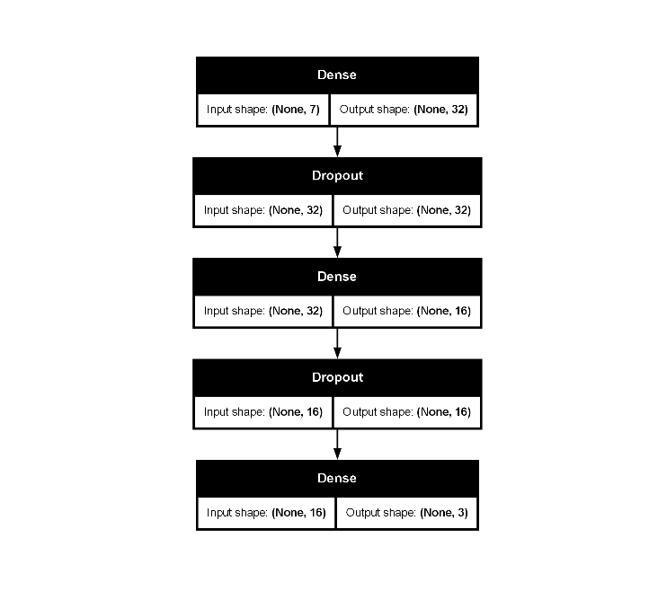
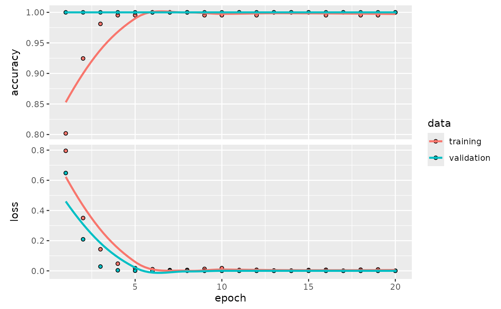
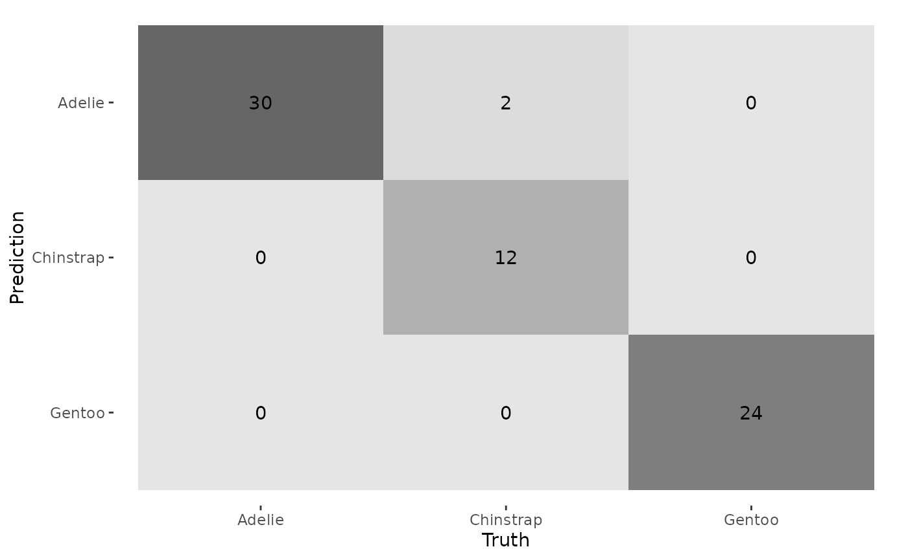

# Tidymodels Workflow with Sequential Keras Models

## Introduction

This vignette demonstrates a complete `tidymodels` workflow for a
classification task using a Keras sequential model defined with
`kerasnip`. We will use the Palmer Penguins dataset to predict penguin
species based on physical measurements.

The `kerasnip` package allows you to define Keras models using a modular
“layer block” approach, which then integrates seamlessly with the
`parsnip` and `tune` packages for model specification and hyperparameter
tuning.

## Setup

First, we load the necessary packages.

``` r
library(kerasnip)
library(tidymodels)
#> ── Attaching packages ────────────────────────────────────── tidymodels 1.5.0 ──
#> ✔ broom        1.0.12     ✔ recipes      1.3.2 
#> ✔ dials        1.4.3      ✔ rsample      1.3.2 
#> ✔ dplyr        1.2.1      ✔ tailor       0.1.0 
#> ✔ ggplot2      4.0.3      ✔ tidyr        1.3.2 
#> ✔ infer        1.1.0      ✔ tune         2.1.0 
#> ✔ modeldata    1.5.1      ✔ workflows    1.3.0 
#> ✔ parsnip      1.5.0      ✔ workflowsets 1.1.1 
#> ✔ purrr        1.2.2      ✔ yardstick    1.4.0
#> ── Conflicts ───────────────────────────────────────── tidymodels_conflicts() ──
#> ✖ purrr::discard() masks scales::discard()
#> ✖ dplyr::filter()  masks stats::filter()
#> ✖ dplyr::lag()     masks stats::lag()
#> ✖ recipes::step()  masks stats::step()
library(keras3)
#> 
#> Attaching package: 'keras3'
#> The following object is masked from 'package:yardstick':
#> 
#>     get_weights
#> The following object is masked from 'package:infer':
#> 
#>     generate
library(dplyr) # For data manipulation
library(ggplot2) # For plotting
library(future) # For parallel processing
#> 
#> Attaching package: 'future'
#> The following object is masked from 'package:keras3':
#> 
#>     %<-%
library(finetune) # For racing
```

## Data Preparation

We’ll use the `penguins` dataset from the `modeldata` package. We will
clean it by removing rows with missing values and ensuring the `species`
column is a factor.

``` r
# Remove rows with missing values
penguins_df <- penguins |>
  na.omit() |>
  # Convert species to factor for classification
  mutate(species = factor(species))

# Split data into training and testing sets
set.seed(123)
penguin_split <- initial_split(penguins_df, prop = 0.8, strata = species)
penguin_train <- training(penguin_split)

penguin_test <- testing(penguin_split)

# Create cross-validation folds for tuning
penguin_folds <- vfold_cv(penguin_train, v = 5, strata = species)
```

## Recipe for Preprocessing

We will create a `recipes` object to preprocess our data. This recipe
will: \* Predict `species` using all other variables. \* Normalize all
numeric predictors. \* Create dummy variables for all categorical
predictors.

``` r
penguin_recipe <- recipe(species ~ ., data = penguin_train) |>
  step_normalize(all_numeric_predictors()) |>
  step_dummy(all_nominal_predictors())
```

## Define Keras Sequential Model with `kerasnip`

Now, we define our Keras sequential model using `kerasnip`’s layer
blocks. We’ll create a simple Multi-Layer Perceptron (MLP) with two
hidden layers.

For a sequential Keras model with tabular data, all preprocessed input
features are typically combined into a single input layer. The `recipes`
package handles this preprocessing, transforming predictors into a
single matrix that serves as the input to the Keras model.

``` r
# Define layer blocks
input_block <- function(model, input_shape) {
  keras_model_sequential(input_shape = input_shape)
}

hidden_block <- function(model, units = 32, activation = "relu", rate = 0.2) {
  model |>
    layer_dense(units = units, activation = activation) |>
    layer_dropout(rate = rate)
}

output_block <- function(model, num_classes, activation = "softmax") {
  model |>
    layer_dense(units = num_classes, activation = activation)
}

# Create the kerasnip model specification function
create_keras_sequential_spec(
  model_name = "penguin_mlp",
  layer_blocks = list(
    input = input_block,
    hidden_1 = hidden_block,
    hidden_2 = hidden_block,
    output = output_block
  ),
  mode = "classification"
)
```

## Model Specification

We’ll define our `penguin_mlp` model specification and set some
hyperparameters to
[`tune()`](https://hardhat.tidymodels.org/reference/tune.html),
indicating that they should be optimized. We will also set fixed
parameters for compilation and fitting.

``` r
# Define the tunable model specification
mlp_spec <- penguin_mlp(
  # Tunable parameters for hidden layers
  hidden_1_units = tune(),
  hidden_1_rate = tune(),
  hidden_2_units = tune(),
  hidden_2_rate = tune(),
  # Fixed compilation and fitting parameters
  compile_loss = "categorical_crossentropy",
  compile_optimizer = "adam",
  compile_metrics = c("accuracy"),
  fit_epochs = 20,
  fit_batch_size = 32,
  fit_validation_split = 0.2,
  fit_callbacks = list(
    callback_early_stopping(monitor = "val_loss", patience = 5)
  )
) |>
  set_engine("keras")

print(mlp_spec)
#> penguin mlp Model Specification (classification)
#> 
#> Main Arguments:
#>   num_input = structure(list(), class = "rlang_zap")
#>   num_hidden_1 = structure(list(), class = "rlang_zap")
#>   num_hidden_2 = structure(list(), class = "rlang_zap")
#>   num_output = structure(list(), class = "rlang_zap")
#>   hidden_1_units = tune()
#>   hidden_1_activation = structure(list(), class = "rlang_zap")
#>   hidden_1_rate = tune()
#>   hidden_2_units = tune()
#>   hidden_2_activation = structure(list(), class = "rlang_zap")
#>   hidden_2_rate = tune()
#>   output_activation = structure(list(), class = "rlang_zap")
#>   learn_rate = structure(list(), class = "rlang_zap")
#>   fit_batch_size = 32
#>   fit_epochs = 20
#>   fit_callbacks = list(callback_early_stopping(monitor = "val_loss", patience = 5))
#>   fit_validation_split = 0.2
#>   fit_validation_data = structure(list(), class = "rlang_zap")
#>   fit_shuffle = structure(list(), class = "rlang_zap")
#>   fit_class_weight = structure(list(), class = "rlang_zap")
#>   fit_sample_weight = structure(list(), class = "rlang_zap")
#>   fit_initial_epoch = structure(list(), class = "rlang_zap")
#>   fit_steps_per_epoch = structure(list(), class = "rlang_zap")
#>   fit_validation_steps = structure(list(), class = "rlang_zap")
#>   fit_validation_batch_size = structure(list(), class = "rlang_zap")
#>   fit_validation_freq = structure(list(), class = "rlang_zap")
#>   fit_verbose = structure(list(), class = "rlang_zap")
#>   fit_view_metrics = structure(list(), class = "rlang_zap")
#>   compile_optimizer = adam
#>   compile_loss = categorical_crossentropy
#>   compile_metrics = c("accuracy")
#>   compile_loss_weights = structure(list(), class = "rlang_zap")
#>   compile_weighted_metrics = structure(list(), class = "rlang_zap")
#>   compile_run_eagerly = structure(list(), class = "rlang_zap")
#>   compile_steps_per_execution = structure(list(), class = "rlang_zap")
#>   compile_jit_compile = structure(list(), class = "rlang_zap")
#>   compile_auto_scale_loss = structure(list(), class = "rlang_zap")
#> 
#> Computational engine: keras
```

## Create Workflow

A `workflow` combines the recipe and the model specification.

``` r
penguin_wf <- workflow() |>
  add_recipe(penguin_recipe) |>
  add_model(mlp_spec)

print(penguin_wf)
#> ══ Workflow ════════════════════════════════════════════════════════════════════
#> Preprocessor: Recipe
#> Model: penguin_mlp()
#> 
#> ── Preprocessor ────────────────────────────────────────────────────────────────
#> 2 Recipe Steps
#> 
#> • step_normalize()
#> • step_dummy()
#> 
#> ── Model ───────────────────────────────────────────────────────────────────────
#> penguin mlp Model Specification (classification)
#> 
#> Main Arguments:
#>   num_input = structure(list(), class = "rlang_zap")
#>   num_hidden_1 = structure(list(), class = "rlang_zap")
#>   num_hidden_2 = structure(list(), class = "rlang_zap")
#>   num_output = structure(list(), class = "rlang_zap")
#>   hidden_1_units = tune()
#>   hidden_1_activation = structure(list(), class = "rlang_zap")
#>   hidden_1_rate = tune()
#>   hidden_2_units = tune()
#>   hidden_2_activation = structure(list(), class = "rlang_zap")
#>   hidden_2_rate = tune()
#>   output_activation = structure(list(), class = "rlang_zap")
#>   learn_rate = structure(list(), class = "rlang_zap")
#>   fit_batch_size = 32
#>   fit_epochs = 20
#>   fit_callbacks = list(callback_early_stopping(monitor = "val_loss", patience = 5))
#>   fit_validation_split = 0.2
#>   fit_validation_data = structure(list(), class = "rlang_zap")
#>   fit_shuffle = structure(list(), class = "rlang_zap")
#>   fit_class_weight = structure(list(), class = "rlang_zap")
#>   fit_sample_weight = structure(list(), class = "rlang_zap")
#>   fit_initial_epoch = structure(list(), class = "rlang_zap")
#>   fit_steps_per_epoch = structure(list(), class = "rlang_zap")
#>   fit_validation_steps = structure(list(), class = "rlang_zap")
#>   fit_validation_batch_size = structure(list(), class = "rlang_zap")
#>   fit_validation_freq = structure(list(), class = "rlang_zap")
#>   fit_verbose = structure(list(), class = "rlang_zap")
#>   fit_view_metrics = structure(list(), class = "rlang_zap")
#>   compile_optimizer = adam
#>   compile_loss = categorical_crossentropy
#>   compile_metrics = c("accuracy")
#>   compile_loss_weights = structure(list(), class = "rlang_zap")
#>   compile_weighted_metrics = structure(list(), class = "rlang_zap")
#>   compile_run_eagerly = structure(list(), class = "rlang_zap")
#>   compile_steps_per_execution = structure(list(), class = "rlang_zap")
#>   compile_jit_compile = structure(list(), class = "rlang_zap")
#>   compile_auto_scale_loss = structure(list(), class = "rlang_zap")
#> 
#> Computational engine: keras
```

## Define Tuning Grid

We will create a regular grid for our hyperparameters.

``` r
# Define the tuning grid
params <- extract_parameter_set_dials(penguin_wf) |>
  update(
    hidden_1_units = hidden_units(range = c(32, 128)),
    hidden_1_rate = dropout(range = c(0.1, 0.4)),
    hidden_2_units = hidden_units(range = c(16, 64)),
    hidden_2_rate = dropout(range = c(0.1, 0.4))
  )
mlp_grid <- grid_regular(params, levels = 3)

print(mlp_grid)
#> # A tibble: 81 × 4
#>    hidden_1_units hidden_1_rate hidden_2_units hidden_2_rate
#>             <int>         <dbl>          <int>         <dbl>
#>  1             32         0.1               16           0.1
#>  2             80         0.1               16           0.1
#>  3            128         0.1               16           0.1
#>  4             32         0.25              16           0.1
#>  5             80         0.25              16           0.1
#>  6            128         0.25              16           0.1
#>  7             32         0.400             16           0.1
#>  8             80         0.400             16           0.1
#>  9            128         0.400             16           0.1
#> 10             32         0.1               40           0.1
#> # ℹ 71 more rows
```

## Tune Model

Now, we’ll use
[`tune_race_anova()`](https://finetune.tidymodels.org/reference/tune_race_anova.html)
to perform cross-validation and find the best hyperparameters.

``` r
# Note: Parallel processing with `plan(multisession)` is currently not working
# with Keras models due to backend conflicts

set.seed(123)
penguin_tune_results <- tune_race_anova(
  penguin_wf,
  resamples = penguin_folds,
  grid = mlp_grid,
  metrics = metric_set(accuracy, roc_auc, f_meas),
  control = control_race(save_pred = TRUE, save_workflow = TRUE)
)
#> 2/2 - 0s - 28ms/step
#> 2/2 - 0s - 11ms/step
#> 2/2 - 0s - 28ms/step
#> 2/2 - 0s - 11ms/step
#> 2/2 - 0s - 27ms/step
#> 2/2 - 0s - 10ms/step
#> 2/2 - 0s - 27ms/step
#> 2/2 - 0s - 10ms/step
#> 2/2 - 0s - 28ms/step
#> 2/2 - 0s - 11ms/step
#> 2/2 - 0s - 28ms/step
#> 2/2 - 0s - 11ms/step
#> 2/2 - 0s - 28ms/step
#> 2/2 - 0s - 11ms/step
#> 2/2 - 0s - 27ms/step
#> 2/2 - 0s - 10ms/step
#> 2/2 - 0s - 27ms/step
#> 2/2 - 0s - 10ms/step
#> 2/2 - 0s - 27ms/step
#> 2/2 - 0s - 10ms/step
#> 2/2 - 0s - 28ms/step
#> 2/2 - 0s - 10ms/step
#> 2/2 - 0s - 28ms/step
#> 2/2 - 0s - 10ms/step
#> 2/2 - 0s - 27ms/step
#> 2/2 - 0s - 11ms/step
#> 2/2 - 0s - 28ms/step
#> 2/2 - 0s - 10ms/step
#> 2/2 - 0s - 28ms/step
#> 2/2 - 0s - 11ms/step
#> 2/2 - 0s - 28ms/step
#> 2/2 - 0s - 11ms/step
#> 2/2 - 0s - 27ms/step
#> 2/2 - 0s - 11ms/step
#> 2/2 - 0s - 27ms/step
#> 2/2 - 0s - 10ms/step
#> 2/2 - 0s - 30ms/step
#> 2/2 - 0s - 11ms/step
#> 2/2 - 0s - 28ms/step
#> 2/2 - 0s - 11ms/step
#> 2/2 - 0s - 28ms/step
#> 2/2 - 0s - 10ms/step
#> 2/2 - 0s - 28ms/step
#> 2/2 - 0s - 11ms/step
#> 2/2 - 0s - 28ms/step
#> 2/2 - 0s - 11ms/step
#> 2/2 - 0s - 28ms/step
#> 2/2 - 0s - 10ms/step
#> 2/2 - 0s - 29ms/step
#> 2/2 - 0s - 11ms/step
#> 2/2 - 0s - 27ms/step
#> 2/2 - 0s - 11ms/step
#> 2/2 - 0s - 29ms/step
#> 2/2 - 0s - 11ms/step
#> 2/2 - 0s - 29ms/step
#> 2/2 - 0s - 11ms/step
#> 2/2 - 0s - 27ms/step
#> 2/2 - 0s - 11ms/step
#> 2/2 - 0s - 28ms/step
#> 2/2 - 0s - 11ms/step
#> 2/2 - 0s - 28ms/step
#> 2/2 - 0s - 11ms/step
#> 2/2 - 0s - 27ms/step
#> 2/2 - 0s - 11ms/step
#> 2/2 - 0s - 27ms/step
#> 2/2 - 0s - 10ms/step
#> 2/2 - 0s - 27ms/step
#> 2/2 - 0s - 10ms/step
#> 2/2 - 0s - 214ms/step
#> 2/2 - 0s - 11ms/step
#> 2/2 - 0s - 27ms/step
#> 2/2 - 0s - 10ms/step
#> 2/2 - 0s - 27ms/step
#> 2/2 - 0s - 11ms/step
#> 2/2 - 0s - 27ms/step
#> 2/2 - 0s - 11ms/step
#> 2/2 - 0s - 26ms/step
#> 2/2 - 0s - 11ms/step
#> 2/2 - 0s - 27ms/step
#> 2/2 - 0s - 11ms/step
#> 2/2 - 0s - 28ms/step
#> 2/2 - 0s - 11ms/step
#> 2/2 - 0s - 27ms/step
#> 2/2 - 0s - 10ms/step
#> 2/2 - 0s - 27ms/step
#> 2/2 - 0s - 10ms/step
#> 2/2 - 0s - 27ms/step
#> 2/2 - 0s - 10ms/step
#> 2/2 - 0s - 27ms/step
#> 2/2 - 0s - 10ms/step
#> 2/2 - 0s - 26ms/step
#> 2/2 - 0s - 10ms/step
#> 2/2 - 0s - 27ms/step
#> 2/2 - 0s - 10ms/step
#> 2/2 - 0s - 29ms/step
#> 2/2 - 0s - 11ms/step
#> 2/2 - 0s - 27ms/step
#> 2/2 - 0s - 10ms/step
#> 2/2 - 0s - 28ms/step
#> 2/2 - 0s - 10ms/step
#> 2/2 - 0s - 28ms/step
#> 2/2 - 0s - 10ms/step
#> 2/2 - 0s - 28ms/step
#> 2/2 - 0s - 11ms/step
#> 2/2 - 0s - 27ms/step
#> 2/2 - 0s - 11ms/step
#> 2/2 - 0s - 28ms/step
#> 2/2 - 0s - 11ms/step
#> 2/2 - 0s - 27ms/step
#> 2/2 - 0s - 11ms/step
#> 2/2 - 0s - 27ms/step
#> 2/2 - 0s - 10ms/step
#> 2/2 - 0s - 28ms/step
#> 2/2 - 0s - 10ms/step
#> 2/2 - 0s - 27ms/step
#> 2/2 - 0s - 11ms/step
#> 2/2 - 0s - 27ms/step
#> 2/2 - 0s - 11ms/step
#> 2/2 - 0s - 28ms/step
#> 2/2 - 0s - 10ms/step
#> 2/2 - 0s - 27ms/step
#> 2/2 - 0s - 11ms/step
#> 2/2 - 0s - 29ms/step
#> 2/2 - 0s - 11ms/step
#> 2/2 - 0s - 28ms/step
#> 2/2 - 0s - 10ms/step
#> 2/2 - 0s - 28ms/step
#> 2/2 - 0s - 11ms/step
#> 2/2 - 0s - 26ms/step
#> 2/2 - 0s - 10ms/step
#> 2/2 - 0s - 28ms/step
#> 2/2 - 0s - 11ms/step
#> 2/2 - 0s - 28ms/step
#> 2/2 - 0s - 11ms/step
#> 2/2 - 0s - 27ms/step
#> 2/2 - 0s - 10ms/step
#> 2/2 - 0s - 26ms/step
#> 2/2 - 0s - 10ms/step
#> 2/2 - 0s - 26ms/step
#> 2/2 - 0s - 11ms/step
#> 2/2 - 0s - 27ms/step
#> 2/2 - 0s - 10ms/step
#> 2/2 - 0s - 26ms/step
#> 2/2 - 0s - 10ms/step
#> 2/2 - 0s - 27ms/step
#> 2/2 - 0s - 10ms/step
#> 2/2 - 0s - 27ms/step
#> 2/2 - 0s - 11ms/step
#> 2/2 - 0s - 27ms/step
#> 2/2 - 0s - 11ms/step
#> 2/2 - 0s - 28ms/step
#> 2/2 - 0s - 10ms/step
#> 2/2 - 0s - 26ms/step
#> 2/2 - 0s - 11ms/step
#> 2/2 - 0s - 28ms/step
#> 2/2 - 0s - 11ms/step
#> 2/2 - 0s - 27ms/step
#> 2/2 - 0s - 10ms/step
#> 2/2 - 0s - 26ms/step
#> 2/2 - 0s - 10ms/step
#> 2/2 - 0s - 26ms/step
#> 2/2 - 0s - 11ms/step
#> 2/2 - 0s - 27ms/step
#> 2/2 - 0s - 10ms/step
#> 2/2 - 0s - 28ms/step
#> 2/2 - 0s - 11ms/step
#> 2/2 - 0s - 28ms/step
#> 2/2 - 0s - 11ms/step
#> 2/2 - 0s - 28ms/step
#> 2/2 - 0s - 11ms/step
#> 2/2 - 0s - 28ms/step
#> 2/2 - 0s - 11ms/step
#> 2/2 - 0s - 28ms/step
#> 2/2 - 0s - 11ms/step
#> 2/2 - 0s - 27ms/step
#> 2/2 - 0s - 11ms/step
#> 2/2 - 0s - 27ms/step
#> 2/2 - 0s - 11ms/step
#> 2/2 - 0s - 28ms/step
#> 2/2 - 0s - 11ms/step
#> 2/2 - 0s - 31ms/step
#> 2/2 - 0s - 11ms/step
#> 2/2 - 0s - 27ms/step
#> 2/2 - 0s - 11ms/step
#> 2/2 - 0s - 27ms/step
#> 2/2 - 0s - 11ms/step
#> 2/2 - 0s - 28ms/step
#> 2/2 - 0s - 11ms/step
#> 2/2 - 0s - 29ms/step
#> 2/2 - 0s - 11ms/step
#> 2/2 - 0s - 28ms/step
#> 2/2 - 0s - 11ms/step
#> 2/2 - 0s - 28ms/step
#> 2/2 - 0s - 11ms/step
#> 2/2 - 0s - 27ms/step
#> 2/2 - 0s - 10ms/step
#> 2/2 - 0s - 27ms/step
#> 2/2 - 0s - 11ms/step
#> 2/2 - 0s - 28ms/step
#> 2/2 - 0s - 11ms/step
#> 2/2 - 0s - 28ms/step
#> 2/2 - 0s - 10ms/step
#> 2/2 - 0s - 29ms/step
#> 2/2 - 0s - 11ms/step
#> 2/2 - 0s - 28ms/step
#> 2/2 - 0s - 11ms/step
#> 2/2 - 0s - 29ms/step
#> 2/2 - 0s - 11ms/step
#> 2/2 - 0s - 29ms/step
#> 2/2 - 0s - 11ms/step
#> 2/2 - 0s - 28ms/step
#> 2/2 - 0s - 10ms/step
#> 2/2 - 0s - 28ms/step
#> 2/2 - 0s - 11ms/step
#> 2/2 - 0s - 28ms/step
#> 2/2 - 0s - 11ms/step
#> 2/2 - 0s - 28ms/step
#> 2/2 - 0s - 11ms/step
#> 2/2 - 0s - 28ms/step
#> 2/2 - 0s - 11ms/step
#> 2/2 - 0s - 28ms/step
#> 2/2 - 0s - 11ms/step
#> 2/2 - 0s - 27ms/step
#> 2/2 - 0s - 10ms/step
#> 2/2 - 0s - 28ms/step
#> 2/2 - 0s - 11ms/step
#> 2/2 - 0s - 28ms/step
#> 2/2 - 0s - 11ms/step
#> 2/2 - 0s - 28ms/step
#> 2/2 - 0s - 11ms/step
#> 2/2 - 0s - 31ms/step
#> 2/2 - 0s - 13ms/step
#> 2/2 - 0s - 29ms/step
#> 2/2 - 0s - 11ms/step
#> 2/2 - 0s - 29ms/step
#> 2/2 - 0s - 11ms/step
#> 2/2 - 0s - 29ms/step
#> 2/2 - 0s - 11ms/step
#> 2/2 - 0s - 28ms/step
#> 2/2 - 0s - 11ms/step
#> 2/2 - 0s - 28ms/step
#> 2/2 - 0s - 11ms/step
#> 2/2 - 0s - 30ms/step
#> 2/2 - 0s - 11ms/step
#> 2/2 - 0s - 30ms/step
#> 2/2 - 0s - 11ms/step
#> 2/2 - 0s - 29ms/step
#> 2/2 - 0s - 11ms/step
#> 2/2 - 0s - 28ms/step
#> 2/2 - 0s - 11ms/step
#> 2/2 - 0s - 28ms/step
#> 2/2 - 0s - 11ms/step
#> 2/2 - 0s - 27ms/step
#> 2/2 - 0s - 11ms/step
#> 2/2 - 0s - 28ms/step
#> 2/2 - 0s - 11ms/step
#> 2/2 - 0s - 27ms/step
#> 2/2 - 0s - 11ms/step
#> 2/2 - 0s - 28ms/step
#> 2/2 - 0s - 11ms/step
#> 2/2 - 0s - 28ms/step
#> 2/2 - 0s - 11ms/step
#> 2/2 - 0s - 27ms/step
#> 2/2 - 0s - 10ms/step
#> 2/2 - 0s - 27ms/step
#> 2/2 - 0s - 11ms/step
#> 2/2 - 0s - 27ms/step
#> 2/2 - 0s - 10ms/step
#> 2/2 - 0s - 26ms/step
#> 2/2 - 0s - 11ms/step
#> 2/2 - 0s - 26ms/step
#> 2/2 - 0s - 10ms/step
#> 2/2 - 0s - 28ms/step
#> 2/2 - 0s - 11ms/step
#> 2/2 - 0s - 27ms/step
#> 2/2 - 0s - 10ms/step
#> 2/2 - 0s - 27ms/step
#> 2/2 - 0s - 10ms/step
#> 2/2 - 0s - 27ms/step
#> 2/2 - 0s - 10ms/step
#> 2/2 - 0s - 28ms/step
#> 2/2 - 0s - 11ms/step
#> 2/2 - 0s - 28ms/step
#> 2/2 - 0s - 11ms/step
#> 2/2 - 0s - 27ms/step
#> 2/2 - 0s - 11ms/step
#> 2/2 - 0s - 27ms/step
#> 2/2 - 0s - 10ms/step
#> 2/2 - 0s - 27ms/step
#> 2/2 - 0s - 11ms/step
#> 2/2 - 0s - 28ms/step
#> 2/2 - 0s - 11ms/step
#> 2/2 - 0s - 28ms/step
#> 2/2 - 0s - 11ms/step
#> 2/2 - 0s - 28ms/step
#> 2/2 - 0s - 11ms/step
#> 2/2 - 0s - 28ms/step
#> 2/2 - 0s - 11ms/step
#> 2/2 - 0s - 27ms/step
#> 2/2 - 0s - 10ms/step
#> 2/2 - 0s - 27ms/step
#> 2/2 - 0s - 11ms/step
#> 2/2 - 0s - 28ms/step
#> 2/2 - 0s - 10ms/step
#> 2/2 - 0s - 27ms/step
#> 2/2 - 0s - 11ms/step
#> 2/2 - 0s - 28ms/step
#> 2/2 - 0s - 11ms/step
#> 2/2 - 0s - 28ms/step
#> 2/2 - 0s - 11ms/step
#> 2/2 - 0s - 29ms/step
#> 2/2 - 0s - 11ms/step
#> 2/2 - 0s - 28ms/step
#> 2/2 - 0s - 11ms/step
#> 2/2 - 0s - 28ms/step
#> 2/2 - 0s - 11ms/step
#> 2/2 - 0s - 27ms/step
#> 2/2 - 0s - 11ms/step
#> 2/2 - 0s - 28ms/step
#> 2/2 - 0s - 10ms/step
#> 2/2 - 0s - 27ms/step
#> 2/2 - 0s - 10ms/step
#> 2/2 - 0s - 28ms/step
#> 2/2 - 0s - 11ms/step
#> 2/2 - 0s - 27ms/step
#> 2/2 - 0s - 11ms/step
#> 2/2 - 0s - 28ms/step
#> 2/2 - 0s - 10ms/step
#> 2/2 - 0s - 27ms/step
#> 2/2 - 0s - 10ms/step
#> 2/2 - 0s - 27ms/step
#> 2/2 - 0s - 10ms/step
#> 2/2 - 0s - 27ms/step
#> 2/2 - 0s - 10ms/step
#> 2/2 - 0s - 28ms/step
#> 2/2 - 0s - 10ms/step
#> 2/2 - 2s - 792ms/step
#> 2/2 - 0s - 13ms/step
#> 2/2 - 0s - 29ms/step
#> 2/2 - 0s - 11ms/step
#> 2/2 - 0s - 28ms/step
#> 2/2 - 0s - 11ms/step
#> 2/2 - 0s - 27ms/step
#> 2/2 - 0s - 11ms/step
#> 2/2 - 0s - 29ms/step
#> 2/2 - 0s - 11ms/step
#> 2/2 - 0s - 28ms/step
#> 2/2 - 0s - 11ms/step
#> 2/2 - 0s - 28ms/step
#> 2/2 - 0s - 11ms/step
#> 2/2 - 0s - 28ms/step
#> 2/2 - 0s - 11ms/step
#> 2/2 - 0s - 26ms/step
#> 2/2 - 0s - 10ms/step
#> 2/2 - 0s - 27ms/step
#> 2/2 - 0s - 11ms/step
#> 2/2 - 0s - 28ms/step
#> 2/2 - 0s - 11ms/step
#> 2/2 - 0s - 27ms/step
#> 2/2 - 0s - 10ms/step
#> 2/2 - 0s - 28ms/step
#> 2/2 - 0s - 10ms/step
#> 2/2 - 0s - 27ms/step
#> 2/2 - 0s - 11ms/step
#> 2/2 - 0s - 28ms/step
#> 2/2 - 0s - 11ms/step
#> 2/2 - 0s - 28ms/step
#> 2/2 - 0s - 11ms/step
#> 2/2 - 0s - 28ms/step
#> 2/2 - 0s - 11ms/step
#> 2/2 - 0s - 26ms/step
#> 2/2 - 0s - 10ms/step
#> 2/2 - 0s - 27ms/step
#> 2/2 - 0s - 10ms/step
#> 2/2 - 0s - 29ms/step
#> 2/2 - 0s - 11ms/step
#> 2/2 - 0s - 29ms/step
#> 2/2 - 0s - 11ms/step
#> 2/2 - 0s - 29ms/step
#> 2/2 - 0s - 11ms/step
#> 2/2 - 0s - 28ms/step
#> 2/2 - 0s - 10ms/step
#> 2/2 - 0s - 28ms/step
#> 2/2 - 0s - 11ms/step
#> 2/2 - 0s - 28ms/step
#> 2/2 - 0s - 10ms/step
#> 2/2 - 0s - 28ms/step
#> 2/2 - 0s - 11ms/step
#> 2/2 - 0s - 26ms/step
#> 2/2 - 0s - 10ms/step
#> 2/2 - 0s - 27ms/step
#> 2/2 - 0s - 10ms/step
#> 2/2 - 0s - 28ms/step
#> 2/2 - 0s - 10ms/step
#> 2/2 - 0s - 28ms/step
#> 2/2 - 0s - 11ms/step
#> 2/2 - 0s - 28ms/step
#> 2/2 - 0s - 10ms/step
#> 2/2 - 0s - 28ms/step
#> 2/2 - 0s - 11ms/step
#> 2/2 - 0s - 30ms/step
#> 2/2 - 0s - 12ms/step
#> 2/2 - 0s - 30ms/step
#> 2/2 - 0s - 11ms/step
#> 2/2 - 0s - 28ms/step
#> 2/2 - 0s - 11ms/step
#> 2/2 - 0s - 27ms/step
#> 2/2 - 0s - 11ms/step
#> 2/2 - 0s - 27ms/step
#> 2/2 - 0s - 10ms/step
#> 2/2 - 0s - 27ms/step
#> 2/2 - 0s - 10ms/step
#> 2/2 - 0s - 27ms/step
#> 2/2 - 0s - 10ms/step
#> 2/2 - 0s - 28ms/step
#> 2/2 - 0s - 11ms/step
#> 2/2 - 0s - 27ms/step
#> 2/2 - 0s - 10ms/step
#> 2/2 - 0s - 27ms/step
#> 2/2 - 0s - 10ms/step
#> 2/2 - 0s - 28ms/step
#> 2/2 - 0s - 11ms/step
#> 2/2 - 0s - 27ms/step
#> 2/2 - 0s - 10ms/step
#> 2/2 - 0s - 26ms/step
#> 2/2 - 0s - 10ms/step
#> 2/2 - 0s - 28ms/step
#> 2/2 - 0s - 11ms/step
#> 2/2 - 0s - 27ms/step
#> 2/2 - 0s - 10ms/step
#> 2/2 - 0s - 27ms/step
#> 2/2 - 0s - 10ms/step
#> 2/2 - 0s - 26ms/step
#> 2/2 - 0s - 10ms/step
#> 2/2 - 0s - 28ms/step
#> 2/2 - 0s - 10ms/step
#> 2/2 - 0s - 28ms/step
#> 2/2 - 0s - 11ms/step
#> 2/2 - 0s - 27ms/step
#> 2/2 - 0s - 10ms/step
#> 2/2 - 0s - 28ms/step
#> 2/2 - 0s - 11ms/step
#> 2/2 - 0s - 28ms/step
#> 2/2 - 0s - 10ms/step
#> 2/2 - 0s - 28ms/step
#> 2/2 - 0s - 11ms/step
#> 2/2 - 0s - 29ms/step
#> 2/2 - 0s - 11ms/step
#> 2/2 - 0s - 28ms/step
#> 2/2 - 0s - 11ms/step
#> 2/2 - 0s - 28ms/step
#> 2/2 - 0s - 11ms/step
#> 2/2 - 0s - 28ms/step
#> 2/2 - 0s - 11ms/step
#> 2/2 - 0s - 28ms/step
#> 2/2 - 0s - 10ms/step
#> 2/2 - 0s - 28ms/step
#> 2/2 - 0s - 11ms/step
#> 2/2 - 0s - 26ms/step
#> 2/2 - 0s - 10ms/step
#> 2/2 - 0s - 27ms/step
#> 2/2 - 0s - 11ms/step
#> 2/2 - 0s - 26ms/step
#> 2/2 - 0s - 10ms/step
#> 2/2 - 0s - 27ms/step
#> 2/2 - 0s - 10ms/step
#> 2/2 - 0s - 27ms/step
#> 2/2 - 0s - 10ms/step
#> 2/2 - 0s - 27ms/step
#> 2/2 - 0s - 10ms/step
#> 2/2 - 0s - 27ms/step
#> 2/2 - 0s - 11ms/step
#> 2/2 - 0s - 27ms/step
#> 2/2 - 0s - 10ms/step
#> 2/2 - 0s - 29ms/step
#> 2/2 - 0s - 11ms/step
#> 2/2 - 0s - 29ms/step
#> 2/2 - 0s - 11ms/step
#> 2/2 - 0s - 28ms/step
#> 2/2 - 0s - 11ms/step
#> 2/2 - 0s - 28ms/step
#> 2/2 - 0s - 11ms/step
#> 2/2 - 0s - 28ms/step
#> 2/2 - 0s - 11ms/step
#> 2/2 - 0s - 28ms/step
#> 2/2 - 0s - 11ms/step
#> 2/2 - 0s - 28ms/step
#> 2/2 - 0s - 11ms/step
#> 2/2 - 0s - 28ms/step
#> 2/2 - 0s - 11ms/step
#> 2/2 - 0s - 28ms/step
#> 2/2 - 0s - 11ms/step
#> 2/2 - 0s - 26ms/step
#> 2/2 - 0s - 10ms/step
#> 2/2 - 0s - 27ms/step
#> 2/2 - 0s - 10ms/step
#> 2/2 - 0s - 27ms/step
#> 2/2 - 0s - 10ms/step
#> 2/2 - 0s - 27ms/step
#> 2/2 - 0s - 11ms/step
#> 2/2 - 0s - 28ms/step
#> 2/2 - 0s - 11ms/step
#> 2/2 - 0s - 27ms/step
#> 2/2 - 0s - 10ms/step
#> 2/2 - 0s - 28ms/step
#> 2/2 - 0s - 11ms/step
#> 2/2 - 0s - 27ms/step
#> 2/2 - 0s - 11ms/step
#> 2/2 - 0s - 27ms/step
#> 2/2 - 0s - 11ms/step
#> 2/2 - 0s - 28ms/step
#> 2/2 - 0s - 11ms/step
#> 2/2 - 0s - 26ms/step
#> 2/2 - 0s - 10ms/step
#> 2/2 - 0s - 28ms/step
#> 2/2 - 0s - 10ms/step
#> 2/2 - 0s - 27ms/step
#> 2/2 - 0s - 11ms/step
#> 2/2 - 0s - 28ms/step
#> 2/2 - 0s - 11ms/step
#> 2/2 - 0s - 27ms/step
#> 2/2 - 0s - 10ms/step
#> 2/2 - 0s - 27ms/step
#> 2/2 - 0s - 11ms/step
#> 2/2 - 0s - 27ms/step
#> 2/2 - 0s - 11ms/step
#> 2/2 - 0s - 29ms/step
#> 2/2 - 0s - 11ms/step
#> 2/2 - 0s - 27ms/step
#> 2/2 - 0s - 11ms/step
#> 2/2 - 0s - 27ms/step
#> 2/2 - 0s - 11ms/step
#> 2/2 - 0s - 27ms/step
#> 2/2 - 0s - 10ms/step
#> 2/2 - 0s - 28ms/step
#> 2/2 - 0s - 10ms/step
#> 2/2 - 0s - 27ms/step
#> 2/2 - 0s - 11ms/step
#> 2/2 - 0s - 27ms/step
#> 2/2 - 0s - 10ms/step
#> 2/2 - 0s - 27ms/step
#> 2/2 - 0s - 10ms/step
#> 2/2 - 0s - 27ms/step
#> 2/2 - 0s - 11ms/step
#> 2/2 - 0s - 27ms/step
#> 2/2 - 0s - 11ms/step
#> 2/2 - 0s - 27ms/step
#> 2/2 - 0s - 11ms/step
#> 2/2 - 0s - 29ms/step
#> 2/2 - 0s - 11ms/step
#> 2/2 - 0s - 28ms/step
#> 2/2 - 0s - 11ms/step
#> 2/2 - 0s - 28ms/step
#> 2/2 - 0s - 11ms/step
#> 2/2 - 0s - 27ms/step
#> 2/2 - 0s - 10ms/step
#> 2/2 - 0s - 27ms/step
#> 2/2 - 0s - 11ms/step
#> 2/2 - 0s - 29ms/step
#> 2/2 - 0s - 11ms/step
#> 2/2 - 0s - 30ms/step
#> 2/2 - 0s - 12ms/step
#> 2/2 - 0s - 28ms/step
#> 2/2 - 0s - 11ms/step
#> 2/2 - 0s - 29ms/step
#> 2/2 - 0s - 11ms/step
#> 2/2 - 0s - 28ms/step
#> 2/2 - 0s - 11ms/step
#> 2/2 - 0s - 29ms/step
#> 2/2 - 0s - 11ms/step
#> 2/2 - 0s - 27ms/step
#> 2/2 - 0s - 10ms/step
#> 2/2 - 0s - 30ms/step
#> 2/2 - 0s - 11ms/step
#> 2/2 - 0s - 30ms/step
#> 2/2 - 0s - 12ms/step
#> 2/2 - 0s - 28ms/step
#> 2/2 - 0s - 11ms/step
#> 2/2 - 0s - 27ms/step
#> 2/2 - 0s - 10ms/step
#> 2/2 - 0s - 28ms/step
#> 2/2 - 0s - 10ms/step
#> 2/2 - 0s - 28ms/step
#> 2/2 - 0s - 11ms/step
#> 2/2 - 0s - 28ms/step
#> 2/2 - 0s - 11ms/step
#> 2/2 - 0s - 27ms/step
#> 2/2 - 0s - 10ms/step
#> 2/2 - 0s - 27ms/step
#> 2/2 - 0s - 11ms/step
#> 2/2 - 0s - 27ms/step
#> 2/2 - 0s - 10ms/step
#> 2/2 - 0s - 27ms/step
#> 2/2 - 0s - 10ms/step
#> 2/2 - 0s - 27ms/step
#> 2/2 - 0s - 11ms/step
#> 2/2 - 0s - 27ms/step
#> 2/2 - 0s - 11ms/step
#> 2/2 - 0s - 28ms/step
#> 2/2 - 0s - 11ms/step
#> 2/2 - 0s - 27ms/step
#> 2/2 - 0s - 11ms/step
#> 2/2 - 0s - 27ms/step
#> 2/2 - 0s - 11ms/step
#> 2/2 - 0s - 27ms/step
#> 2/2 - 0s - 10ms/step
#> 2/2 - 0s - 26ms/step
#> 2/2 - 0s - 10ms/step
#> 2/2 - 0s - 27ms/step
#> 2/2 - 0s - 11ms/step
#> 2/2 - 0s - 28ms/step
#> 2/2 - 0s - 11ms/step
#> 2/2 - 0s - 28ms/step
#> 2/2 - 0s - 10ms/step
#> 2/2 - 0s - 27ms/step
#> 2/2 - 0s - 10ms/step
#> 2/2 - 0s - 28ms/step
#> 2/2 - 0s - 10ms/step
#> 2/2 - 0s - 27ms/step
#> 2/2 - 0s - 10ms/step
#> 2/2 - 0s - 27ms/step
#> 2/2 - 0s - 10ms/step
#> 2/2 - 0s - 27ms/step
#> 2/2 - 0s - 10ms/step
#> 2/2 - 0s - 27ms/step
#> 2/2 - 0s - 10ms/step
#> 2/2 - 0s - 27ms/step
#> 2/2 - 0s - 10ms/step
#> 2/2 - 0s - 26ms/step
#> 2/2 - 0s - 10ms/step
#> 2/2 - 0s - 26ms/step
#> 2/2 - 0s - 10ms/step
#> 2/2 - 0s - 27ms/step
#> 2/2 - 0s - 10ms/step
#> 2/2 - 0s - 27ms/step
#> 2/2 - 0s - 11ms/step
#> 2/2 - 0s - 27ms/step
#> 2/2 - 0s - 10ms/step
#> 2/2 - 0s - 28ms/step
#> 2/2 - 0s - 11ms/step
#> 2/2 - 0s - 27ms/step
#> 2/2 - 0s - 10ms/step
#> 2/2 - 0s - 28ms/step
#> 2/2 - 0s - 11ms/step
#> 2/2 - 0s - 27ms/step
#> 2/2 - 0s - 11ms/step
#> 2/2 - 0s - 27ms/step
#> 2/2 - 0s - 10ms/step
#> 2/2 - 0s - 27ms/step
#> 2/2 - 0s - 10ms/step
#> 2/2 - 0s - 28ms/step
#> 2/2 - 0s - 10ms/step
#> 2/2 - 0s - 28ms/step
#> 2/2 - 0s - 11ms/step
#> 2/2 - 0s - 27ms/step
#> 2/2 - 0s - 11ms/step
#> 2/2 - 0s - 28ms/step
#> 2/2 - 0s - 11ms/step
#> 2/2 - 3s - 1s/step
#> 2/2 - 0s - 15ms/step
#> 2/2 - 0s - 32ms/step
#> 2/2 - 0s - 12ms/step
#> 2/2 - 0s - 29ms/step
#> 2/2 - 0s - 11ms/step
#> 2/2 - 0s - 30ms/step
#> 2/2 - 0s - 12ms/step
#> 2/2 - 0s - 29ms/step
#> 2/2 - 0s - 11ms/step
#> 2/2 - 0s - 29ms/step
#> 2/2 - 0s - 11ms/step
#> 2/2 - 0s - 29ms/step
#> 2/2 - 0s - 11ms/step
#> 2/2 - 0s - 28ms/step
#> 2/2 - 0s - 11ms/step
#> 2/2 - 0s - 29ms/step
#> 2/2 - 0s - 11ms/step
#> 2/2 - 0s - 30ms/step
#> 2/2 - 0s - 11ms/step
#> 2/2 - 0s - 29ms/step
#> 2/2 - 0s - 11ms/step
#> 2/2 - 0s - 28ms/step
#> 2/2 - 0s - 10ms/step
#> 2/2 - 0s - 30ms/step
#> 2/2 - 0s - 11ms/step
#> 2/2 - 0s - 28ms/step
#> 2/2 - 0s - 10ms/step
#> 2/2 - 0s - 28ms/step
#> 2/2 - 0s - 11ms/step
#> 2/2 - 0s - 27ms/step
#> 2/2 - 0s - 11ms/step
#> 2/2 - 0s - 27ms/step
#> 2/2 - 0s - 11ms/step
#> 2/2 - 0s - 29ms/step
#> 2/2 - 0s - 11ms/step
#> 2/2 - 0s - 28ms/step
#> 2/2 - 0s - 10ms/step
#> 2/2 - 0s - 27ms/step
#> 2/2 - 0s - 10ms/step
#> 2/2 - 0s - 26ms/step
#> 2/2 - 0s - 10ms/step
#> 2/2 - 0s - 29ms/step
#> 2/2 - 0s - 11ms/step
#> 2/2 - 0s - 28ms/step
#> 2/2 - 0s - 11ms/step
#> 2/2 - 0s - 28ms/step
#> 2/2 - 0s - 11ms/step
#> 2/2 - 0s - 28ms/step
#> 2/2 - 0s - 11ms/step
#> 2/2 - 0s - 27ms/step
#> 2/2 - 0s - 11ms/step
#> 2/2 - 0s - 27ms/step
#> 2/2 - 0s - 10ms/step
#> 2/2 - 0s - 28ms/step
#> 2/2 - 0s - 11ms/step
#> 2/2 - 0s - 27ms/step
#> 2/2 - 0s - 11ms/step
#> 2/2 - 0s - 28ms/step
#> 2/2 - 0s - 10ms/step
#> 2/2 - 0s - 27ms/step
#> 2/2 - 0s - 11ms/step
#> 2/2 - 0s - 27ms/step
#> 2/2 - 0s - 11ms/step
#> 2/2 - 0s - 27ms/step
#> 2/2 - 0s - 10ms/step
#> 2/2 - 0s - 27ms/step
#> 2/2 - 0s - 10ms/step
#> 2/2 - 0s - 28ms/step
#> 2/2 - 0s - 11ms/step
#> 2/2 - 0s - 27ms/step
#> 2/2 - 0s - 10ms/step
#> 2/2 - 0s - 27ms/step
#> 2/2 - 0s - 10ms/step
#> 2/2 - 0s - 27ms/step
#> 2/2 - 0s - 10ms/step
#> 2/2 - 0s - 27ms/step
#> 2/2 - 0s - 10ms/step
#> 2/2 - 0s - 27ms/step
#> 2/2 - 0s - 10ms/step
#> 2/2 - 0s - 27ms/step
#> 2/2 - 0s - 11ms/step
#> 2/2 - 0s - 27ms/step
#> 2/2 - 0s - 11ms/step
#> 2/2 - 0s - 28ms/step
#> 2/2 - 0s - 11ms/step
#> 2/2 - 0s - 27ms/step
#> 2/2 - 0s - 11ms/step
#> 2/2 - 0s - 27ms/step
#> 2/2 - 0s - 10ms/step
#> 2/2 - 0s - 27ms/step
#> 2/2 - 0s - 10ms/step
#> 2/2 - 0s - 27ms/step
#> 2/2 - 0s - 11ms/step
#> 2/2 - 0s - 28ms/step
#> 2/2 - 0s - 11ms/step
#> 2/2 - 0s - 27ms/step
#> 2/2 - 0s - 11ms/step
#> 2/2 - 0s - 27ms/step
#> 2/2 - 0s - 10ms/step
#> 2/2 - 0s - 27ms/step
#> 2/2 - 0s - 10ms/step
#> 2/2 - 0s - 27ms/step
#> 2/2 - 0s - 11ms/step
#> 2/2 - 0s - 27ms/step
#> 2/2 - 0s - 10ms/step
#> 2/2 - 0s - 27ms/step
#> 2/2 - 0s - 10ms/step
#> 2/2 - 0s - 27ms/step
#> 2/2 - 0s - 10ms/step
#> 2/2 - 0s - 28ms/step
#> 2/2 - 0s - 11ms/step
#> 2/2 - 0s - 27ms/step
#> 2/2 - 0s - 10ms/step
#> 2/2 - 0s - 26ms/step
#> 2/2 - 0s - 10ms/step
#> 2/2 - 3s - 2s/step
#> 2/2 - 0s - 14ms/step
#> 2/2 - 0s - 31ms/step
#> 2/2 - 0s - 12ms/step
#> 2/2 - 0s - 29ms/step
#> 2/2 - 0s - 12ms/step
#> 2/2 - 0s - 28ms/step
#> 2/2 - 0s - 11ms/step
#> 2/2 - 0s - 29ms/step
#> 2/2 - 0s - 11ms/step
#> 2/2 - 0s - 28ms/step
#> 2/2 - 0s - 11ms/step
#> 2/2 - 0s - 28ms/step
#> 2/2 - 0s - 11ms/step
#> 2/2 - 0s - 29ms/step
#> 2/2 - 0s - 11ms/step
#> 2/2 - 0s - 28ms/step
#> 2/2 - 0s - 11ms/step
#> 2/2 - 0s - 28ms/step
#> 2/2 - 0s - 11ms/step
#> 2/2 - 0s - 28ms/step
#> 2/2 - 0s - 11ms/step
#> 2/2 - 0s - 27ms/step
#> 2/2 - 0s - 11ms/step
#> 2/2 - 0s - 28ms/step
#> 2/2 - 0s - 11ms/step
#> 2/2 - 0s - 29ms/step
#> 2/2 - 0s - 11ms/step
```

## Inspect Tuning Results

We can inspect the tuning results to see which hyperparameter
combinations performed best.

``` r
# Show the best performing models based on accuracy
show_best(penguin_tune_results, metric = "accuracy", n = 5)
#> # A tibble: 5 × 10
#>   hidden_1_units hidden_1_rate hidden_2_units hidden_2_rate .metric  .estimator
#>            <int>         <dbl>          <int>         <dbl> <chr>    <chr>     
#> 1             32          0.1              16         0.1   accuracy multiclass
#> 2             32          0.1              40         0.25  accuracy multiclass
#> 3             32          0.1              40         0.400 accuracy multiclass
#> 4             32          0.1              64         0.1   accuracy multiclass
#> 5             32          0.25             16         0.1   accuracy multiclass
#> # ℹ 4 more variables: mean <dbl>, n <int>, std_err <dbl>, .config <chr>

# Autoplot the results
# Currently does not work due to a label issue: autoplot(penguin_tune_results)

# Select the best hyperparameters
best_mlp_params <- select_best(penguin_tune_results, metric = "accuracy")
print(best_mlp_params)
#> # A tibble: 1 × 5
#>   hidden_1_units hidden_1_rate hidden_2_units hidden_2_rate .config         
#>            <int>         <dbl>          <int>         <dbl> <chr>           
#> 1             32           0.1             16           0.1 pre0_mod01_post0
```

## Finalize Workflow and Fit Model

Once we have the best hyperparameters, we finalize the workflow and fit
the model on the entire training dataset.

``` r
# Finalize the workflow with the best hyperparameters
final_penguin_wf <- finalize_workflow(penguin_wf, best_mlp_params)

# Fit the final model on the full training data
final_penguin_fit <- fit(final_penguin_wf, data = penguin_train)

print(final_penguin_fit)
#> ══ Workflow [trained] ══════════════════════════════════════════════════════════
#> Preprocessor: Recipe
#> Model: penguin_mlp()
#> 
#> ── Preprocessor ────────────────────────────────────────────────────────────────
#> 2 Recipe Steps
#> 
#> • step_normalize()
#> • step_dummy()
#> 
#> ── Model ───────────────────────────────────────────────────────────────────────
#> $fit
#> Model: "sequential_401"
#> ┏━━━━━━━━━━━━━━━━━━━━━━━━━━━━━━━━━━━┳━━━━━━━━━━━━━━━━━━━━━━━━━━┳━━━━━━━━━━━━━━━┓
#> ┃ Layer (type)                      ┃ Output Shape             ┃       Param # ┃
#> ┡━━━━━━━━━━━━━━━━━━━━━━━━━━━━━━━━━━━╇━━━━━━━━━━━━━━━━━━━━━━━━━━╇━━━━━━━━━━━━━━━┩
#> │ dense_1203 (Dense)                │ (None, 32)               │           256 │
#> ├───────────────────────────────────┼──────────────────────────┼───────────────┤
#> │ dropout_802 (Dropout)             │ (None, 32)               │             0 │
#> ├───────────────────────────────────┼──────────────────────────┼───────────────┤
#> │ dense_1204 (Dense)                │ (None, 16)               │           528 │
#> ├───────────────────────────────────┼──────────────────────────┼───────────────┤
#> │ dropout_803 (Dropout)             │ (None, 16)               │             0 │
#> ├───────────────────────────────────┼──────────────────────────┼───────────────┤
#> │ dense_1205 (Dense)                │ (None, 3)                │            51 │
#> └───────────────────────────────────┴──────────────────────────┴───────────────┘
#>  Total params: 2,507 (9.80 KB)
#>  Trainable params: 835 (3.26 KB)
#>  Non-trainable params: 0 (0.00 B)
#>  Optimizer params: 1,672 (6.54 KB)
#> 
#> $keras_bytes
#>     [1] 50 4b 03 04 14 00 00 00 00 00 00 00 21 00 e0 21 d2 c6 40 00 00 00 40 00
#>    [25] 00 00 0d 00 00 00 6d 65 74 61 64 61 74 61 2e 6a 73 6f 6e 7b 22 6b 65 72
#>    [49] 61 73 5f 76 65 72 73 69 6f 6e 22 3a 20 22 33 2e 31 34 2e 30 22 2c 20 22
#>    [73] 64 61 74 65 5f 73 61 76 65 64 22 3a 20 22 32 30 32 36 2d 30 34 2d 32 34
#>    [97] 40 31 37 3a 35 39 3a 34 37 22 7d 50 4b 03 04 14 00 00 00 00 00 00 00 21
#>   [121] 00 cd aa ab 8a 17 11 00 00 17 11 00 00 0b 00 00 00 63 6f 6e 66 69 67 2e
#>   [145] 6a 73 6f 6e 7b 22 6d 6f 64 75 6c 65 22 3a 20 22 6b 65 72 61 73 22 2c 20
#>   [169] 22 63 6c 61 73 73 5f 6e 61 6d 65 22 3a 20 22 53 65 71 75 65 6e 74 69 61
#>   [193] 6c 22 2c 20 22 63 6f 6e 66 69 67 22 3a 20 7b 22 6e 61 6d 65 22 3a 20 22
#>   [217] 73 65 71 75 65 6e 74 69 61 6c 5f 34 30 31 22 2c 20 22 74 72 61 69 6e 61
#>   [241] 62 6c 65 22 3a 20 74 72 75 65 2c 20 22 64 74 79 70 65 22 3a 20 7b 22 6d
#>   [265] 6f 64 75 6c 65 22 3a 20 22 6b 65 72 61 73 22 2c 20 22 63 6c 61 73 73 5f
#>   [289] 6e 61 6d 65 22 3a 20 22 44 54 79 70 65 50 6f 6c 69 63 79 22 2c 20 22 63
#>   [313] 6f 6e 66 69 67 22 3a 20 7b 22 6e 61 6d 65 22 3a 20 22 66 6c 6f 61 74 33
#>   [337] 32 22 7d 2c 20 22 72 65 67 69 73 74 65 72 65 64 5f 6e 61 6d 65 22 3a 20
#>   [361] 6e 75 6c 6c 2c 20 22 73 68 61 72 65 64 5f 6f 62 6a 65 63 74 5f 69 64 22
#>   [385] 3a 20 31 33 39 39 32 30 31 38 39 39 33 32 39 34 34 7d 2c 20 22 6c 61 79
#>   [409] 65 72 73 22 3a 20 5b 7b 22 6d 6f 64 75 6c 65 22 3a 20 22 6b 65 72 61 73
#>   [433] 2e 6c 61 79 65 72 73 22 2c 20 22 63 6c 61 73 73 5f 6e 61 6d 65 22 3a 20
#>   [457] 22 49 6e 70 75 74 4c 61 79 65 72 22 2c 20 22 63 6f 6e 66 69 67 22 3a 20
#>   [481] 7b 22 62 61 74 63 68 5f 73 68 61 70 65 22 3a 20 5b 6e 75 6c 6c 2c 20 37
#>   [505] 5d 2c 20 22 64 74 79 70 65 22 3a 20 22 66 6c 6f 61 74 33 32 22 2c 20 22
#>   [529] 73 70 61 72 73 65 22 3a 20 66 61 6c 73 65 2c 20 22 72 61 67 67 65 64 22
#>   [553] 3a 20 66 61 6c 73 65 2c 20 22 6e 61 6d 65 22 3a 20 22 69 6e 70 75 74 5f
#>   [577] 6c 61 79 65 72 5f 34 30 31 22 2c 20 22 6f 70 74 69 6f 6e 61 6c 22 3a 20
#>   [601] 66 61 6c 73 65 7d 2c 20 22 72 65 67 69 73 74 65 72 65 64 5f 6e 61 6d 65
#>   [625] 22 3a 20 6e 75 6c 6c 7d 2c 20 7b 22 6d 6f 64 75 6c 65 22 3a 20 22 6b 65
#>   [649] 72 61 73 2e 6c 61 79 65 72 73 22 2c 20 22 63 6c 61 73 73 5f 6e 61 6d 65
#>   [673] 22 3a 20 22 44 65 6e 73 65 22 2c 20 22 63 6f 6e 66 69 67 22 3a 20 7b 22
#> 
#> ...
#> and 1701 more lines.
```

### Inspect Final Model

You can extract the underlying Keras model and its training history for
further inspection.

``` r
# Extract the Keras model summary
final_penguin_fit |>
  extract_fit_parsnip() |>
  extract_keras_model() |>
  summary()
#> Model: "sequential_401"
#> ┏━━━━━━━━━━━━━━━━━━━━━━━━━━━━━━━━━━━┳━━━━━━━━━━━━━━━━━━━━━━━━━━┳━━━━━━━━━━━━━━━┓
#> ┃ Layer (type)                      ┃ Output Shape             ┃       Param # ┃
#> ┡━━━━━━━━━━━━━━━━━━━━━━━━━━━━━━━━━━━╇━━━━━━━━━━━━━━━━━━━━━━━━━━╇━━━━━━━━━━━━━━━┩
#> │ dense_1203 (Dense)                │ (None, 32)               │           256 │
#> ├───────────────────────────────────┼──────────────────────────┼───────────────┤
#> │ dropout_802 (Dropout)             │ (None, 32)               │             0 │
#> ├───────────────────────────────────┼──────────────────────────┼───────────────┤
#> │ dense_1204 (Dense)                │ (None, 16)               │           528 │
#> ├───────────────────────────────────┼──────────────────────────┼───────────────┤
#> │ dropout_803 (Dropout)             │ (None, 16)               │             0 │
#> ├───────────────────────────────────┼──────────────────────────┼───────────────┤
#> │ dense_1205 (Dense)                │ (None, 3)                │            51 │
#> └───────────────────────────────────┴──────────────────────────┴───────────────┘
#>  Total params: 2,507 (9.80 KB)
#>  Trainable params: 835 (3.26 KB)
#>  Non-trainable params: 0 (0.00 B)
#>  Optimizer params: 1,672 (6.54 KB)
```

``` r
# Plot the Keras model
final_penguin_fit |>
  extract_fit_parsnip() |>
  extract_keras_model() |>
  plot(show_shapes = TRUE)
```



Model

``` r
# Plot the training history
final_penguin_fit |>
  extract_fit_parsnip() |>
  extract_keras_history() |>
  plot()
```



## Make Predictions and Evaluate

Finally, we will make predictions on the test set and evaluate the
model’s performance.

``` r
# Make predictions on the test set
penguin_test_pred <- predict(final_penguin_fit, new_data = penguin_test)
#> 3/3 - 0s - 19ms/step
penguin_test_prob <- predict(
  final_penguin_fit,
  new_data = penguin_test,
  type = "prob"
)
#> 3/3 - 0s - 7ms/step

# Combine predictions with actuals
penguin_results <- penguin_test |>
  select(species) |>
  bind_cols(penguin_test_pred, penguin_test_prob)

print(head(penguin_results))
#> # A tibble: 6 × 5
#>   species .pred_class .pred_Adelie .pred_Chinstrap .pred_Gentoo
#>   <fct>   <fct>              <dbl>           <dbl>        <dbl>
#> 1 Adelie  Adelie             1.000        8.60e-10     1.40e-10
#> 2 Adelie  Adelie             1.000        8.26e- 7     2.34e- 7
#> 3 Adelie  Adelie             1.000        2.18e-10     2.66e-11
#> 4 Adelie  Adelie             1.000        3.39e- 9     1.23e- 9
#> 5 Adelie  Adelie             1.000        2.40e- 9     9.63e-10
#> 6 Adelie  Adelie             1.000        6.77e- 9     3.14e- 9

# Evaluate performance using yardstick metrics
metrics_results <- metric_set(
  accuracy,
  roc_auc,
  f_meas
)(
  penguin_results,
  truth = species,
  estimate = .pred_class,
  .pred_Adelie,
  .pred_Chinstrap,
  .pred_Gentoo
)

print(metrics_results)
#> # A tibble: 3 × 3
#>   .metric  .estimator .estimate
#>   <chr>    <chr>          <dbl>
#> 1 accuracy multiclass     0.971
#> 2 f_meas   macro          0.964
#> 3 roc_auc  hand_till      0.999

# Confusion Matrix
conf_mat(penguin_results, truth = species, estimate = .pred_class) |>
  autoplot(type = "heatmap")
```



## Saving and Reloading Your Model

`kerasnip` serializes the Keras model weights to bytes at fit time and
stores them alongside the workflow object. This means plain
[`saveRDS()`](https://rdrr.io/r/base/readRDS.html) /
[`readRDS()`](https://rdrr.io/r/base/readRDS.html) **works out of the
box** — the underlying Keras model is restored automatically the first
time [`predict()`](https://rdrr.io/r/stats/predict.html) is called on
the reloaded object.

``` r
# Save
saveRDS(fit_wf, "my_model.rds")

# Reload — no extra steps needed
fit_wf <- readRDS("my_model.rds")
predict(fit_wf, new_data = new_data)  # model restored automatically
```

If you need a fully self-contained bundle suitable for deployment with
`vetiver` or other MLOps tools, use
[`bundle::bundle()`](https://rstudio.github.io/bundle/reference/bundle.html)
instead:

``` r
library(bundle)

# Save as a portable bundle
bundled <- bundle(fit_wf)
saveRDS(bundled, "my_model_bundle.rds")

# Reload in any R session
library(kerasnip)
library(bundle)
fit_wf <- unbundle(readRDS("my_model_bundle.rds"))
predict(fit_wf, new_data = new_data)
```

See
[`vignette("saving_and_reloading")`](https://davidrsch.github.io/kerasnip/dev/articles/saving_and_reloading.md)
for a detailed comparison of both approaches.
