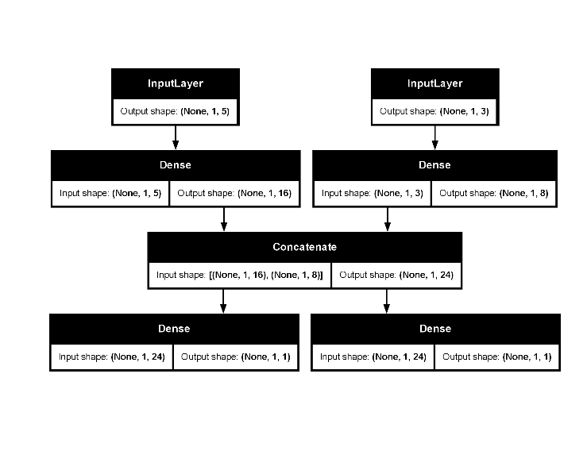

This vignette demonstrates how to use the `create_keras_functional_spec()` function to build complex, non-linear Keras models that integrate seamlessly with the `tidymodels` ecosystem.

## When to Use the Functional API

While `create_keras_sequential_spec()` is perfect for models that are a simple, linear stack of layers, many advanced architectures are not linear. The Keras Functional API is designed for these cases. You should use `create_keras_functional_spec()` when your model has:

*   Multiple input or multiple output layers.
*   Shared layers between different branches.
*   Residual connections (e.g., ResNets), where a layer's input is added to its output.
*   Any other non-linear topology.

`kerasnip` makes it easy to define these architectures by automatically connecting a graph of layer blocks.

## The Core Concept: Building a Graph

`kerasnip` builds the model's graph by inspecting the `layer_blocks` you provide. The connection logic is simple but powerful:

1.  The **names of the list elements** in `layer_blocks` define the names of the nodes in your graph (e.g., `main_input`, `dense_path`, `output`).
2.  The **names of the arguments** in each block function specify its inputs. A block function like `my_block <- function(input_a, input_b, ...)` declares that it needs input from the nodes named `input_a` and `input_b`.

There are two special requirements:

*   **Input Block**: The first block in the list is treated as the main input node. Its function should not take other blocks as input.
*   **Output Block**: Exactly one block must be named `"output"`. The tensor returned by this block is used as the final output of the Keras model.

Let's see this in action.

## Example 1: A Two-Input Regression Model

This model will take two distinct inputs, process them separately, and then concatenate their outputs before a final regression layer. This clearly demonstrates the functional API's ability to handle multiple inputs, which is not possible with the sequential API.

### Step 1: Load Libraries

First, we load the necessary packages.

```{r, include = FALSE}
knitr::opts_chunk$set(
  collapse = TRUE,
  comment = "#>",
  eval = reticulate::py_module_available("keras")
)
```

```{r setup}
library(kerasnip)
library(tidymodels)
library(keras3)

# Silence the startup messages from remove_keras_spec
options(kerasnip.show_removal_messages = FALSE)
```

### Step 2: Define Layer Blocks

These are the building blocks of our model. Each function represents a node in the graph.

```{r define-blocks-functional-two-input}
# Input blocks for two distinct inputs
input_block_1 <- function(input_shape) {
  layer_input(shape = input_shape, name = "input_1")
}

input_block_2 <- function(input_shape) {
  layer_input(shape = input_shape, name = "input_2")
}

# Dense paths for each input
dense_path_1 <- function(tensor, units = 16) {
  tensor |> layer_dense(units = units, activation = "relu")
}

dense_path_2 <- function(tensor, units = 16) {
  tensor |> layer_dense(units = units, activation = "relu")
}

# A block to join two tensors
concat_block <- function(input_a, input_b) {
  layer_concatenate(list(input_a, input_b))
}

# The final output block for regression
output_block_1 <- function(tensor) {
  layer_dense(tensor, units = 1, name = "output_1")
}

output_block_2 <- function(tensor) {
  layer_dense(tensor, units = 1, name = "output_2")
}
```

### Step 3: Create the Model Specification

Now we assemble the blocks into a graph. The `inp_spec()` helper simplifies connecting these blocks, eliminating the need for verbose anonymous functions. `inp_spec()` automatically creates a wrapper that renames the arguments of our blocks to match the node names defined in the `layer_blocks` list.

```{r create-spec-functional-two-input}
model_name <- "two_output_reg_spec" # Changed model name
# Clean up the spec when the vignette is done knitting
on.exit(remove_keras_spec(model_name), add = TRUE)

create_keras_functional_spec(
  model_name = model_name,
  layer_blocks = list(
    input_1 = input_block_1,
    input_2 = input_block_2,
    processed_1 = inp_spec(dense_path_1, "input_1"),
    processed_2 = inp_spec(dense_path_2, "input_2"),
    concatenated = inp_spec(
      concat_block,
      c(processed_1 = "input_a", processed_2 = "input_b")
    ),
    output_1 = inp_spec(output_block_1, "concatenated"), # New output block 1
    output_2 = inp_spec(output_block_2, "concatenated")  # New output block 2
  ),
  mode = "regression" # Still regression, but will have two columns in y
)
```

### Step 4: Use and Fit the Model

The new function `two_input_reg_spec()` is now available. Its arguments (`processed_1_units`, `processed_2_units`) were discovered automatically from our block definitions.

```{r fit-functional-two-input}
# We can override the default `units` for each path.
spec <- two_output_reg_spec( # Changed spec name
  processed_1_units = 16,
  processed_2_units = 8,
  fit_epochs = 10,
  fit_verbose = 0 # Suppress fitting output in vignette
) |>
  set_engine("keras")

print(spec)

# Prepare dummy data with two inputs and two outputs
set.seed(123)
x_data_1 <- matrix(runif(100 * 5), ncol = 5)
x_data_2 <- matrix(runif(100 * 3), ncol = 3)
y_data_1 <- runif(100)
y_data_2 <- runif(100) # New second output

# For tidymodels, inputs and outputs need to be in a data frame,
# potentially as lists of matrices
train_df <- tibble::tibble(
  input_1 = lapply(
    seq_len(nrow(x_data_1)),
    function(i) x_data_1[i, , drop = FALSE]
  ),
  input_2 = lapply(
    seq_len(nrow(x_data_2)),
    function(i) x_data_2[i, , drop = FALSE]
  ),
  output_1 = y_data_1, # Named output 1
  output_2 = y_data_2  # Named output 2
)

rec <- recipe(output_1 + output_2 ~ input_1 + input_2, data = train_df)
wf <- workflow() |>
  add_recipe(rec) |>
  add_model(spec)

fit_obj <- fit(wf, data = train_df)

# Predict on new data
new_data_df <- tibble::tibble(
  input_1 = lapply(seq_len(5), function(i) matrix(runif(5), ncol = 5)),
  input_2 = lapply(seq_len(5), function(i) matrix(runif(3), ncol = 3))
)
predict(fit_obj, new_data = new_data_df)
```

## A common debugging workflow: `compile_keras_grid()`

In the original Keras guide, a common workflow is to incrementally add layers and call `summary()` to inspect the architecture. With `kerasnip`, the model is defined declaratively, so we can't inspect it layer-by-layer in the same way.

However, `kerasnip` provides a powerful equivalent: `compile_keras_grid()`. This function checks if your `layer_blocks` define a valid Keras model and returns the compiled model structure, all without running a full training cycle. This is perfect for debugging your architecture.

Let's see this in action with the `two_input_reg_spec` model:

```{r compile-grid-debug-functional}
# Create a spec instance
spec <- two_output_reg_spec( # Changed spec name
  processed_1_units = 16,
  processed_2_units = 8
)

# Prepare dummy data with two inputs and two outputs
x_dummy_1 <- matrix(runif(10 * 5), ncol = 5)
x_dummy_2 <- matrix(runif(10 * 3), ncol = 3)
y_dummy_1 <- runif(10)
y_dummy_2 <- runif(10) # New second output

# For tidymodels, inputs and outputs need to be in a data frame,
# potentially as lists of matrices
x_dummy_df <- tibble::tibble(
  input_1 = lapply(
    seq_len(nrow(x_dummy_1)),
    function(i) x_dummy_1[i, , drop = FALSE]
  ),
  input_2 = lapply(
    seq_len(nrow(x_dummy_2)),
    function(i) x_dummy_2[i, , drop = FALSE]
  )
)
y_dummy_df <- tibble::tibble(output_1 = y_dummy_1, output_2 = y_dummy_2)

# Use compile_keras_grid to get the model
compilation_results <- compile_keras_grid(
  spec = spec,
  grid = tibble::tibble(),
  x = x_dummy_df,
  y = y_dummy_df
)

# Print the summary
compilation_results |>
  select(compiled_model) |>
  pull() |>
  pluck(1) |>
  summary()
```

```{r grid-debug-plot, eval=FALSE}
compilation_results |>
  select(compiled_model) |>
  pull() |>
  pluck(1) |>
  plot(show_shapes = TRUE)
```

{fig-alt="A picture showing the model shape"}

## When to use the functional API

In general, the functional API is higher-level, easier and safer, and has a number of features that subclassed models do not support.

However, model subclassing provides greater flexibility when building models that are not easily expressible as directed acyclic graphs of layers. For example, you could not implement a Tree-RNN with the functional API and would have to subclass `Model` directly.

### Functional API strengths

*   **Less verbose**: There is no `super$initialize()`, no `call = function(...)`, no `self$...`, etc.
*   **Model validation during graph definition**: In the functional API, the input specification (shape and dtype) is created in advance using `layer_input()`. Each time a layer is called, it validates that the input specification matches its assumptions, raising a helpful error message if not.
*   **A functional model is plottable and inspectable**: You can plot the model as a graph, and you can easily access intermediate nodes in this graph.
*   **A functional model can be serialized or cloned**: As a data structure rather than code, a functional model is safely serializable. It can be saved as a single file, allowing you to recreate the exact same model without needing the original code.

### Functional API weakness

*   **It does not support dynamic architectures**: The functional API treats models as DAGs of layers. This is true for most deep learning architectures, but not all – for example, recursive networks or Tree RNNs do not follow this assumption and cannot be implemented in the functional API.

## Conclusion

The `create_keras_functional_spec()` function provides a powerful and intuitive way to define, fit, and tune complex Keras models within the `tidymodels` framework. By defining the model as a graph of connected blocks, you can represent nearly any architecture while `kerasnip` handles the boilerplate of integrating it with `parsnip`, `dials`, and `tune`.
