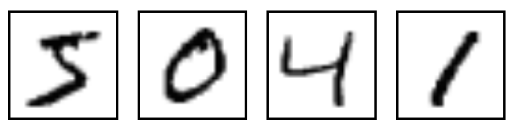

```{r, include = FALSE}
knitr::opts_chunk$set(
  collapse = TRUE,
  comment = "#>"
)
# Suppress verbose Keras output for the vignette 
options(keras.fit_verbose = 0)
set.seed(123)
```

## The Core Idea: From Keras Layers to Tidymodels Specs

The `keras3` package allows for building deep learning models layer-by-layer, which is a powerful and flexible approach. However, the `tidymodels` ecosystem is designed around declarative model specifications, where you define *what* model you want and which of its parameters you want to tune, rather than building it imperatively.

`kerasnip` bridges this gap with a simple but powerful concept: **layer blocks**. You define the components of your neural network (e.g., an input block, a dense block, a dropout block) as simple R functions. `kerasnip` then uses these blocks as building materials to create a brand new `parsnip` model specification function for you.

This new function behaves just like any other `parsnip` model (e.g., `rand_forest()` or `linear_reg()`), making it easy to integrate into `tidymodels` workflows.

## Installation

You can install the development version of `kerasnip` from GitHub. You will also need `keras3`.

```{r, eval=FALSE}
install.packages("pak")
pak::pak("davidrsch/kerasnip")
pak::pak("rstudio/keras3")

# Install the backend
keras3::install_keras()
```

We’ll start by loading `kerasnip`, `tidymodels` and `keras3`:

```{r load-kerasnip}
library(kerasnip)
library(tidymodels)
library(keras3)
```

## A `kerasnip` MNIST Example

Let’s replicate the classic Keras introductory example, training a simple MLP on the MNIST dataset, but using the `kerasnip` workflow. This will demonstrate how to translate a standard Keras model into a reusable, modular `parsnip` specification.

If you’re familiar with Keras, you’ll recognize the structure; if not, this is a perfect place to start. We’ll begin by learning the basics through a simple task: recognizing handwritten digits from the MNIST dataset.

The MNIST dataset contains 28×28 pixel grayscale images of handwritten digits, like these:

{fig-alt="A picture showing grayscale images of handwritten digits (5, 0, 4 and 1)"}

Each image comes with a label indicating which digit it represents. For example, the labels for the images above might be 5, 0, 4, and 1.

### Preparing the Data

This step is identical to any other Keras model. We load the MNIST dataset, reshape the predictors, and convert the outcome to a factor for `tidymodels`.

```{r prepare-data}
mnist <- dataset_mnist()
x_train <- mnist$train$x
y_train <- mnist$train$y
x_test <- mnist$test$x
y_test <- mnist$test$y

# Reshape
x_train <- array_reshape(x_train, c(nrow(x_train), 784))
x_test <- array_reshape(x_test, c(nrow(x_test), 784))
# Rescale
x_train <- x_train / 255
x_test <- x_test / 255

# Convert outcomes to factors for tidymodels
# kerasnip will handle y convertion internally using keras3::to_categorical()
y_train_factor <- factor(y_train)
y_test_factor <- factor(y_test)

# For tidymodels, it's best to work with data frames
# Use I() to keep the matrix structure of x within the data frame
train_df <- data.frame(x = I(x_train), y = y_train_factor)
test_df <- data.frame(x = I(x_test), y = y_test_factor)
```

### The Standard Keras Approach (for comparison)

Before diving into the `kerasnip` workflow, let's quickly look at how this same model is built using standard `keras3` code. This will help highlight the different approach `kerasnip` enables.

```{r keras-standard, eval=FALSE, echo=TRUE, results='hide'}
# The standard Keras3 approach
model <- keras_model_sequential(input_shape = 784) |>
  layer_dense(units = 256, activation = "relu") |>
  layer_dropout(rate = 0.4) |>
  layer_dense(units = 128, activation = "relu") |>
  layer_dropout(rate = 0.3) |>
  layer_dense(units = 10, activation = "softmax")

summary(model)

model |>
  compile(
    loss = "categorical_crossentropy",
    optimizer = optimizer_rmsprop(),
    metrics = "accuracy"
  )

# The model would then be trained with model |> fit(...)
```

The code above is imperative: you define each layer and add it to the model step-by-step. Now, let's see how `kerasnip` approaches this by defining reusable components for a declarative, `tidymodels`-friendly workflow.

### Defining the Model with Reusable Blocks

The original Keras example interleaves `layer_dense()` and `layer_dropout()`. With `kerasnip`, we can encapsulate this pattern into a single, reusable block. This makes the overall architecture cleaner and more modular.

```{r define-blocks}
# An input block to initialize the model.
# The 'model' argument is supplied implicitly by the kerasnip backend.
mlp_input_block <- function(model, input_shape) {
  keras_model_sequential(input_shape = input_shape)
}

# A reusable "module" that combines a dense layer and a dropout layer.
# All arguments that should be tunable need a default value.
dense_dropout_block <- function(model, units = 128, rate = 0.1) {
  model |>
    layer_dense(units = units, activation = "relu") |>
    layer_dropout(rate = rate)
}

# The output block for classification.
mlp_output_block <- function(model, num_classes) {
  model |> layer_dense(units = num_classes, activation = "softmax")
}
```

Now, we use `create_keras_sequential_spec()` to generate our `parsnip` model function.

```{r create-spec}
create_keras_sequential_spec(
  model_name = "mnist_mlp",
  layer_blocks = list(
    input = mlp_input_block,
    hidden_1 = dense_dropout_block,
    hidden_2 = dense_dropout_block,
    output = mlp_output_block
  ),
  mode = "classification"
)
```

### Building and Fitting the Model

We can now use our new `mnist_mlp()` function. Notice how its arguments, such as `hidden_1_units` and `hidden_1_rate`, were automatically generated by `kerasnip`. The names are created by combining the name of the layer block (e.g., `hidden_1`) with the arguments of that block's function (e.g., `units`, `rate`).

To replicate the `keras3` example, we'll use both `hidden` blocks and provide their parameters.

```{r use-spec}
mlp_spec <- mnist_mlp(
  hidden_1_units = 256,
  hidden_1_rate = 0.4,
  hidden_2_rate = 0.3,
  hidden_2_units =  128,
  compile_loss = "categorical_crossentropy",
  compile_optimizer = optimizer_rmsprop(),
  compile_metrics = c("accuracy"),
  fit_epochs = 30,
  fit_batch_size = 128,
  fit_validation_split = 0.2
) |>
  set_engine("keras")

# Fit the model
mlp_fit <- fit(mlp_spec, y ~ x, data = train_df)
```

```{r model-summarize}
mlp_fit |> 
  extract_keras_summary()
```

```{r model-plot eval=FALSE}
mlp_fit |> 
  extract_keras_summary() |> 
  plot(show_shapes = TRUE)
```

{fig-alt="A picture showing the model shape"}

```{r model-fit-history}
mlp_fit |> 
  extract_keras_history() |> 
  plot()
```

### Evaluating Model Performance

The `keras_evaluate()` function provides a straightforward way to assess the model's performance on a test set, using the underlying `keras3::evaluate()` method. It returns the loss and any other metrics that were specified during the model compilation step.

```{r model-evaluate}
mlp_fit |> keras_evaluate(x_test, y_test)
```

### Making Predictions

Once the model is trained, we can use the standard `tidymodels` `predict()` function to generate predictions on new data. By default, `predict()` on a `parsnip` classification model returns the predicted class labels.

```{r model-predict-class}
# Predict the class for the first 5 images in the test set 
class_preds <- mlp_fit |>
  predict(new_data = head(test_df))
class_preds
```

To get the underlying probabilities for each class, we can set `type = "prob"`. This returns a tibble with a probability column for each of the 10 classes (0-9).

```{r model-predict-prob}
# Predict probabilities for the first 5 images
prob_preds <- mlp_fit |> predict(new_data = head(test_df), type = "prob")
prob_preds
```

We can then compare the predicted class to the actual class for these images to see how the model is performing.

```{r model-predict-compare}
# Combine predictions with actuals for comparison
comparison <- bind_cols(
  class_preds,
  prob_preds
) |>
  bind_cols(
    head(test_df[, "y", drop = FALSE])
  )
comparison
```

## Example 2: Tuning the Model Architecture

Now we’ll showcase the main strength of `kerasnip`: tuning the network architecture itself. We can treat the number of layers, and the parameters of those layers, as hyperparameters to be optimized by `tune`.

Using the `mnist_mlp` spec we just created, let's define a tunable model.

```{r tune-spec-mnist}
# Define a tunable specification
# We set num_hidden_2 = 0 to disable the second hidden block for this tuning example
tune_spec <- mnist_mlp(
  num_hidden_1 = tune(),
  hidden_1_units = tune(),
  hidden_1_rate = tune(),
  num_hidden_2 = 0,
  compile_loss = "categorical_crossentropy",
  compile_optimizer = optimizer_rmsprop(),
  compile_metrics = c("accuracy"),
  fit_epochs = 30,
  fit_batch_size = 128,
  fit_validation_split = 0.2
) |>
  set_engine("keras")

# Create a workflow
tune_wf <- workflow(y ~ x, tune_spec)
```

Next, we define the search space for our tunable parameters using `dials`.

```{r create-grid-mnist}
# Define the tuning grid
params <- extract_parameter_set_dials(tune_wf) |>
  update(
    num_hidden_1 = dials::num_terms(c(1, 3)),
    hidden_1_units = dials::hidden_units(c(64, 256)),
    hidden_1_rate = dials::dropout(c(0.2, 0.4))
  )
grid <- grid_regular(params, levels = 3)
grid
```

```{r run-tuning-mnist, cache=TRUE}
folds <- vfold_cv(train_df, v = 3)

tune_res <- tune_grid(
  tune_wf,
  resamples = folds,
  grid = grid,
  metrics = metric_set(accuracy),
  control = control_grid(save_pred = FALSE, save_workflow = TRUE)
)
```

Finally, we can inspect the results to find which architecture performed the best. First, a summary table:

```{r show-best-mnist}
# Show the summary table of the best models
show_best(tune_res, metric = "accuracy")
```

Now that we've identified the best-performing hyperparameters, our final step is to create and train the final model. We use `select_best()` to get the top parameters, `finalize_workflow()` to update our workflow with them, and then `fit()` one last time on our full training dataset.

```{r finalize-best-model}
# Select the best hyperparameters
best_hps <- select_best(tune_res, metric = "accuracy")

# Finalize the workflow with the best hyperparameters
final_wf <- finalize_workflow(tune_wf, best_hps)

# Fit the final model on the full training data
final_fit <- fit(final_wf, data = train_df)
```

We can now inspect our final, tuned model.

```{r inspect-final-model}
# Print the model summary
final_fit |>
  extract_fit_parsnip() |>
  extract_keras_summary()

# Plot the training history
final_fit |> 
  extract_fit_parsnip() |>
  extract_keras_history() |>
  plot()
```

This result shows that `tune` has tested various network depths, widths, and dropout rates, successfully finding the best-performing combination within the search space. By using `kerasnip`, we were able to integrate this complex architectural tuning directly into a standard `tidymodels` workflow.