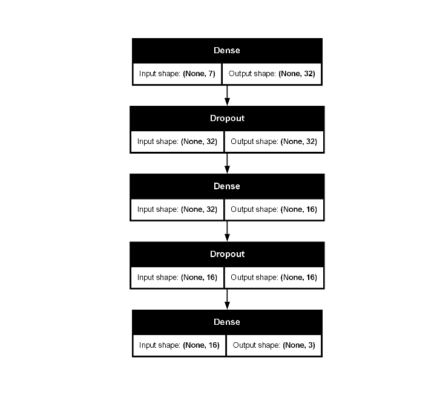

```{r, include = FALSE}
knitr::opts_chunk$set(
  collapse = TRUE,
  comment = "#>"
)
# Suppress verbose Keras output for the vignette
options(keras.fit_verbose = 0)
set.seed(123)
```

## Introduction

This vignette demonstrates a complete `tidymodels` workflow for a classification task using a Keras sequential model defined with `kerasnip`. We will use the Palmer Penguins dataset to predict penguin species based on physical measurements.

The `kerasnip` package allows you to define Keras models using a modular "layer block" approach, which then integrates seamlessly with the `parsnip` and `tune` packages for model specification and hyperparameter tuning.

## Setup

First, we load the necessary packages.

```{r load-packages}
library(kerasnip)
library(tidymodels)
library(keras3)
library(dplyr)          # For data manipulation
library(ggplot2)        # For plotting
library(future)         # For parallel processing
library(finetune)       # For racing
```

## Data Preparation

We'll use the `penguins` dataset from the `modeldata` package. We will clean it by removing rows with missing values and ensuring the `species` column is a factor.

```{r data-prep}
# Remove rows with missing values
penguins_df <- penguins |>
  na.omit() |>
  # Convert species to factor for classification
  mutate(species = factor(species))

# Split data into training and testing sets
set.seed(123)
penguin_split <- initial_split(penguins_df, prop = 0.8, strata = species)
penguin_train <- training(penguin_split)

penguin_test <- testing(penguin_split)

# Create cross-validation folds for tuning
penguin_folds <- vfold_cv(penguin_train, v = 5, strata = species)
```

## Recipe for Preprocessing

We will create a `recipes` object to preprocess our data. This recipe will:
*   Predict `species` using all other variables.
*   Normalize all numeric predictors.
*   Create dummy variables for all categorical predictors.

```{r create-recipe}
penguin_recipe <- recipe(species ~ ., data = penguin_train) |>
  step_normalize(all_numeric_predictors()) |>
  step_dummy(all_nominal_predictors())

# You can prep and bake the recipe to see the processed data
# prep(penguin_recipe) |> bake(new_data = penguin_train)
```

## Define Keras Sequential Model with `kerasnip`

Now, we define our Keras sequential model using `kerasnip`'s layer blocks. We'll create a simple Multi-Layer Perceptron (MLP) with two hidden layers.

For a sequential Keras model with tabular data, all preprocessed input features are typically combined into a single input layer. The `recipes` package handles this preprocessing, transforming predictors into a single matrix that serves as the input to the Keras model.

```{r define-kerasnip-model}
# Define layer blocks
input_block <- function(model, input_shape) {
  keras_model_sequential(input_shape = input_shape)
}

hidden_block <- function(model, units = 32, activation = "relu", rate = 0.2) {
  model |>
    layer_dense(units = units, activation = activation) |>
    layer_dropout(rate = rate)
}

output_block <- function(model, num_classes, activation = "softmax") {
  model |>
    layer_dense(units = num_classes, activation = activation)
}

# Create the kerasnip model specification function
create_keras_sequential_spec(
  model_name = "penguin_mlp",
  layer_blocks = list(
    input = input_block,
    hidden_1 = hidden_block,
    hidden_2 = hidden_block,
    output = output_block
  ),
  mode = "classification"
)

# Clean up the spec when the vignette is done knitting
on.exit(remove_keras_spec("penguin_mlp"), add = TRUE)
```

## Model Specification

We'll define our `penguin_mlp` model specification and set some hyperparameters to `tune()`, indicating that they should be optimized. We will also set fixed parameters for compilation and fitting.

```{r define-tune-spec}
# Define the tunable model specification
mlp_spec <- penguin_mlp(
  # Tunable parameters for hidden layers
  hidden_1_units = tune(),
  hidden_1_rate = tune(),
  hidden_2_units = tune(),
  hidden_2_rate = tune(),
  # Fixed compilation and fitting parameters
  compile_loss = "categorical_crossentropy",
  compile_optimizer = "adam",
  compile_metrics = c("accuracy"),
  fit_epochs = 20,
  fit_batch_size = 32,
  fit_validation_split = 0.2,
  fit_callbacks = list(callback_early_stopping(monitor = "val_loss", patience = 5))
) |>
  set_engine("keras")

print(mlp_spec)
```

## Create Workflow

A `workflow` combines the recipe and the model specification.

```{r create-workflow}
penguin_wf <- workflow() |>
  add_recipe(penguin_recipe) |>
  add_model(mlp_spec)

print(penguin_wf)
```

## Define Tuning Grid

We will create a regular grid for our hyperparameters.

```{r create-tuning-grid}
# Define the tuning grid
params <- extract_parameter_set_dials(penguin_wf) |>
  update(
    hidden_1_units = hidden_units(range = c(32, 128)),
    hidden_1_rate = dropout(range = c(0.1, 0.4)),
    hidden_2_units = hidden_units(range = c(16, 64)),
    hidden_2_rate = dropout(range = c(0.1, 0.4))
  )
mlp_grid <- grid_regular(params, levels = 3)

print(mlp_grid)
```

## Tune Model

Now, we'll use `tune_race_anova()` to perform cross-validation and find the best hyperparameters.

```{r tune-model, cache=TRUE}
# Note: Parallel processing with `plan(multisession)` is currently not working
# with Keras models due to backend conflicts.
# plan(multisession)
set.seed(123)

penguin_tune_results <- tune_race_anova(
  penguin_wf,
  resamples = penguin_folds,
  grid = mlp_grid,
  metrics = metric_set(accuracy, roc_auc, f_meas), # Evaluate multiple metrics
  control = control_race(save_pred = TRUE, save_workflow = TRUE)
)
```

## Inspect Tuning Results

We can inspect the tuning results to see which hyperparameter combinations performed best.

```{r inspect-results}
# Show the best performing models based on accuracy
show_best(penguin_tune_results, metric = "accuracy", n = 5)

# Autoplot the results
# autoplot(penguin_tune_results) # Currently does not work due to a label issue.

# Select the best hyperparameters
best_mlp_params <- select_best(penguin_tune_results, metric = "accuracy")
print(best_mlp_params)
```

## Finalize Workflow and Fit Model

Once we have the best hyperparameters, we finalize the workflow and fit the model on the entire training dataset.

```{r finalize-fit}
# Finalize the workflow with the best hyperparameters
final_penguin_wf <- finalize_workflow(penguin_wf, best_mlp_params)

# Fit the final model on the full training data
final_penguin_fit <- fit(final_penguin_wf, data = penguin_train)

print(final_penguin_fit)
```

### Inspect Final Model

You can extract the underlying Keras model and its training history for further inspection.

```{r inspect-final-keras-model-summary}
# Extract the Keras model summary
final_penguin_fit |>
  extract_fit_parsnip() |>
  extract_keras_model() |>
  summary()
```

```{r inspect-final-keras-model-plot, eval=FALSE}
# Plot the Keras model
final_penguin_fit |>
  extract_fit_parsnip() |>
  extract_keras_model() |>
  plot(show_shapes = TRUE)
```

{fig-alt="A picture showing the model shape"}

```{r inspect-final-keras-model-history}
# Plot the training history
final_penguin_fit |>
  extract_fit_parsnip() |>
  extract_keras_history() |>
  plot()
```

## Make Predictions and Evaluate

Finally, we will make predictions on the test set and evaluate the model's performance.

```{r predict-evaluate}
# Make predictions on the test set
penguin_test_pred <- predict(final_penguin_fit, new_data = penguin_test)
penguin_test_prob <- predict(final_penguin_fit, new_data = penguin_test, type = "prob")

# Combine predictions with actuals
penguin_results <- penguin_test |>
  select(species) |>
  bind_cols( penguin_test_pred, penguin_test_prob)

print(head(penguin_results))

# Evaluate performance using yardstick metrics
metrics_results <- metric_set(accuracy, roc_auc, f_meas)(penguin_results, truth = species, estimate = .pred_class, .pred_Adelie, .pred_Chinstrap, .pred_Gentoo)

print(metrics_results)

# Confusion Matrix
conf_mat(penguin_results, truth = species, estimate = .pred_class) |>
  autoplot(type = "heatmap")
```
